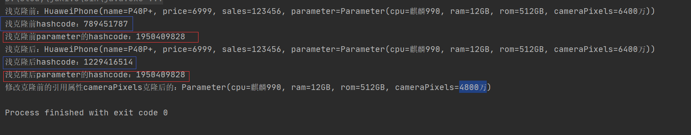
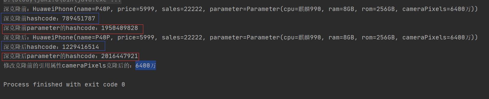
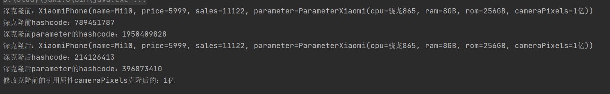

# 设计模式（Design Pattern）

## 简介

设计模式是一套可以用来提高代码可复用性、可维护性、可读性、稳健性以及安全性的解决方案。当一个项目需求越来越多时，如果在项目架构和开发时使用了设计模式，即使需求再多，项目的结构也不会有太大变化，也不会变得非常复杂。

目前一个有23种设计模式，这23种设计模式的本质都是面向对象程序设计的**封装、继承和多态**。

## 设计模式六种原则

### **一、单一原则**（Single Responsibility Principle）

一个类或者一个方法只负责一项职责。如果实现逻辑足够简单，则可以适当破坏单一原则。目的是**降低代码复杂度、系统解耦合、提高可读性**

### **二、里氏替换原则**（liskov substitution principle）

父类出现的地方一定可以使用子类，而子类出现的地方不一定可以使用父类。子类不能重写或者重载父类的方法，不能改变父类已经实现的方法，只能实现父类的抽象方法。子类可以实现一些个性方法，但是一定不能影响父类。

目的是**防止继承体系被破坏**

### 三、依赖倒置原则（Dependence Inversion Principle）

面向接口编程，使用接口或者抽象类来声明变量或者传参，而具体的实现细节交给实现类来完成。目的是**防止需求变更过多导致项目维护难度增加**

### 四、接口隔离原则（Interface Segregation Principle）

接口粒度要设计得小点，类与类之间共同依赖的接口的尽量要小，即需要同时满足两个类的所需的方法，如果两个类需要的方法不一样，那就需要把接口拆分开来。目的是**避免接口过于脓肿**

### 五、迪米特法则（Demeter Principle）

类与类之间尽量不要发生过多的相互作用，即对象之间的引用尽量少一些，目的是**降低类之间的耦合度**

### 六、开闭原则（Open Close Principle）

对扩展开放，对修改关闭，即项目有新增需求时，不能修改原有的代码，应该通过新增代码来实现这些需求。开闭原则是其他原则的总纲。目的是**提高扩展性、便于维护**

### 七、合成复用原则（Composite Reuse Principle）

类与类之间优先使用组合和聚合关系来实现，其次才考虑用继承。

## 23种设计模式

**23种设计模式**可以分为**3大类设计模式**

- **创建型模式（5种）：**
  - **单例模式（Singleton）**
  - **原型模式（Prototype）**
  - **工厂方法模式（FactoryMethod）**
  - **抽象工厂模式品（AbstractFactory）**
  - **建造者模式（Builder）**

- **结构型模式（7种）：**
  - **代理模式（Proxy）**
  - **适配器模式（Adapter）**
  - **桥接模式（Bridge）**
  - **装饰模式（Decorator）**
  - **外观模式（Facade）**
  - **享元模式（Flyweight）**
  - **组合模式（Composite）**
- **行为型模式（11种）：**
  - **模板方法模式（Template Method）**
  - **策略模式（Strategy）**
  - **命令模式（Command）**
  - **职责链模式（Chain of Responsibility）**
  - **状态模式（State）**
  - **观察者模式（Observer）**
  - **中介者模式（Mediator）**
  - **迭代器模式（Iterator）**
  - **访问者模式（Visitor）**
  - **备忘录模式（Memento）**
  - **解释器模式（Interpreter）**

## ---创建型模式---

创建型模式主要是用于对象的创建，即把对象的创建与使用分离，客户端注重与对象的使用，而对象的创建交给各种设计模式来创建，这样可以降低系统的耦合性。

### 1.单例模式（Singleton）

一个类只能生成一个实例，该类提供了一个全局访问点供外部获取该实例，程序启动后直到程序停止该类都只有一个实例。单例模式有7种创建的方式。

**具体场景：**

- **spiring默认创建的bean（bean也可以通过组合@scope注解设置成prototype，默认是singleton）**

### -- 1.1. 饿汉式（通过静态变量创建单例）

> **饿汉式单例模式：在程序启动后就创建该实例**

- **优点：**线程安全，静态变量在类加载中的初始化阶段就运行，且只运行一次。所以不会有线程安全问题

- **缺点：**在类加载时已经创建了对象，如果后面没有用到该实例则会浪费内存
- **使用场景：轻量级的对象、确保该对象肯定会被用到**

代码：

```java
public class HungrySingleton {
    // 使用静态变量创建一个对象
    private static final HungrySingleton singleton = new HungrySingleton();
    // 构造方法私有，不能让其他对象初始化
    private HungrySingleton(){}
    // 暴露一个获取对象的方法，其他对象只能通过该方法获取该对象
    public static HungrySingleton getSingleton(){
        init();//模拟耗时任务
        return singleton;
    }

    // 模拟创建实例时需要做的一些逻辑处理
    private static void init(){
        // 模拟耗时任务----开始----
        try {
            Thread.sleep(1);
        } catch (InterruptedException e) {
            e.printStackTrace();
        }
        // 模拟耗时任务----结束----
    }
}
```

测试代码：

```java
    /**
     * 测试饿汉式单例模式（静态变量）
     */
    public static void testHungry() {
        for (int i = 0; i < 10; i++) {
            new Thread(() -> {
                HungrySingleton singleton = HungrySingleton.getSingleton();
                System.out.println(Thread.currentThread().getName() + "：" +
                        "singleton's hashcode：" + singleton.hashCode());
            }).start();
        }
    }
```

运行结果：

```
Thread-1：singleton's hashcode：861198744
Thread-2：singleton's hashcode：861198744
Thread-3：singleton's hashcode：861198744
Thread-4：singleton's hashcode：861198744
Thread-0：singleton's hashcode：861198744
Thread-5：singleton's hashcode：861198744
Thread-6：singleton's hashcode：861198744
Thread-8：singleton's hashcode：861198744
Thread-7：singleton's hashcode：861198744
Thread-9：singleton's hashcode：861198744
```

### -- 1.2. 懒汉式（普通用法，不加锁）

> **饿汉式单例模式：在该实例第一次用到时创建该实例**

- **优点：**可以延时创建对象，即在第一次用到该实例时才会创建

- **缺点：**线程不安全

- **使用场景：不推荐使用**

代码：

```java
public class LazySingleton {

    private static LazySingleton singleton;
    private LazySingleton(){}

    public static LazySingleton getSingleton(){
        if (singleton == null){
            init();//模拟耗时任务
            singleton = new LazySingleton();
        }
        return singleton;
    }

    private static void init(){
        // 模拟耗时任务----开始----
        try {
            Thread.sleep(1);
        } catch (InterruptedException e) {
            e.printStackTrace();
        }
        // 模拟耗时任务----结束----
    }
}
```

测试代码：

```java
/**
     * 测试懒汉式单例模式（普通用法）
     * 线程不安全
     */
    public static void testLazy() {
        for (int i = 0; i < 10; i++) {
            new Thread(() -> {
                LazySingleton singleton = LazySingleton.getSingleton();
                System.out.println(Thread.currentThread().getName() + "：" +
                        "singleton's hashcode：" + singleton.hashCode());
            }).start();

        }
    }
```

运行结果：(线程不安全，创建了多个实例)

```
Thread-2：singleton's hashcode：1663701226
Thread-6：singleton's hashcode：1138243632
Thread-5：singleton's hashcode：80492082
Thread-4：singleton's hashcode：1645804334
Thread-3：singleton's hashcode：1917135228
Thread-0：singleton's hashcode：1219201818
Thread-1：singleton's hashcode：861198744
Thread-7：singleton's hashcode：1842520111
Thread-9：singleton's hashcode：1226880356
Thread-8：singleton's hashcode：1031371881
```

### -- 1.3. 懒汉式（给方法加锁）

- **优点：**可以延时创建对象，线程安全

- **缺点：**效率慢

- **使用场景：不推荐**

代码：

```java
public class LazySingleton2 {

    private static LazySingleton2 singleton;

    private LazySingleton2() {}

    public static synchronized LazySingleton2 getSingleton() {
        if (singleton == null) {
            init();//模拟耗时任务

            singleton = new LazySingleton2();
        }
        return singleton;
    }

    private static void init() {
        // 模拟耗时任务----开始----
        try {
            Thread.sleep(1);
        } catch (InterruptedException e) {
            e.printStackTrace();
        }
        // 模拟耗时任务----结束----
    }
}
```

测试代码：

```java
    /**
     * 测试懒汉式单例模式（同步锁getSingleton方法）
     * 线程安全
     */
    public static void testLazy2() {
        for (int i = 0; i < 10; i++) {
            new Thread(() -> {
                LazySingleton2 singleton = LazySingleton2.getSingleton();
                System.out.println(Thread.currentThread().getName() + "：" +
                        "singleton's hashcode：" + singleton.hashCode());
            }).start();

        }
    }
```

运行结果：

```
Thread-0：singleton's hashcode：1887032973
Thread-4：singleton's hashcode：1887032973
Thread-3：singleton's hashcode：1887032973
Thread-5：singleton's hashcode：1887032973
Thread-1：singleton's hashcode：1887032973
Thread-6：singleton's hashcode：1887032973
Thread-8：singleton's hashcode：1887032973
Thread-7：singleton's hashcode：1887032973
Thread-9：singleton's hashcode：1887032973
Thread-2：singleton's hashcode：1887032973
```

### -- 1.4. 懒汉式（使用同步代码块）

- **优点：**可以延时创建对象

- **缺点：**线程不安全

- **使用场景：不推荐**

代码：

```java
public class LazySingleton3 {

    private static volatile LazySingleton3 singleton;
    private LazySingleton3(){}

    public static LazySingleton3 getSingleton(){
        if (singleton == null){
            // 同步代码块
            synchronized (LazySingleton3.class){
                init();//模拟耗时任务
                singleton = new LazySingleton3();
            }

        }
        return singleton;
    }

    private static void init(){
        // 模拟耗时任务----开始----
        try {
            Thread.sleep(1);
        } catch (InterruptedException e) {
            e.printStackTrace();
        }
        // 模拟耗时任务----结束----
    }
}
```

测试代码：

```java
    /**
     * 测试懒汉式单例模式（同步块锁具体逻辑代码）
     * 线程不安全
     */
    public static void testLazy3() {
        for (int i = 0; i < 10; i++) {
            new Thread(() -> {
                LazySingleton3 singleton = LazySingleton3.getSingleton();
                System.out.println(Thread.currentThread().getName() + "：" +
                        "singleton's hashcode：" + singleton.hashCode());
            }).start();

        }
    }
```

运行结果：

```
Thread-8：singleton's hashcode：1226880356
Thread-9：singleton's hashcode：868907500
Thread-0：singleton's hashcode：861198744
Thread-1：singleton's hashcode：1663701226
Thread-2：singleton's hashcode：1917135228
Thread-3：singleton's hashcode：1645804334
Thread-4：singleton's hashcode：80492082
Thread-5：singleton's hashcode：1138243632
Thread-7：singleton's hashcode：1031371881
Thread-6：singleton's hashcode：1842520111
```

### -- 1.5. 双重检测（加锁最优解）

**双重检测也是懒汉式的一种，可以延时创建实例**

- **优点：**可以延时创建对象、线程安全

- **缺点：**可能会被序列化与反序列化和反射破坏

- **使用场景：推荐，需要延时实例化的单例对象**

代码：

```java
public class DoubleCheckSingleton {
    private static DoubleCheckSingleton singleton;
    private DoubleCheckSingleton(){}

    public static DoubleCheckSingleton getSingleton(){
        // 第一重检测
        if (singleton == null){
            // 第二重检测
            synchronized (DoubleCheckSingleton.class){
                if (singleton == null){
                    init(); //模拟耗时任务
                    singleton = new DoubleCheckSingleton();
                }
            }
        }
        return singleton;
    }

    private static void init(){
        // 模拟耗时任务----开始----
        try {
            Thread.sleep(1);
        } catch (InterruptedException e) {
            e.printStackTrace();
        }
        // 模拟耗时任务----结束----
    }

}
```

测试代码：

```java
    /**
     * 测试懒汉式单例模式（双重检测，锁具体逻辑代码）
     * 线程安全
     */
    public static void testDoubleCheck() {
        for (int i = 0; i < 10; i++) {
            new Thread(() -> {
                DoubleCheckSingleton singleton = DoubleCheckSingleton.getSingleton();
                System.out.println(Thread.currentThread().getName() + "：" +
                        "singleton's hashcode：" + singleton.hashCode());
            }).start();

        }
    }
```

运行结果：

```
Thread-0：singleton's hashcode：1663701226
Thread-9：singleton's hashcode：1663701226
Thread-8：singleton's hashcode：1663701226
Thread-7：singleton's hashcode：1663701226
Thread-4：singleton's hashcode：1663701226
Thread-2：singleton's hashcode：1663701226
Thread-5：singleton's hashcode：1663701226
Thread-6：singleton's hashcode：1663701226
Thread-1：singleton's hashcode：1663701226
Thread-3：singleton's hashcode：1663701226
```

### -- 1.6. 静态内部类

**静态内部类也是懒汉式的一种，也可以实现延时创建实例**,静态内部类在调用getInstance方法时才会初始化对象，而不是在类的加载中就初始化，所以也能实现延时创建实例

- **优点：**可以延时创建对象、线程安全

- **缺点：**可能会被序列化与反序列化和反射破坏

- **使用场景：推荐，需要延时实例化的单例对象**

代码：

```java
public class StaticInnerSingleton {
    // 静态内部类
    private static class InnerSingleton {
        private static StaticInnerSingleton singleton = new StaticInnerSingleton();
    }

    public static StaticInnerSingleton getInstance() {
        init();//模拟耗时任务

        return InnerSingleton.singleton;
    }

    private static void init(){
        // 模拟耗时任务----开始----
        try {
            Thread.sleep(1);
        } catch (InterruptedException e) {
            e.printStackTrace();
        }
        // 模拟耗时任务----结束----
    }
}
```

测试代码：

```java
    /**
     * 测试静态内部类
     * 线程安全、延时加载
     */
    public static void testStaticInner() {
        for (int i = 0; i < 10; i++) {
            new Thread(() -> {
                StaticInnerSingleton singleton = StaticInnerSingleton.getInstance();
                System.out.println(Thread.currentThread().getName() + "：" +
                        "singleton's hashcode：" + singleton.hashCode());
            }).start();

        }
    }
```

运行结果：

```
Thread-1：singleton's hashcode：1917135228
Thread-9：singleton's hashcode：1917135228
Thread-4：singleton's hashcode：1917135228
Thread-7：singleton's hashcode：1917135228
Thread-8：singleton's hashcode：1917135228
Thread-5：singleton's hashcode：1917135228
Thread-6：singleton's hashcode：1917135228
Thread-2：singleton's hashcode：1917135228
Thread-3：singleton's hashcode：1917135228
Thread-0：singleton's hashcode：1917135228
```

### -- 1.7. 枚举

- **优点：**创建单例对象的**最优方法**

- **缺点：不会**被序列化与反序列化和反射破坏

- **使用场景：推荐**

代码：

```java
public enum EnumSingleton {
    SINGLETON;

    EnumSingleton() {
        init();//模拟耗时任务
    }

    int i = 0;
    // 单例对象的方法
    public void enumDoSomething(){
        System.out.println(i++);
    }

    private static void init(){
        // 模拟耗时任务----开始----
        try {
            Thread.sleep(1);
        } catch (InterruptedException e) {
            e.printStackTrace();
        }
        // 模拟耗时任务----结束----
    }
}

```

测试代码：

```java
    /**
     * 测试枚举单例模式（使用枚举）
     * 线程安全，效率高，可以防止被反射破坏，防止序列化和反序列化，实现最简单
     */
    public static void testEnum() {
        for (int i = 0; i < 10; i++) {
            new Thread(() -> {
                EnumSingleton singleton = EnumSingleton.SINGLETON;
                System.out.println(Thread.currentThread().getName() + "：" +
                        "singleton's hashcode：" + singleton.hashCode());
            }).start();

        }
    }
```

运行结果：

```
Thread-0：singleton's hashcode：1219201818
Thread-5：singleton's hashcode：1219201818
Thread-4：singleton's hashcode：1219201818
Thread-6：singleton's hashcode：1219201818
Thread-2：singleton's hashcode：1219201818
Thread-7：singleton's hashcode：1219201818
Thread-8：singleton's hashcode：1219201818
Thread-9：singleton's hashcode：1219201818
Thread-1：singleton's hashcode：1219201818
Thread-3：singleton's hashcode：1219201818
```

### 2.原型模式（Prototype）

原型模式是Java自带的一种设计模式，使用原型模式可以克隆一份对象的副本，使该副本的值与原对象一模一样，相当于创建一个对象与原对象的属性一模一样（两个对象不是同一个对象，只是对象里的属性的值是一样的），Object对象里有一个clone()方法，实现Cloneable接口的对象以重写clone()方法实现对象的克隆。对象的克隆有两种方式：**浅克隆和深克隆**

- **浅克隆**：只克隆了当前对象，当前对象下的基本类型属性的值会被克隆，而引用类型的属性只是克隆了内存地址，所以两个对象中的引用类型属性指向的是同一个内存地址，所以修改其中一个对象的该引用属性，那么两个对象的该引用属性值都会改变。
- **深克隆：**对象下的引用类型属性也会被克隆，即克隆后的对象与原对象里的引用属性指向的内存地址是不一样的。其中一个对象修改了该引用类型属性，另一个对象的该属性不会改变

**具体场景：**

- **System.arraycopy()数组拷贝**
- **BeanUtils.copyProperties()对象拷贝**
- **spring创建bean（@scope注解可以设置为prototype）**

### -- 2.1. 浅克隆

实现代码：

HuaweiPhone类，使用lombok简化了实体类。这个对象实现了Cloneable接口并且重写了clone()方法。

```java
import lombok.*;

@Setter
@Getter
@AllArgsConstructor
@NoArgsConstructor
@ToString
public class HuaweiPhone implements Cloneable {
    private String name;
    private int price;
    private int sales;
    private Parameter parameter;

    @Override
    protected Object clone() throws CloneNotSupportedException {
        return super.clone();
    }
}
```

Parameter类，该对象是HuaweiPhone内的一个引用属性

```java
import lombok.*;

@Setter
@Getter
@AllArgsConstructor
@NoArgsConstructor
@ToString
public class Parameter {
    private String cpu;
    private String ram;
    private String rom;
    private String cameraPixels;
}

```

测试：

```java
public class Main {
    public static void main(String[] args) throws CloneNotSupportedException {
        HuaweiPhone phone = new HuaweiPhone("P40P+",6999,123456,
                new Parameter("麒麟990","12GB","512GB","6400万"));
        System.out.println("浅克隆前："+phone);
        System.out.println("浅克隆前hashcode："+phone.hashCode());
        System.out.println("浅克隆前parameter的hashcode："+phone.getParameter().hashCode());
        HuaweiPhone clone = (HuaweiPhone) phone.clone();
        System.out.println("浅克隆后："+clone);
        System.out.println("浅克隆后hashcode："+clone.hashCode());
        System.out.println("浅克隆后parameter的hashcode："+clone.getParameter().hashCode());
        phone.getParameter().setCameraPixels("4800万");
        System.out.println("修改克隆前的引用属性cameraPixels克隆后的："+clone.getParameter().getCameraPixels());
    }
}
```



### -- 2.2. 深克隆

实现代码：

```java
import lombok.*;

@Setter
@Getter
@AllArgsConstructor
@NoArgsConstructor
@ToString
public class HuaweiPhone implements Cloneable {
    private String name;
    private int price;
    private int sales;
    private Parameter parameter;

    @Override
    public Object clone() throws CloneNotSupportedException {
        HuaweiPhone o = (HuaweiPhone) super.clone();
        // Parameter对象不为空时进行Parameter对象的克隆
        if (o.getParameter() != null){
            o.parameter = (Parameter) parameter.clone();
        }
        return o;
    }
}
```

HuaweiPhone里引用的对象Parameter也重写clone()方法

```java
import lombok.*;

@Setter
@Getter
@AllArgsConstructor
@NoArgsConstructor
@ToString
public class Parameter implements Cloneable{
    private String cpu;
    private String ram;
    private String rom;
    private String cameraPixels;

    @Override
    public Object clone() throws CloneNotSupportedException {
        return super.clone();
    }
}
```

测试代码：

```java
public class Main {
    public static void main(String[] args) throws CloneNotSupportedException {
        HuaweiPhone phone = new HuaweiPhone("P40P",5999,22222,
                new Parameter("麒麟990","8GB","256GB","6400万"));
        System.out.println("深克隆前："+phone);
        System.out.println("深克隆前hashcode："+phone.hashCode());
        System.out.println("深克隆前parameter的hashcode："+phone.getParameter().hashCode());
        HuaweiPhone clone = (HuaweiPhone) phone.clone();
        System.out.println("深克隆后："+clone);
        System.out.println("深克隆后hashcode："+clone.hashCode());
        System.out.println("深克隆后parameter的hashcode："+clone.getParameter().hashCode());
        phone.getParameter().setCameraPixels("4800万");
        System.out.println("修改克隆前的引用属性cameraPixels克隆后的："+clone.getParameter().getCameraPixels());
    }
}
```

运行结果



使用**序列化与反序列化**来实现对象的深克隆：

实现代码：

```java
import lombok.*;

import java.io.Serializable;

@Setter
@Getter
@AllArgsConstructor
@NoArgsConstructor
@ToString
public class XiaomiPhone implements Serializable{
    private String name;
    private int price;
    private int sales;
    private ParameterXiaomi parameter;

}
```

```java
import lombok.*;

import java.io.Serializable;

@Setter
@Getter
@AllArgsConstructor
@NoArgsConstructor
@ToString
public class ParameterXiaomi implements Serializable{
    private String cpu;
    private String ram;
    private String rom;
    private String cameraPixels;

}
```

测试代码：

```java
public static void testSerializable() throws IOException, ClassNotFoundException {
        XiaomiPhone phone = new XiaomiPhone("Mi10",5999,11122,
                new ParameterXiaomi("骁龙865","8GB","256GB","1亿"));
        System.out.println("深克隆前："+phone);
        System.out.println("深克隆前hashcode："+phone.hashCode());
        System.out.println("深克隆前parameter的hashcode："+phone.getParameter().hashCode());
        // 序列化
        ByteArrayOutputStream bos = new ByteArrayOutputStream();
        ObjectOutputStream oos = new ObjectOutputStream(bos);
        oos.writeObject(phone);
        // 反序列化
        ByteArrayInputStream bis = new ByteArrayInputStream(bos.toByteArray());
        ObjectInputStream ois = new ObjectInputStream(bis);
        XiaomiPhone clone = (XiaomiPhone) ois.readObject();
        System.out.println("深克隆后："+clone);
        System.out.println("深克隆后hashcode："+clone.hashCode());
        System.out.println("深克隆后parameter的hashcode："+clone.getParameter().hashCode());
        phone.getParameter().setCameraPixels("6400万");
        System.out.println("修改克隆前的引用属性cameraPixels克隆后的："+clone.getParameter().getCameraPixels());
    }
```

运行结果：



### 3.工厂方法模式（FactoryMethod）

使用**工厂**来**创建对象**而不是直接创建对象，工厂与对象是有关联的，工厂等于**产品**，对象等于**某种产品**，比如手机是一种产品的总称，华为手机是属于手机的一种，索尼手机也是属于手机的一种。如果我想创建一个对象，不需要知道这个对象是如何创建的，创建的该对象的具体逻辑交给工厂来完成。因此我们只需要知道使用哪个工厂可以创建哪种类型的对象。

工厂模式有3种：简单工厂模式(静态工厂方法模式)、工厂方法模式、抽象工厂模式

**具体场景：**

- **springIOC容器启动初始化bean的BeanFactory**

### -- 3.1. 简单工厂模式(静态工厂方法模式)

- **优点：**创建对象的具体逻辑交给工厂，创建者不需要关注该对象是如何创建的
- **缺点：**违反开闭原则，当新增一种产品时，需要修改工厂方法

**简单工厂模式构造：**

- **一个抽象产品（如Phone）**：产品的接口，交由具体产品实现该接口
- **多个具体产品（如SonyPhone、HuaweiPhone...）**：实现抽象产品的接口
- **一个具体工厂（如PhoneFactory）**：供创建者使用，包含创建某些具体产品对象的实现，根据某个标识（如参数）创建相应的对象

UML关系图：


代码实现：

Phone接口**（抽象产品）**

```java
/**
 * 定义产品（phone）接口
 */
public interface Phone {
    void name();
    void produced();
}

```

HuaweiPhone类实现Phone接口**（具体产品）**

```java
/**
 * 该工厂可以创建HuaweiPhone华为手机，HuaweiPhone实现Phone接口
 */
public class HuaweiPhone implements Phone{

    @Override
    public void name() {
        System.out.println("华为手机");
    }

    @Override
    public void produced() {
        System.out.println("产地：中国");
    }
}

```

SonyPhone类实现Phone接口**（具体产品）**

```java
/**
 * 该工厂可以创建SonyPhone索尼手机，SonyPhone实现Phone接口
 */
public class SonyPhone implements Phone {
    @Override
    public void name() {
        System.out.println("索尼手机");
    }

    @Override
    public void produced() {
        System.out.println("产地：日本");
    }
}

```

PhoneFactory具体工厂**（具体工厂）**

```java
/**
 * 手机工厂，该工厂可以创建不同品牌的手机，就像一家手机店，它可以卖多种品牌的手机
 */
public class PhoneFactory {
    // 根据传入的参数来创建相应的对象
    public static Phone create(String name){
        Phone p = null;
        if ("Sony".equals(name)){
            p = new SonyPhone();
        }else if ("Huawei".equals(name)){
            p = new HuaweiPhone();
        }else {
            System.out.println("暂时没有 "+name+" 手机");
        }
        return p;
    }
}

```

测试代码

```java
public class Main {
    public static void main(String[] args) {
        // 创建华为手机对象
        Phone phone = PhoneFactory.create("Huawei");
        phone.name();
        phone.produced();

        // 创建索尼手机对象
        Phone phone2 = PhoneFactory.create("Sony");
        phone2.name();
        phone2.produced();
    }
}
```

运行结果

```
华为手机
产地：中国
索尼手机
产地：日本

Process finished with exit code 0
```

当我们需要新增一种产品时，需要新增一个类实现Phone接口，还需要在PhoneFactory工厂类中创建对象的create方法中添加一个if条件。所以这种模式不适合后续需要新增产品的业务。

### -- 3.2. 工厂方法模式

- **优点：**只需要知道具体工厂就可以创建具体对象，符合开闭原则，扩展容易
- **缺点：**类文件增多，增加系统复杂度

**工厂方法模式构造：**

- **一个抽象产品（如Phone）**：产品的接口，交由具体产品实现该接口
- **多个具体产品（如SonyPhone、HuaweiPhone...）**：实现抽象产品的接口
- **一个抽象工厂（如PhoneFactory）**：工厂的接口，交由具体工厂实现该接口
- **多个具体工厂（SonyFactory、HuaweiFactory...）**：实现抽象工厂的接口，供调用者使用

UML关系图


代码实现：

Phone接口**（抽象产品）**

```java
/**
 * 定义产品（phone）接口
 */
public interface Phone {
    void name();
    void produced();
}
```

PhoneFactory接口**（抽象工厂）**

```java
/**
 * 手机工厂，所有品牌的手机工厂都要实现该工厂接口。
 */
public interface PhoneFactory {
    Phone create();
}
```

SonyPhone实现Phone接口**（具体产品）**

```java
/**
 * 该工厂可以创建SonyPhone索尼手机，SonyPhone实现Phone接口
 */
public class SonyPhone implements Phone {
    @Override
    public void name() {
        System.out.println("索尼手机");
    }

    @Override
    public void produced() {
        System.out.println("产地：日本");
    }
}
```

HuaweiPhone实现Phone接口**（具体产品）**

```java
/**
 * 该工厂可以创建HuaweiPhone华为手机，HuaweiPhone实现Phone接口
 */
public class HuaweiPhone implements Phone {

    @Override
    public void name() {
        System.out.println("华为手机");
    }

    @Override
    public void produced() {
        System.out.println("产地：中国");
    }
}
```

SonyFactory实现PhoneFactory接口**（具体工厂）**

```java
/**
 * 索尼手机的工厂，实现手机工厂接口，相当于索尼手机专卖店。
 */
public class SonyFactory implements PhoneFactory {
    @Override
    public Phone create() {
        return new SonyPhone();
    }
}
```

HuaweiFactory实现PhoneFactory接口**（具体工厂）**

```java
/**
 * 华为手机 的工厂，实现手机工厂接口，相当于 华为手机 专卖店。
 */
public class HuaweiFactory implements PhoneFactory{
    @Override
    public Phone create() {
        return new HuaweiPhone();
    }
}
```

测试代码：

```java
public class Main {
    public static void main(String[] args) {
        Phone p = new SonyFactory().create();
        p.name();
        p.produced();

        Phone p2 = new HuaweiFactory().create();
        p2.name();
        p2.produced();
    }
}
```

运行结果与简单工厂模式一致

假如我们需要新增一种具体产品(小米手机)，则只需要创建一个具体产品（小米手机）实现抽象产品接口（手机）、创建一个具体工厂（小米手机工厂）实现抽象工厂（手机工厂）。不过这种方式会增加很多类。

### 4.抽象工厂模式

简单工厂模式与工厂方法模式是对应一个**产品等级**的，即同一种产品（如手机）。而抽象工厂模式可以有多种产品，即**产品族**（如手机、电脑），所以是对应多个**产品等级**。一个工厂可以生产多种产品。

- **优点：**可以有多种产品，新增一个产品族时**（具体工厂）**，不需要修改抽象工厂
- **缺点：**当一个工厂新增一种新产品时，所有的工厂都要修改

**工厂方法模式构造：**

- **多个抽象产品（如Phone、Computer...）**：产品的接口，交由具体产品实现该接口
- **多个具体产品（如HuaweiPhone、HuaweiLaptop、LenovoPhone、LenovoComputer...）**：实现抽象产品的接口
- **一个抽象工厂（如ElectronicFactory）**：抽象工厂的抽象类，交由具体工厂继承该抽象类
- **多个具体工厂（HuaweiElectronicFactory、LenovoElectronicFactory...）**：实现抽象工厂的接口，供调用者使用


实现代码：

Phone接口**（抽象产品）**

```java
/**
 * 定义产品（phone）接口
 */
public interface Phone {
    void name();
    void produced();
}
```

Computer接口**（抽象产品）**

```java
/**
 * 定义Computer接口
 */
public interface Computer {
    void name();
    void produced();
}

```

ElectronicFactory抽象类**（抽象工厂）**

```java
public abstract class ElectronicFactory {
    public abstract Phone createPhone();
    public abstract Computer createComputer();
}
```

HuaweiPhone实现Phone接口**（具体产品--手机）**

```java
/**
 * 具体产品（华为手机）
 */
public class HuaweiPhone implements Phone{
    @Override
    public void name() {
        System.out.println("华为手机");
    }

    @Override
    public void produced() {
        System.out.println("华为手机产地：中国");
    }
}

```

HuaweiLaptop实现Computer接口**（具体产品--电脑）**

```java
/**
 * 具体产品（华为笔记本）
 */
public class HuaweiLaptop implements Computer {

    @Override
    public void name() {
        System.out.println("华为笔记本");
    }

    @Override
    public void produced() {
        System.out.println("华为笔记本产地：中国");
    }
}
```

LenovoPhone实现Phone接口**（具体产品--手机）**

```java
/**
 * 具体产品（联想手机）
 */
public class LenovoPhone implements Phone {
    @Override
    public void name() {
        System.out.println("联想手机");
    }

    @Override
    public void produced() {
        System.out.println("联想手机产地：美国");
    }
}
```

LenovoComputer实现Computer接口**（具体产品--电脑）**

```java
/**
 * 具体产品（联想电脑）
 */
public class LenovoComputer implements Computer{
    @Override
    public void name() {
        System.out.println("联想台式机");
    }

    @Override
    public void produced() {
        System.out.println("联想台式机产地：美国");
    }
}
```

HuaweiElectronicFactory继承ElectronicFactory抽象类**（具体工厂）**

```java
/**
 * 具体工厂（华为电子才产品工厂），继承电子产品工厂（ElectronicFactory）
 */
public class HuaweiElectronicFactory extends ElectronicFactory {
    @Override
    public Phone createPhone() {
        return new HuaweiPhone();
    }

    @Override
    public Computer createComputer() {
        return new HuaweiLaptop();
    }
}
```

LenovoElectronicFactory继承ElectronicFactory抽象类**（具体工厂）**

```java
/**
 * 具体工厂（联想电子产品工厂），继承电子产品（ElectronicFactory）类
 */
public class LenovoElectronicFactory  extends ElectronicFactory{
    @Override
    public Phone createPhone() {
        return new LenovoPhone();
    }

    @Override
    public Computer createComputer() {
        return new LenovoComputer();
    }
}
```

测试代码：

```java
public class Main {
    public static void main(String[] args) {
        ElectronicFactory ef = new HuaweiElectronicFactory();
        ef.createPhone().name();
        ef.createPhone().produced();

        ef.createComputer().name();
        ef.createComputer().produced();

        ElectronicFactory ef2 = new LenovoElectronicFactory();
        ef2.createPhone().name();
        ef2.createPhone().produced();

        ef2.createComputer().name();
        ef2.createComputer().produced();
    }
}
```

运行结果：

```java
华为手机
华为手机产地：中国
华为笔记本
华为笔记本产地：中国
联想手机
联想手机产地：美国
联想台式机
联想台式机产地：美国

Process finished with exit code 0
```

如果要新增一个产品族（具体工厂），则只需要写一个工厂类继承ElectronicFactory抽象类，不过该具体工厂也只能生产Phone和Computer这两种产品。

### 5.建造者模式（Builder）

建造者模式指将一个复杂对象的构造与它的表示分离，使同样的构建过程可以创建不同的表示，它与工厂模式相比，建造者模式更注重于组件的拼装，而工厂模式更注重于组件的创建。建造者模式可能会因为组装的组件顺序不同或者组件的个数不同而创建不同的对象。

**具体场景：**

- **lombok插件的@Builder注解标注实体类**

### -- 5.1. 经典方式

建造者模式的经典方式结构：

- **产品：**该产品对象包含了创建该产品需要的属性
- **抽象建造者：**这是一个抽象类，它包含了创建产品的抽象方法，每个抽象方法代表为产品组装n个属性
- **具体建造者：**继承抽象建造者，实现抽象建造者的抽象方法
- **指导者：**调用建造者对象中组装方法实现复杂对象的创建

UML关系图


实现代码：

Phone对象（产品），组装一台手机需要的硬件（各个属性）

```java
import lombok.Getter;
import lombok.Setter;
import lombok.ToString;

/**
 * Phone产品通用的参数
 */
@Setter
@Getter
@ToString
public class Phone {
    private String name;
    private String cpu;
    private String ram;
    private String rom;
    private String camera;

    private String nfc;
    private String infrared;
    private String Fingerprint;

}
```

PhoneBuilder抽象建造器

```java
/**
 * 抽象手机建造器
 */
public abstract class PhoneBuilder {
    public abstract void buildName();
    public abstract void buildCpu();
    public abstract void buildRam();
    public abstract void buildRom();
    public abstract void buildCamera();

    public abstract void buildNfc();
    public abstract void buildInfrared();
    public abstract void buildFingerprint();

    // 获取组装完成后的手机对象
    public abstract Phone getPhone();

}
```

HuaweiPhoneBuilder具体建造器

```java
/**
 * 具体手机建造器
 */
public class HuaweiPhoneBuilder extends PhoneBuilder {
    private Phone phone;

    public HuaweiPhoneBuilder() {
        this.phone = new Phone();
    }

    @Override
    public void buildName() {
        phone.setName("华为P50");
    }

    @Override
    public void buildCpu() {
        phone.setCpu("麒麟1080");
    }

    @Override
    public void buildRam() {
        phone.setRam("12GB");
    }

    @Override
    public void buildRom() {
        phone.setRom("512GB");
    }

    @Override
    public void buildCamera() {
        phone.setCamera("1亿像素");
    }

    @Override
    public void buildNfc() {
        phone.setNfc("有");
    }

    @Override
    public void buildInfrared() {
        phone.setInfrared("有");
    }

    @Override
    public void buildFingerprint() {
        phone.setFingerprint("有");
    }

    @Override
    public Phone getPhone() {
        return phone;
    }
}

```

Director指导者，通过建造器来创建复杂对象

```java
/**
 * 指导者
 */
public class Director {
    private PhoneBuilder phoneBuilder;

    public Director(PhoneBuilder phoneBuilder) {
        this.phoneBuilder = phoneBuilder;
    }

    public Phone buildPhone(){
        phoneBuilder.buildCamera();
        phoneBuilder.buildCpu();
        phoneBuilder.buildFingerprint();
        phoneBuilder.buildInfrared();
        phoneBuilder.buildName();
        phoneBuilder.buildNfc();
        phoneBuilder.buildRam();
        phoneBuilder.buildRom();
        return phoneBuilder.getPhone();
    }
}
```

测试代码：

```java
/**
 * 经典构造器模式
 *
 */
public class Main {
    public static void main(String[] args) {
        Director director = new Director(new HuaweiPhoneBuilder());
        Phone phone = director.buildPhone();
        System.out.println(phone);
    }
}

```

### -- 5.2. 扩展方式

当只有一个产品时，可以直接省略掉**抽象建造者、指导者**这两个角色，使用**静态内部类**来实现具体建造器，这种方式更适合那些有很多复杂的属并且只有一种产品的对象的创建，并且可以根据业务需要自定义必需的属性和非必需的属性，并且使用链式调用的方式来创建对象。

实现代码：

```java
package com.hat.javaadvance.design_pattern.builder.variety;

import lombok.ToString;

@ToString
public class SmartPhone {
    private String cpu;
    private String ram;
    private String rom;
    private String screen;
    private String camera;
    // 可选
    private String nfc;
    private String infrared;
    private String Fingerprint;

    // 私有构造
    private SmartPhone(builder build) {
        this.cpu = build.cpu;
        this.ram = build.ram;
        this.rom = build.rom;
        this.screen = build.screen;
        this.camera = build.camera;
        this.nfc = build.nfc;
        this.infrared = build.infrared;
        this.Fingerprint = build.Fingerprint;
    }

    // 静态内部类，实现对SmartPhone对象的组装创建
    public static class builder{
        private String cpu;
        private String ram;
        private String rom;
        private String screen;
        private String camera;

        private String nfc;
        private String infrared;
        private String Fingerprint;

        public builder cpu(String cpu) {
            this.cpu = cpu;
            return this;
        }

        public builder ram(String ram) {
            this.ram = ram;
            return this;
        }

        public builder rom(String rom) {
            this.rom = rom;
            return this;
        }

        public builder screen(String screen) {
            this.screen = screen;
            return this;
        }

        public builder camera(String camera) {
            this.camera = camera;
            return this;
        }

        public builder nfc(String nfc) {
            this.nfc = nfc;
            return this;
        }

        public builder infrared(String infrared) {
            this.infrared = infrared;
            return this;
        }

        public builder fingerprint(String fingerprint) {
            Fingerprint = fingerprint;
            return this;
        }

        public SmartPhone build(){
            return new SmartPhone(this);
        }
    }
}

```

测试代码：

```java
public class Main {
    public static void main(String[] args) {
        SmartPhone phone = new SmartPhone.builder()
                .cpu("骁龙865")
                .camera("6400万像素")
                .fingerprint("屏幕指纹")
                .infrared("无红外线")
                .ram("8Gb运行内存")
                .rom("512Gb存储内存")
                .screen("OLED屏幕")
                .build();
        System.out.println(phone);
    }
}
```

## ---结构型模式---

结构型模式是将类和对象按照某种方式来组合成一个更大的结构。它分为类结构型模式和对象结构型模式

，类结构型模式采用的是继承，而对象结构型模式采用的是组合、聚合。对象结构型模式的应用更广泛些。

### 6.代理模式（Proxy）

代理模式是提供一个代理对象，根据这个代理对象来访问真正的对象，并且可以增强真正对象的方法，比如在执行方法前后增加额外的逻辑。代理对象相当于一个中介。

代理模式的结构：

- **抽象主题（Subject）：**通过接口或抽象类声明真实主题和代理对象实现的业务方法。
- **真实主题（Real Subject）：**实现了抽象主题中的具体业务，是代理对象所代表的真实对象，是最终要引用的对象。
- **代理（Proxy）：**提供了与真实主题相同的接口，其内部含有对真实主题的引用，它可以访问、控制或扩展真实主题的功能。

UML关系图


**优点：**

- 使用代理模式可以适当的隐藏真实的对象，算是对真实对象的一种保护机制。
- 可以增强真实对象的实现方法，即在调用真实对象的前后做一些其他处理。
- 降低程序的耦合性，增加程序的可扩展性。

**缺点：**

- 增加系统的复杂度，客户端与目标对象中间多了一层代理类，运行效率会变慢

**具体场景：**

- **spring AOP**

### -- 6.1. 静态代理

静态代理模式是在**程序启动完成后就把类文件加载成字节码文件**。

代码实现：

PhoneSales接口（抽象主题），被代理的抽象对象

```java
/**
 * 抽象主题（Subject），被代理的抽象对象
 */
public interface PhoneSales {
    void sales();
}
```

OfflinePhoneSales类（真实主题），被代理的真实对象

```java
/**
 * 真实主题（realSuject），被代理的真实对象
 */
public class OfflinePhoneSales implements PhoneSales{
    @Override
    public void sales() {
        System.out.println("线下实体店售出手机。。。。。。");
    }
}

```

PhoneProxy类（代理对象），

```java
/**
 * 代理对象，提供与真实主题一样的方法，并且可以对真实主题的方法调用前后做一些其他的处理
 */
public class PhoneProxy implements PhoneSales{
    private PhoneSales sales;

    public PhoneProxy() {
    }

    public PhoneProxy(PhoneSales sales) {
        this.sales = sales;
    }

    @Override
    public void sales() {
        // 默认是通过线下实体店来销售手机
        if (null == sales){
            sales = new OfflinePhoneSales();
        }
        beforeSales();
        sales.sales();
        afterSales();
    }
    // 两个增强方法
    private void beforeSales(){
        System.out.println("售出手机之前。砍价或者送耳机等等");
    }
    private void afterSales(){
        System.out.println("售出手机之后。赠送xxx年售后服务");
    }
}

```

测试代码：

```java
public class Main {
    public static void main(String[] args) {
        // 使用lamda表达式传入被代理的对象创建一个代理对象
        PhoneSales proxy = new PhoneProxy(() -> {
            System.out.println("线上官方店售出手机。。。。");
        });
        // 调用代理对象的方法
        proxy.sales();

        System.out.println("--------------------------------------");
        // 传入被代理的对象
        OfflinePhoneSales off = new OfflinePhoneSales();
        new PhoneProxy(off).sales();
    }
}
```

运行结果

```
售出手机之前。砍价或者送耳机等等
线上官方店售出手机。。。。
售出手机之后。赠送xxx年售后服务
--------------------------------------
售出手机之前。砍价或者送耳机等等
线下实体店售出手机。。。。。。
售出手机之后。赠送xxx年售后服务

Process finished with exit code 0
```

### -- 6.2. 动态代理

动态代理模式是可以**在程序运行期间把类文件加载成字节码文件**。目前有两种动态代理的实现，jdk和cglib。


- **JDK动态代理**

jdk动态代理模式是通过反射来实现的，使用jdk动态代理时，被代理的类必须要有接口，由于java语言是不支持多继承的，而jdk创建的代理类是继承了Proxy类的，所以不能再有继承，只能使用接口来实现。

实现代码：

PhoneSales接口（抽象主题），被代理的抽象对象

```java
/**
 * 抽象主题（Subject），被代理的抽象对象
 */
public interface PhoneSales {
    void sales();
}
```

OfflinePhoneSales类（真实主题），被代理的真实对象

```java
/**
 * 真实主题（realSuject），被代理的真实对象
 */
public class OfflinePhoneSales implements PhoneSales{
    @Override
    public void sales() {
        System.out.println("线下实体店售出手机。。。。。。");
    }
}
```

MyJDKInvocationHandler类实现InvocationHandler（代理对象的通过这个接口方法来调用真实对象的方法）

```java
import java.lang.reflect.InvocationHandler;
import java.lang.reflect.Method;

/**
 * 自定义代理对象的调用接口
 */
public class MyJDKInvocationHandler implements InvocationHandler {
    PhoneSales sales;

    public MyJDKInvocationHandler(PhoneSales sales) {
        this.sales = sales;
    }

    /**
     * 实现被代理类方法的增强
     * @param proxy  代理类
     * @param method  被代理的类的方法
     * @param args   被代理的类的方法的参数
     * @return
     * @throws Throwable
     */
    @Override
    public Object invoke(Object proxy, Method method, Object[] args) throws Throwable {
        System.out.println("实现InvocationHandler来实现增强。。售出手机之前。.....");
        method.invoke(sales, args);
        System.out.println("实现InvocationHandler来实现增强。。售出手机之后。。。。。");
        return proxy;
    }
}
```

测试代码：

```java
public class JDKProxyMain {
    public static void main(String[] args) throws NoSuchMethodException, IllegalAccessException, InvocationTargetException, InstantiationException {
        PhoneSales sales = new OfflinePhoneSales();
        /** 使用Proxy的newProxyInstance创建一个代理对象，
         * 接受的参数：类装载器、类的接口、方法的增强（InvocationHandler）
         * 这个例子使用lambda表达式来实现InvocationHandler
         */
        PhoneSales o = (PhoneSales) Proxy.newProxyInstance(sales.getClass().getClassLoader(),
                sales.getClass().getInterfaces(),
                (proxy, method, args1) -> {
                    System.out.println("售出手机之前。.....");
                    method.invoke(sales, args1);
                    System.out.println("售出手机之后。。。。。");
                    return proxy;
                });
        // 使用代理对象调用被代理对象的方法
        o.sales();

        System.out.println("------------------------------------");
        /**
         * 使用自定义的InvocationHandler来实现被代理对象的方法增强
         */
        PhoneSales sales2 = new OfflinePhoneSales();
        // 根据被代理对象的类加载器（ClassLoader）和接口（Interfaces）来加载代理对象
        Class<?> proxyClass = Proxy.getProxyClass(sales2.getClass().getClassLoader(),
                sales.getClass().getInterfaces());
        // 获取代理对象的构造器，并且新增自定义的InvocationHandler实例MyJDKInvocationHandler
        PhoneSales s = (PhoneSales) proxyClass.getConstructor(InvocationHandler.class).newInstance(new MyJDKInvocationHandler(sales2));
        s.sales();
    }
}
```

运行结果：

```java
售出手机之前。.....
线下实体店售出手机。。。。。。
售出手机之后。。。。。
------------------------------------
实现InvocationHandler来实现增强。。售出手机之前。.....
线下实体店售出手机。。。。。。
实现InvocationHandler来实现增强。。售出手机之后。。。。。
```


- **cglib动态代理**：

cglib动态代理底层基于ASM字节码技术，与jdk不同的是，cglib的被代理对象可以是普通类，也可以是继承，**不过被代理对象不能是私有（private）的或者使用final关键字修饰**

实现代码：

OnlinePhoneSale类（真实主题），被代理的真实对象

```java
/**
 * 真实主题（realSuject），被代理的真实对象
 */
public class OnlinePhoneSale {
    public void sale(){
        System.out.println("线上销售手机。。。。");
    }
}
```

MyCglibInterceptor实现MethodInterceptor接口，真实对象的方法拦截器，使用代理对象调用真实方法时都会经过这里

```java
import org.springframework.cglib.proxy.MethodInterceptor;
import org.springframework.cglib.proxy.MethodProxy;

import java.lang.reflect.Method;

/**
 * 自定义方法拦截器，相当于jdk中的InvocationHandler
 */
public class MyCglibInterceptor implements MethodInterceptor {

    /**
     * 相当于jdk动态代理的invoke()方法
     * @param o        被代理的对象
     * @param method   被代理的对象的方法
     * @param objects  被代理的对象的方法的参数
     * @param methodProxy  代理对象
     * @return
     * @throws Throwable
     */
    @Override
    public Object intercept(Object o, Method method, Object[] objects, MethodProxy methodProxy) throws Throwable {
        System.out.println("实现MethodInterceptor来实现方法增强。。出售手机之前。。。");
        Object invoke = methodProxy.invokeSuper(o, objects);
        System.out.println("实现MethodInterceptor来实现方法增强。。出售手机之后。。。");
        return invoke;
    }
}
```

测试代码：

```java
public class CglibProxyMain {
    public static void main(String[] args) {
        // 创建一个增强器
        Enhancer enhancer = new Enhancer();
        // 设置超类，即被代理的类
        enhancer.setSuperclass(OnlinePhoneSale.class);
        // 设置方法拦截器，即通过该对象来调用真实对象的方法，并实现方法的增强
        enhancer.setCallback(new MyCglibInterceptor());
        // 创建代理类
        OnlinePhoneSale o = (OnlinePhoneSale) enhancer.create();
        // 使用代理类调用真实对象的方法
        o.sale();

        System.out.println("----------------------------");

        Enhancer e2 = new Enhancer();
        e2.setSuperclass(OnlinePhoneSale.class);
        // 使用lambda表达式来设置方法拦截器
        e2.setCallback((MethodInterceptor) (o1, method, objects, methodProxy) -> {
            System.out.println("实现MethodInterceptor来实现方法增强(lambda)。。出售手机之前。。。");
            Object invoke = methodProxy.invokeSuper(o1, objects);
            System.out.println("实现MethodInterceptor来实现方法增强(lambda)。。出售手机之后。。。");
            return invoke;
        });
        OnlinePhoneSale o1 = (OnlinePhoneSale) e2.create();
        o1.sale();
    }
}
```

运行结果：

```
实现MethodInterceptor来实现方法增强。。出售手机之前。。。
线上销售手机。。。。
实现MethodInterceptor来实现方法增强。。出售手机之后。。。
----------------------------
实现MethodInterceptor来实现方法增强(lambda)。。出售手机之前。。。
线上销售手机。。。。
实现MethodInterceptor来实现方法增强(lambda)。。出售手机之后。。。

Process finished with exit code 0

```

### 7.适配器模式（Adapter）

适配器模式是将一个**原有**的类的接口转换成**当前所需**的类的接口，由于原有的类的接口无法满足当前的需求，但是又不能改变原有的类，所以可以使用适配器模式来把原有的类的接口转换成符合当前需求的类的接口。

适配器模式的结构：

- **目标接口（Target）：**目标接口就是当前业务所需要的接口
- **适配者（Adaptee）：**就是原本存在的具体接口
- **适配器（Adapter）：**相当于一个转换器，负责将适配者（Adaptee）转换成目标接口（Target）

UML关系图


适配器模式分为**类结构型模式**和**对象结构型模式**

**具体场景：**

- **java的I/O库**

**例子：**张三最近刚换了手机，之前那部手机都是有3.5mm耳机孔的，但是新手机被取消了3.5mm耳机孔，只有一个TypeC接口，张三不想把耳机也换了，所以需要一个耳机孔转接头。

例子中的Target是TypeC接口，Adaptee是3.5mm耳机孔接口，Adapter是耳机孔转接头。

### -- 7.1. 类结构型模式：

类结构型模式的实现是使用继承，由于java语言只支持单继承，所以目标接口需要定义为接口供适配器实现。

由于是使用继承来实现，所以耦合性会变高

实现代码：

NewPhone接口（目标接口）

```java
public interface NewPhone {
    String inputInterface(); // 输入接口
}
```

Earphone类（Adaptee），就是原本就存在的

```java
/**
 * 适配者（Adaptee），即原来的耳机接口类型
 */
public class Earphone {
    // 该耳机的接口是3.5mm
    public String earphoneInput(){
        System.out.println("3.5mm耳机接口的耳机");
        return "3.5mm";
    };
}
```

InputAdapter适配器（Adater），负责把Earphone类中的3.5mm转换成NewPhone所需要的typeC

```java
/**
 * 适配器（adapter），接口转换器，使用转换器将3.5mm的耳机转成typec接口
 */
public class InputAdapter extends Earphone implements NewPhone{
    // 实现目标接口
    @Override
    public String inputInterface() {
        // 调用适配者本来就有的方法
        String s = this.earphoneInput();
        // 将适配者的的3.5mm转换成typeC
        if ("3.5mm".equals(s)){
            System.out.println("转换成typcC接口");
            return "typeC";
        }
        System.out.println("不支持 "+s+" 接口的转换");
        return s;
    }
}
```

测试代码：

```java
public class Main {
    public static void main(String[] args) {
        InputAdapter adapter = new InputAdapter();
        adapter.inputInterface();
    }
}
```

运行结果：

```
3.5mm耳机接口的耳机
转换成typcC接口

Process finished with exit code 0
```

### --  7.2. 对象结构型模式

对象结构型模式使用的是组合和聚合，所以耦合性相对来更低。

实现代码：

NewPhone接口（目标接口）

```java
public interface NewPhone {
    String inputInterface(); // 输入接口
}
```

Earphone类（Adaptee），就是原本就存在的

```java
/**
 * 适配者（Adaptee），即原来的耳机接口类型
 */
public class Earphone {
    // 该耳机的接口是3.5mm
    public String earphoneInput(){
        System.out.println("3.5mm耳机接口的耳机");
        return "3.5mm";
    };
}
```

InputAdapter适配器（Adapter）

```java
/**
 * 适配器（adapter），接口转换器，使用转换器将3.5mm的耳机转成typec接口
 */
public class InputAdapter implements NewPhone {
    // 适配者作为一个属性引入到适配器中
    private Earphone earphone;

    public InputAdapter(Earphone earphone) {
        this.earphone = earphone;
    }

    // 实现目标接口
    @Override
    public String inputInterface() {
        // 调用适配者本来就有的方法
        String s = earphone.earphoneInput();
        // 将适配者的的3.5mm转换成typeC
        if ("3.5mm".equals(s)){
            System.out.println("转换成typcC接口");
            return "typeC";
        }
        System.out.println("不支持 "+s+" 接口的转换");
        return s;
    }
}
```

测试代码：

```java
public class ObjcetAdapterMain {
    public static void main(String[] args) {
        InputAdapter adapter = new InputAdapter(new Earphone());
        adapter.inputInterface();
    }
}
```

### 8.桥接模式（Bridge）

桥接模式是把**抽象**与**实现**分离，使二者可以独立变化，用组合方式代替继承，从而降低了系统的耦合性。桥接模式与适配器模式很相似，区别在于**桥接模式是先有桥再有两边的路，而适配器模式是先有两边的路再有桥**。桥接模式的**桥**就是**抽象与实现的关联**，两边的**路**就是**抽象和实现**。适配器模式的**桥**是**适配器**，两边的**路**是**目标接口和适配者**。对于一个角色，它有多种维度的变化，如果使用继承的话，会有相当多的类，而且耦合度会变得很高，那么就可以是用桥接模式来代替继承。

桥接模式的结构：

- **抽象化角色（Abstraction）：**一种角色的抽象表示，里面包含实现化角色
- **扩展抽象化角色：（Refined Abstraction）：**继承抽象化角色，实现抽象化角色里的方法，操作实现化角色的方法
- **实现化角色（Implementor）：**是一个角色接口，定义角色必须的方法和属性
- **具体实现化角色（Concrete Implementor）：**实现实现化角色接口，实现具体角色的方法

UML关系图


**具体场景：**

- **数据库连接工具jdbc**

**例子：**

手机有多个品牌（如华为、小米、苹果等），每个品牌都有很多个型号（如华为P40、华为Mate40、小米10、IPhone12等），每个型号都有自己的配置（如骁龙865、麒麟990、A13等CPU，12GB、8GB、6GB运存等）。如果想要选购一台手机的话，需要从多个维度来选择，选择品牌→选择型号→选择具体配置参数。

实现代码：

Phone类（抽象化角色），该角色有两个实现化角色（手机型号和参数）

```java
public abstract class Phone {
    protected PhoneModel model;
    protected PhoneParameter parameter;

    public Phone(PhoneModel model, PhoneParameter parameter) {
        this.model = model;
        this.parameter = parameter;
    }

    public abstract void getPhone();
}
```

BuyPhone类（扩展抽象化角色），继承Phone类（抽象化角色），实现抽象方法

```java
public class BuyPhone extends Phone {

    public BuyPhone(PhoneModel model, PhoneParameter parameter) {
        super(model, parameter);
    }

    @Override
    public void getPhone() {
        model.phoneModel(parameter);
    }
}

```

PhoneModel接口（实现化角色），方法接受另外一个具体实现化角色（PhoneParameter）

```java
public interface PhoneModel {
    void phoneModel(PhoneParameter parameter);
}
```

HuaweiP40P类（具体实现化角色1），实现PhoneModel接口（实现化角色）

```java
public class HuaweiP40P implements PhoneModel{
    @Override
    public void phoneModel(PhoneParameter parameter) {
        System.out.println("华为P40P");
        System.out.println(parameter);
    }
}

```

Xiaomi10类（具体实现化角色1），实现PhoneModel接口（实现化角色）

```java
public class Xiaomi10 implements PhoneModel {
    @Override
    public void phoneModel(PhoneParameter parameter) {
        System.out.println("小米10");
        System.out.println(parameter);
    }
}
```

PhoneParameter类（具体实现化角色2），代表手机参数

```java
@Setter
@Getter
@Builder
public class PhoneParameter {
    private String cpu;
    private String ram;
    private String rom;
    private String color;

    @Override
    public String toString() {
        return "参数如下：{" +
                "cpu='" + cpu + '\'' +
                ", ram='" + ram + '\'' +
                ", rom='" + rom + '\'' +
                ", color='" + color + '\'' +
                '}';
    }
}
```

测试代码：

```java
public class Main {
    public static void main(String[] args) {
        PhoneParameter p40p = PhoneParameter.builder()
                .cpu("麒麟990")
                .ram("8GB")
                .rom("256GB")
                .color("White")
                .build();
        Phone phone = new BuyPhone(new HuaweiP40P(),p40p);
        phone.getPhone();

        PhoneParameter mi10 = PhoneParameter.builder()
                .cpu("骁龙865")
                .ram("8GB")
                .rom("128GB")
                .color("Black")
                .build();
        Phone phone2 = new BuyPhone(new Xiaomi10(),mi10);
        phone2.getPhone();

    }
}
```

运行结果：

```
华为P40P
参数如下：{cpu='麒麟990', ram='8GB', rom='256GB', color='White'}
小米10
参数如下：{cpu='骁龙865', ram='8GB', rom='128GB', color='Black'}

Process finished with exit code 0

```

### 9.装饰模式（Decorator）

装饰模式是在不改变原有对象的情况下给该对象新增新特性，可以动态的给该对象新增功能。而新增功能的办法是使用递归，通俗来讲就是套娃。装饰模式同样是解决继承会造成子类过多和耦合度过高的问题。比如一个角色，可以给它添加多种特性，而且是任意种特性，因为到底有几种特性、哪几种特性根据具体业务需要而定。

装饰模式的构造：

- **抽象组件（Component）：**抽象组件接口，代表被装饰的对象的抽象
- **具体组件（ConcreteComponent）：**具体组件实现，实现抽象组件接口，代表被装饰的具体对象
- **抽象装饰器（Decorator）：**继承抽象组件，并且有一个组件的属性。
- **具体装饰器（ConcreteDecorator）：**继承抽象装饰器，可以给具体组件增加功能

UML关系图


**具体场景：**

- **java中的I/O库**

例子：

购买一个手机不只是只有裸机，它往往会有手机、说明书，可能会有充电插头、充电线、保护套、耳机等等。

实现代码：

Phone接口（抽象组件）

```java
/**
 * 抽象组件（Component）：手机作为一个组件
 */
public interface Phone {
   void wrapper();
}

```

HuaweiPhone类（具体组件）的封装，把（具体组件的共性封装起来）

```java
/**
 * 具体组件（ConcreteComponent）的封装，实现抽象组件Phone
 * 封装了具体组件共同的特性
 */
public class HuaweiPhone implements Phone {
    private String name;

    public String getName() {
        return name;
    }

    public void setName(String name) {
        this.name = name;
    }

    @Override
    public void wrapper() {
        System.out.println("华为 "+this.name+" 裸机");
    }
}
```

P40P类（具体组件）

```java

/**
 * 具体组件（ConcreteComponent）：继承具体组件的封装类
 */
public class P40P extends HuaweiPhone {
    public P40P() {
        setName("P40P");
    }
}
```

PhoneDecorator抽象类（抽象装饰器），实现（抽象组件）接口，并且带有（抽象组件）属性，重写（抽象组件）的方法wrapper()

```java
/**
 * 抽象装饰器（Decorator）：实现抽象组件（Component）
 * 并且有个抽象组件（Component）的属性
 */
public abstract class PhoneDecorator implements Phone{
    private Phone phone;

    public PhoneDecorator(Phone phone) {
        this.phone = phone;
    }

    @Override
    public void wrapper() {
        this.phone.wrapper();
    }

    // 新增一个抽象方法，如果子类非必须有该方法可以不加，根据具体业务需求而定
    protected abstract void add();
}
```

ChargerDecorator类（具体装饰器），相当于一个新特性，

```java
/**
 * 具体装饰器（ConcreteDecorator），继承凑想装饰器，这个是充电器装饰器
 * 实现抽象装饰器的方法（如有）
 * 新增Phone组件的特性方法，重写Phone接口的wrapper()方法，把新特性方法加进去
 */
public class ChargerDecorator extends PhoneDecorator{
    public ChargerDecorator(Phone phone) {
        super(phone);
    }

    @Override
    public void wrapper() {
        super.wrapper();
        this.add(); // 把新特性添加到Phone接口的wrapper()方法
    }

    @Override
    protected void add() {
        System.out.println("附带充电器");
    }
}

```

EarphoneDecorator类（具体装饰器），相当于一个新特性

```java
/**
 * 具体装饰器（EarphoneDecorator），继承凑想装饰器，这个是耳机装饰器
 * 实现抽象装饰器的方法（如有）
 * 新增Phone组件的特性方法，重写Phone接口的wrapper()方法，把新特性方法加进去
 */
public class EarphoneDecorator extends PhoneDecorator {

    public EarphoneDecorator(Phone phone) {
        super(phone);
    }

    @Override
    public void wrapper() {
        super.wrapper();
        this.add();
    }

    @Override
    protected void add() {
        System.out.println("附带耳机");
    }
}
```

InstructionsDecorator类（具体装饰器），相当于一个新特性

```java
/**
 * 具体装饰器（InstructionsDecorator），继承凑想装饰器，这个是说明书装饰器
 * 实现抽象装饰器的方法（如有）
 * 新增Phone组件的特性方法，重写Phone接口的wrapper()方法，把新特性方法加进去
 */
public class InstructionsDecorator extends PhoneDecorator {

    public InstructionsDecorator(Phone phone) {
        super(phone);
    }

    @Override
    public void wrapper() {
        super.wrapper();
        this.add();
    }

    @Override
    protected void add() {
        System.out.println("附带说明书");
    }
}

```

测试代码：

```java
public class Main {
    public static void main(String[] args) {
        Phone phone = new P40P();  // 一台P40P裸机
        phone = new ChargerDecorator(phone); // 给手机添加充电器
        phone= new InstructionsDecorator(phone); // 添加说明书
        phone= new EarphoneDecorator(phone);  // 添加耳机
        phone.wrapper(); //添加完新特性后最终的结果
    }
}
```

运行结果：

```
华为 P40P 裸机
附带充电器
附带说明书
附带耳机

Process finished with exit code 0
```

当新增一种华为其他型号的手机时，只需要写一个类继承HuaweiPhone类。

当新增一种附带内容的话，只需要继承PhoneDecorator抽象类。然后客户端使用时根据具体业务需求给原始对象附加新内容

### 10.外观模式（Facade）

外观模式可以封装多个子系统以提供给客户端使用，客户端只需要知道外观类，就可以操作多个子系统。外观类可以把多个子系统封装成一个接口供客户端使用。外观模式可以降低系统的耦合性，方便客户端调用子系统，不过这种模式违背了开闭原则，所以修改起来很麻烦

外观模式的构造：

- **外观角色（Facade）**：封装子系统，供客户端使用
- **子系统角色（Sub System）**：实现具体功能的类
- **客户角色（Client）**：客户端，原本需要调用多个子系统，现在只需要调用外观角色就可以实现

UML关系图


例子：

手机开机时会默认打开一些必要的模块、软件，关闭时会把所有模块和软件都关闭；比如手机开机会启动电话服务、短信服务、输入法、网络服务，关机时会把这些都关掉，并且所有启动的软件都会被关掉。

实现代码：

Facade类（外观角色）

```java
/**
 * 外观角色，封装了软件或服务的启动和关闭
 */
public class Facade {
    PhoneService phoneService;
    SMSService smsService;
    NETService netService;
    Wechat wechat;
    InputMethod inputMethod;

    public Facade() {
        phoneService = new PhoneService();
        smsService = new SMSService();
        netService = new NETService();
        wechat = new Wechat();
        inputMethod = new InputMethod();
    }

    public void open(){
        phoneService.open();
        smsService.open();
        netService.open();
        inputMethod.open();
    }
    public void stop(){
        phoneService.close();
        smsService.close();
        netService.close();
        inputMethod.close();
        if (wechat != null){
            wechat.close();
        }
    }
}
```

InputMethod（子系统角色）

```java
/**
 * 子系统之一，输入法
 */
public class InputMethod {
    public void open(){
        System.out.println("启动输入法。。");
    }

    public void close(){
        System.out.println("关闭输入法。。");
    }
}
```

NETService（子系统角色）

```java
/**
 * 子系统之一，网络服务
 */
public class NETService {
    public void open(){
        System.out.println("启动网络服务。。");
    }

    public void close(){
        System.out.println("关闭网络服务。。");
    }
}

```

PhoneService（子系统角色）

```java
/**
 * 子系统之一，电话服务
 */
public class PhoneService {
    public void open(){
        System.out.println("启动电话服务。。");
    }

    public void close(){
        System.out.println("关闭电话服务。。");
    }
}
```

SMSService（子系统角色）

```java

/**
 * 子系统之一，短信服务
 */
public class SMSService {
    public void open(){
        System.out.println("启动短信服务。。");
    }

    public void close(){
        System.out.println("关闭短信服务。。");
    }
}
```

Wechat（子系统角色）

```java

/**
 * 子系统之一，微信
 */
public class Wechat {
    public void open(){
        System.out.println("启动微信。。");
    }

    public void close(){
        System.out.println("关闭微信。。");
    }
}

```

测试代码：（客户端角色）

```java
public class Main {
    public static void main(String[] args) {
        Facade facade = new Facade();
        facade.open(); // 启动
        System.out.println("----------------------");
        facade.stop(); // 关闭
    }
}

```

运行结果

```
启动电话服务。。
启动短信服务。。
启动网络服务。。
启动输入法。。
----------------------
关闭电话服务。。
关闭短信服务。。
关闭网络服务。。
关闭输入法。。
关闭微信。。

Process finished with exit code 0
```

### 11.享元模式（Flyweight）

享元模式是将一些经常使用的对象保存起来，通过共享这些对象来减少对这些对象的创建，避免创建过多的对象而导致系统的开销过大，通常享元模式会与工厂模式和单例模式一起使用。

单例模式与享元模式的区别：单例模式是享元模式的子集，单例模式是一个程序一个实例，享元模式可以保存多个不同的单例实例，也可以保存多个相同的单例实例。

享元模式的结构：

- **抽象享元角色（Flyweight）：**享元对象的抽象，可以是抽象类或者接口
- **具体享元角色（ConcreteFlyweight）：**继承该抽象享元对象，享元对象的具体实现，享元对象的内部状态（参与共享，不可变）
- **非享元角色（Unsharable Flyweight）：**继承抽象享元对象，该对象是不参与共享的，享元对象的外部状态（不参与共享，可变），以参数的形式传入具体享元对象的相关方法种 
- **享元工厂（Flyweight Factory）：**负责创建享元对象和管理享元对象，当客户端要创建一个享元对象时，使用享元工厂创建，享元工厂有该对象的话就直接返回该对象，没有则创建一个享元对象交给工厂管理，然后返回这个新创建的对象给客户端

UML关系图：


**优点：**

- 相同对象只要保存一份，这降低了系统中对象的数量，从而降低了系统中细粒度对象给内存带来的压力。
- 不用频繁创建对象

**缺点：**

- 增加程序的复杂性。
- 通常会跟多种设计模式一起使用，组合起来用会变得很复杂

**具体场景：**

- **常量池**
- **池技术，如线程池、连接池**
- **springIOC容器**

例子：

windows上的软件都可以启动多个，而每个软件在电脑也只安装了一份，比如资源管理器可以启动多个，他们的界面基本是一样的，区别在于目录不同，展示的层级不同，QQ也可以启动多个，账号不同，一些个性化的界面也会有些许不同。

实现代码：

Software抽象类（抽象享元对象）

```java
/**
 * 抽象享元对象，name是内部状态，即这个对象的name是不会改变的
 */
public abstract class Software {
    private String name;

    protected Software(String name) {
        this.name = name;
    }

    // 抽象享元对象的共同方法，接受一个非享元对象作为参数，即外部状态，也就是可能会变的内容
    abstract protected void open(DiffForSoftware diff);
}

```

ResourceManager类（具体享元对象）继承Software抽象类，实现抽象方法open()

```java
/**
 * 具体享元对象，需要共享的对象
 */
public class ResourceManager extends Software {

    public ResourceManager(String name) {
        super(name);
    }

    @Override
    protected void open(DiffForSoftware diff) {
        System.out.print("打开了资源管理器，");
        System.out.println("当前浏览的路径："+diff.getUrl());
    }
}
```

DiffForSoftware类（非享元对象）

```java
import lombok.AllArgsConstructor;
import lombok.Getter;
import lombok.NoArgsConstructor;
import lombok.Setter;

/**
 * 非享元对象,其中的属性是可变的
 */
@Setter
@Getter
@AllArgsConstructor
@NoArgsConstructor
public class DiffForSoftware {
    private String url;
}
```

SoftwareFactory类（享元工厂）

```java
import java.util.HashMap;
import java.util.Map;

/**
 * 创建和管理享元对象的工厂类（单例）
 */
public class SoftwareFactory {
    // 使用单例模式创建工厂
    private static SoftwareFactory factory = new SoftwareFactory();
    // 私有构造器
    private SoftwareFactory() {
    }
    // 提供给外部获取工厂
    public static SoftwareFactory getInstance(){
        return factory;
    }

    // 存放享元对象的集合
    private Map<String,Software> flyweights = new HashMap<>();

    // 获取对象
    public Software getSoftware(String name){
        // 如果存放享元对象的集合没有该对象则创建，并且存入集合
        if (!flyweights.containsKey(name)){
            ResourceManager manager = new ResourceManager(name);
            flyweights.put(name,manager);
            return manager;
        }
        return flyweights.get(name);
    }

    // 获取享元对象集合中的对象个数
    public int getFlyweightSize(){
        return flyweights.size();
    }
}

```

测试代码：

```java
public class Main {
    public static void main(String[] args) {
        SoftwareFactory factory = SoftwareFactory.getInstance();
        Software s1 = factory.getSoftware("manager");
        Software s2 = factory.getSoftware("manager");
        Software s3 = factory.getSoftware("manager");
        s1.open(new DiffForSoftware("/user/m1"));
        s2.open(new DiffForSoftware("/user/m2"));
        s3.open(new DiffForSoftware("/user/m3"));
        System.out.println("------------------------");
        System.out.println("s1对象等于s2:" + (s1 == s2));
        System.out.println("s1对象等于s3:" + (s1 == s3));
        System.out.println("享元对象集合中的对象个数："+factory.getFlyweightSize());
    }
}
```

运行结果：

```
打开了资源管理器
当前浏览的路径：/user/m1
打开了资源管理器
当前浏览的路径：/user/m2
打开了资源管理器
当前浏览的路径：/user/m3
------------------------
s1对象等于s2:true
s1对象等于s3:true
享元对象集合中的对象个数：1

Process finished with exit code 0

```

### 12.组合模式（Composite）

组合模式是一种将对象组合成树状层次结构的模式，表示对象之间的**部分--整体**的关系，客户端对单个对象还是组合对象的使用具有一致性，所以客户端无需知道处理的对象是单个对象还是组合对象。组合模式分为**透明模式**和**安全模式**

组合模式的结构：

- **抽象构件（Component）：**抽象构件是声明叶子节点和树枝节点的公共接口
- **叶子节点（Leaf）：**它没有子节点，实现抽象构件的公共接口
- **树枝节点（Composite）：**是叶子节点的父节点，即树枝节点还有子节点，同样实现抽象构件的公共接口，同时还应有**add()、remove()、getChild()**等方法，职责是管理叶子节点

UML关系图：

透明模式：


安全模式：


透明模式下需要把组合需要使用的方法（**add()、remove()、getChild()**等）都放到抽象类**抽象构件（Component）**中，而安全模式是把这些放到树枝节点（Composite）**中

**具体场景：**

- **hashMap**


例子：

一个+文件夹A，里面有文件-fileA1.txt、-fileA2.java、-fileA2.class、+文件夹B，文件夹B中有-文件B1.docx、-文件B2.pptx、+文件夹C，文件夹C中有-fileCCC.ddl。

###  -- 12.1. 透明模式

透明模式中的**抽象构件（Component）**要声明组合需要用到的所有方法，比如**树枝节点（Composite）**需要用到的**add()、remove()、getChild()**等方法，而**叶子节点（Leaf）**实现**抽象构件（Component）**时不用实现这些方法，直接做空处理或者直接抛出异常。

实现代码：

IFile接口（抽象构件），声明树枝节点需要的方法

```java
/**
 * 抽象构件，文件的抽象表示
 */
public interface IFile {
    void add(IFile file);
    void remove(IFile file);
    IFile getChild(int i);
    void show(String preifx);
}

```

FileLeaf（叶子节点）实现IFile接口，相当于一个文件

```java
/**
 * 叶子节点，树形结构的最深度，没有子节点
 * 代表一个文件
 */
public class FileLeaf implements IFile {
    private String name;

    public FileLeaf(String name) {
        this.name = name;
    }

    @Override
    public void add(IFile file) {
        throw new RuntimeException("叶子节点不支持add");
    }

    @Override
    public void remove(IFile file) {
        throw new RuntimeException("叶子节点不支持remove");
    }

    @Override
    public IFile getChild(int i) {
        throw new RuntimeException("叶子节点不支持getChild");
    }

    @Override
    public void show(String preifx) {
        System.out.print(preifx+ "-");
        System.out.println(name);
    }
}
```

FileComposite（树枝节点）实现IFile接口，相当于一个文件夹

```java
import java.util.ArrayList;
import java.util.List;

/**
 * 树枝节点，负责管理和添加叶子节点
 * 代表文件夹，可以新增、删除、获取文件夹里的文件
 */
public class FileComposite implements IFile {
    private List<IFile> files = new ArrayList<>();
    private String name;

    public FileComposite(String name) {
        this.name = name;
    }

    @Override
    public void add(IFile file) {
        files.add(file);
    }

    @Override
    public void remove(IFile file) {
        files.remove(file);
    }

    @Override
    public IFile getChild(int i) {
        return files.get(i);
    }

    @Override
    public void show(String preifx) {
        System.out.println(preifx+ "+"+name);
        preifx += "  ";
        for (IFile file : files) {
            file.show(preifx);
        }
    }
}

```

测试代码:

```java
public class TransparentMain {
    public static void main(String[] args) {
        IFile f1 = new FileComposite("文件夹A");
        IFile f2 = new FileComposite("文件夹B");
        IFile f3 = new FileComposite("文件夹C");
        // 文件夹A里的文件
        f1.add(new FileLeaf("fileA1.txt"));
        f1.add(new FileLeaf("fileA2.java"));
        f1.add(new FileLeaf("fileA2.class"));
        f1.add(f2);
        
        // 文件夹B里的文件
        f2.add(new FileLeaf("文件B1.docx"));
        f2.add(new FileLeaf("文件B2.pptx"));
        f2.add(f3);
        
        // 文件夹C里的文件
        f3.add(new FileLeaf("fileCCC.ddl"));
        
        // 输出整个文件树
        f1.show(" ");
    }
}
```

运行结果：

```
 +文件夹A
   -fileA1.txt
   -fileA2.java
   -fileA2.class
   +文件夹B
     -文件B1.docx
     -文件B2.pptx
     +文件夹C
       -fileCCC.ddl

Process finished with exit code 0

```

### -- 12.2. 安全模式

安全模式中的抽象构件（Component）只需要声明叶子节点与树枝节点共同的方法，叶子节点（Leaf）实现抽象构件（Component）的方法，树枝节点（Composite）实现抽象构件（Component）的方法，并且增加add()、remove()、getChild()等管理叶子节点的方法。因此客户端只对树枝节点是可见的。

实现代码：

IFile接口（抽象构件），只声明叶子节点与树枝节点共同的方法

```java
/**
 * 抽象构件，文件的抽象表示
 */
public interface IFile {

    void show(String preifx); // 参数只是辅助输出的结构，应根据具体需求指定相应的参数
}
```

FileLeaf（叶子节点）实现IFile接口

```java
/**
 * 叶子节点，树形结构的最深度，没有子节点
 * 代表一个文件
 */
public class FileLeaf implements IFile {
    private String name;

    public FileLeaf(String name) {
        this.name = name;
    }

    @Override
    public void show(String preifx) {
        System.out.print(preifx+ "-");
        System.out.println(name);
    }
}

```

FileComposite（树枝节点）实现IFile接口，新增一些管理叶子节点的方法，或者一些个性化方法

```java
import java.util.ArrayList;
import java.util.List;

/**
 * 树枝节点，负责管理和添加叶子节点
 * 代表文件夹，可以新增、删除、获取文件夹里的文件
 */
public class FileComposite implements IFile {
    private List<IFile> files = new ArrayList<>();
    private String name;

    public FileComposite(String name) {
        this.name = name;
    }

    public void add(IFile file) {
        files.add(file);
    }

    public void remove(IFile file) {
        files.remove(file);
    }

    public IFile getChild(int i) {
        return files.get(i);
    }

    @Override
    public void show(String preifx) {
        System.out.println(preifx+ "+"+name);
        preifx += "  ";
        for (IFile file : files) {
            file.show(preifx);
        }
    }
}
```

测试代码：

```java
public class SafeMain {
    public static void main(String[] args) {
        FileComposite f1 = new FileComposite("安全模式文件夹A");
        FileComposite f2 = new FileComposite("安全模式文件夹B");
        FileComposite f3 = new FileComposite("安全模式文件夹C");
        // 文件夹A里的文件
        f1.add(new FileLeaf("fileA1.txt"));
        f1.add(new FileLeaf("fileA2.java"));
        f1.add(new FileLeaf("fileA2.class"));
        f1.add(f2);

        // 文件夹B里的文件
        f2.add(new FileLeaf("文件B1.docx"));
        f2.add(new FileLeaf("文件B2.pptx"));
        f2.add(f3);

        // 文件夹C里的文件
        f3.add(new FileLeaf("fileCCC.ddl"));

        // 输出整个文件树
        f1.show(" ");
    }
}
```

运行结果：

```
 +安全模式文件夹A
   -fileA1.txt
   -fileA2.java
   -fileA2.class
   +安全模式文件夹B
     -文件B1.docx
     -文件B2.pptx
     +安全模式文件夹C
       -fileCCC.ddl

Process finished with exit code 0

```

## ---行为型模式---

行为型模式用于**程序运行时**对一些复杂的流程进行控制，即在运行期间，对象与对象之间的根据某些设计模式来完成一项任务的。行为型模式也分为类行为型模式和对象行为模式，类行为模式同样是根据继承来实现，系统的耦合度会变高，对象行为模式是根据组合、聚合来实现的，耦合度更低

### 13.模板方法模式（Template Method）

模版方法模式是为某套业务流程提供一套模版，然后根据具体业务需求重写这套模版中提供的某些方法以完成这项业务。比如简历模版，在网上下载一套简历模版，自己只需要根据自己的具体需求把里面的信息填上就可以。

模板方法模式的结构：

- **抽象类（abstract class）：**一套模版的抽象 ，里面包含抽象方法、普通方法、钩子方法
  - **抽象方法（abstract method）：**这套模版中的某些步骤是不确定的，所以声明一些抽象方法让子类实现
  - **普通方法（method）：**这套模版中必须要做的步骤，提供一个默认选项，当然子类也可以重写这写方法
  - **钩子方法（hook method）：**空方法或者有默认实现，让子类重写，通常是一个boolean类型的方法，用于做某些步骤的判断
- **具体类（class）：**继承抽象类，重写抽象类的方法，完成具体需求

UML关系图：


例子：

组装一台电脑主机，步骤通常是一样的，但是硬件往往不一样，有些硬件也不是必须的，创建一套模版，然后根据具体需求来组装不同配置的电脑

实现代码：

AbstractComputer（抽象类）

```java
public abstract class AbstractComputer {

    // 组装
    public void assemble(){
        System.out.println("组装电脑，以下硬件");
        motherboard(); // 主板
        cpu();   // cpu
        if (useGpu()){   // 判断钩子方法是否有显卡
            gpu();
        }
        cpuFan(cpuWithFan());  // 钩子方法判断使用cpu自带风扇还是另买风扇
        ram();  // 内存条
        power(); // 电源
        // 判断使用哪种硬盘还是两种硬盘都要
        if ("hdd".equals(hddOrSsd())){
            hdd();
        }else if ("ssd".equals(hddOrSsd())){
            ssd();
        }else {
            hdd();
            ssd();
        }

    }
    // 主板，不同平台主板也不一样，子类实现
    public abstract void motherboard();
    // cpu，AMD或者Intel，子类实现
    public abstract void cpu();
    // 显卡，AMD或者NVIDIA，子类实现
    public abstract void gpu();
    // cpu风扇，盒装cpu附带或者单买
    public void cpuFan(boolean fan){
        if (fan){
            System.out.println("cpu盒装风扇");
        }else {
            System.out.println("玄冰400风扇");
        }
    }
    // 内存条，默认普通内存条
    public void ram(){
        System.out.println("DDR4 3200MHz内存条");
    }
    // 电源，必须
    public void power(){
        System.out.println("750W额定功率电源");
    }
    // 机械硬盘，与ssd二选一或者都要
    public void hdd(){
        System.out.println("1TB机械硬盘");
    }
    // 固态硬盘，与hdd二选一或者都要
    public void ssd(){
        System.out.println("512GB固态硬盘");
    }

    // 钩子方法，使用hdd还使ssd还是两种都要
    public String hddOrSsd(){
        return "";
    }
    // 钩子方法，是否使用显卡
    public boolean useGpu(){
        return false;
    }
    // 钩子方法，是否使用cpu自带风扇
    public boolean cpuWithFan(){
        return true;
    }
}
```

DIYComputer（具体类）继承AbstractComputer

```java
public class DIYComputer extends AbstractComputer {
    @Override
    public void motherboard() {
        System.out.println("适用3700x针脚的主板");
    }

    @Override
    public void cpu() {
        System.out.println("AMD Ryzen 3700x");
    }

    @Override
    public void gpu() {
        System.out.println("RTX 3070");
    }
    // ssd hdd都要
    @Override
    public String hddOrSsd() {
        return "all";
    }

    // 使用显卡
    @Override
    public boolean useGpu() {
        return true;
    }

    // 不使用cpu自带风扇
    @Override
    public boolean cpuWithFan() {
        return false;
    }
}
```

测试代码：

```java
public class Main {
    public static void main(String[] args) {
        DIYComputer diyComputer = new DIYComputer();
        diyComputer.assemble();
    }
}
```

运行结果：

```
组装电脑，以下硬件
适用3700x针脚的主板
AMD Ryzen 3700x
RTX 3070
玄冰400风扇
DDR4 3200MHz内存条
750W额定功率电源
1TB机械硬盘
512GB固态硬盘

Process finished with exit code 0
```

### 14.策略模式（Strategy）

策略模式是定义多种策略来实现一种功能，即实现一种功能有多种实现方式，这些方式就是各种策略。策略模式可以一定程度上减少if。。。else。。。的使用，根据不同业务需求使用不同的算法来实现这些需求

优点：

- 替代部分if...else
- 一种行为可以有多种实现，实现不同的策略来实现这种行为
- 符合开闭原则，不用修改原代码，有新策略时新增一个策略类即可

缺点：

- 策略类增多，只使用一次的策略可以使用lambda表达式来实现

策略模式的结构：

- **抽象策略（Strategy）：**声明一个公共的方法，不同策略都实现该方法。只有一个方法时可以使用lambda表达式
- **具体策略（Concrete Strategy）：**实现抽象策略的方法，某种行为的具体实现策略
- **环境（Context）：**环境类里有一个策略的属性，相当于给使用策略的行为提供了一个载体，然后这个载体使用不同策略来实现一种行为

UML关系图


具体场景：

- Arrays.sort()数组的排序函数

例子：

售卖华为手机的渠道很多，有线下实体店、线上官方店、线上三方店等。出售手机就是行为，渠道商就是环境，具体渠道就是各种店

实现代码：

SaleChannel（抽象策略），售卖手机的各种渠道商

```java
/**
 * 抽象策略角色
 * 这个抽象类作为手机销售渠道
 * 如果这个接口只需要实现一个方法则可以使用lambda表达式创建一种新策略
 * 默认实现@FunctionalInterface注解，即该接口是函数式接口
 */
public interface SaleChannel {
    void channel();
}
```

Offline（具体策略）实现SaleChannel，线下实体店

```java
/**
 * 具体策略
 * 该具体销售渠道是线下实体店
 */
public class Offline implements SaleChannel {
    @Override
    public void channel() {
        System.out.println("线下实体店销售华为手机~~~~");
    }
}
```

OnlineOfficial（具体策略）实现SaleChannel，线上官方店

```java
/**
 * 具体策略，某种行为的具体实现
 * 这里实现销售渠道抽象类，该具体渠道是在线上官网销售
 */
public class OnlineOfficial implements SaleChannel {
    @Override
    public void channel() {
        System.out.println("线上官网销售华为手机~~");
    }
}

```

HuaweiPhoneSeller（环境），各种渠道商的载体

```java
/**
 * 环境角色类，客户端使用该类来进行华为手机的销售
 */
public class HuaweiPhoneSeller {
    private SaleChannel channel;

    public HuaweiPhoneSeller() {
    }

    public HuaweiPhoneSeller(SaleChannel channel) {
        this.channel = channel;
    }

    public SaleChannel getChannel() {
        return channel;
    }

    public void setChannel(SaleChannel channel) {
        this.channel = channel;
    }

    public void sell(){
        channel.channel();
    };
}

```

测试代码：

```java
public class Main {
    public static void main(String[] args) {
        HuaweiPhoneSeller seller = new HuaweiPhoneSeller();
        // 线下
        seller.setChannel(new Offline());
        seller.sell();

        //线上官网
        seller.setChannel(new OnlineOfficial());
        seller.sell();

        //自定义一个销售渠道（策略），使用lambda表达式创建一种策略
        seller.setChannel(() -> System.out.println("新增一个销售渠道~~~~~"));
        seller.sell();
    }
}

```

运行结果：

```
线下实体店销售华为手机~~~~
线上官网销售华为手机~~
新增一个销售渠道~~~~~

Process finished with exit code 0
```

### 15.命令模式（Command）

命令模式是调用者通过请求命令角色，命令角色再找到合适的接收者来完成这项职责的命令，而不是调用者直接请求完成职责的对象（接收者）来完成这项职责，这样就使得调用者与职责对象（接收者）分开，两者通过一个命令角色来进行沟通。

优点：

- 调用者与接收者分开，实现对象之间的解耦
- 容易扩展，如果有新的命令实现类，只需要实现抽象命令类
- 容易与其他设计模式混合使用。

缺点：

- 命令很多时实现命令的类也会变得很多

命令模式的结构：

- **抽象命令（Command）：**声明一个实现命令方法的的抽象类
- **具体命令（Concrete Command）：**实现抽象命令的具体命令类，里面会有一个接收者对象作为属性。
- **接收者（Receiver）：**完成一项或多项职责的真正角色。
- **调用者（Invoker）：** 发起命令的角色，里面会有一个命令对象作为属性，通过这个命令来找到适合的接收者来执行一项职责

UML关系图


**具体场景：**

- **jdbcTemplate**

例子：

一般有红外线的手机会有一个遥控功能，这个遥控器集成了很多电器的遥控。遥控器---》调用者，各种电器---》接收者，遥控器里使用命令控制各种电器。

实现代码：

AbstractCommand（抽象命令）

```java
/**
 * 抽象命令，声明两种命令的方法
 */
public abstract class AbstractCommand {
    protected abstract void open();
    protected abstract void stop();
}
```

LampCommand（具体命令）继承AbstractCommand，实现命令的具体操作

```java
/**
 * 具体命令，控制台灯开关的命令
 */
public class LampCommand extends AbstractCommand {
    private Lamp lamp;

    public LampCommand(Lamp lamp) {
        this.lamp = lamp;
    }

    public void setLamp(Lamp lamp) {
        this.lamp = lamp;
    }

    @Override
    protected void open() {
        lamp.onOrOff("on");
    }

    @Override
    protected void stop() {
        lamp.onOrOff("off");
    }
}

```

TVCommand（具体命令）继承AbstractCommand，实现命令的具体操作

```java
/**
 * 具体命令，控制电视开关的命令
 */
public class TVCommand extends AbstractCommand{
    private TV tv;

    public TVCommand(TV tv) {
        this.tv = tv;
    }

    public void setTv(TV tv) {
        this.tv = tv;
    }

    @Override
    protected void open() {
        tv.onOrOff("on");
    }

    @Override
    protected void stop() {
        tv.onOrOff("off");
    }
}

```

Appliance电器抽象类，方便扩展电器的种类

```java
/**
 * 可遥控的电器的抽象类
 */
public abstract class Appliance {

    public abstract void onOrOff(String status);
}

```

Lamp（接收者），需要执行命令的对象

```java
/**
 * 接收者，台灯
 */
public class Lamp extends Appliance{

    @Override
    public void onOrOff(String status) {
        if ("on".equals(status)){
            System.out.println("打开台灯~~~");
        }else {
            System.out.println("关闭台灯~~~");
        }
    }
}

```

TV（接收者），需要执行命令的对象

```java
/**
 * 接收者，电视
 */
public class TV extends Appliance{

    @Override
    public void onOrOff(String status) {
        if ("on".equals(status)){
            System.out.println("打开电视~~~");
        }else {
            System.out.println("关闭电视~~~");
        }
    }
}
```

Invoker（调用者），调用具体命令来通知接收者执行

```java
/**
 * 调用者
 */
public class Invoker {
    AbstractCommand command;

    public Invoker(AbstractCommand command) {
        this.command = command;
    }
    public void open(){
        command.open();
    }
    public void stop(){
        command.stop();
    }
}
```

测试代码：

```java
public class Client {
    public static void main(String[] args) {
        // 创建一个tv命令
        TVCommand tvCommand = new TVCommand(new TV());
        // 创建一个调用者
        Invoker invoker = new Invoker(tvCommand);
        // 使用调用者来对接收者发送命令打开/关闭电视
        invoker.open();
        invoker.stop();

        // 创建一个lamp命令
        LampCommand lampCommand = new LampCommand(new Lamp());
        // 创建一个调用者
        Invoker invoker2 = new Invoker(lampCommand);
        // 使用调用者来对接收者发送命令打开/关闭台灯
        invoker2.open();
        invoker2.stop();
    }
}

```

运行结果：

```
打开电视~~~
关闭电视~~~
打开台灯~~~
关闭台灯~~~

Process finished with exit code 0
```

### 16.职责链模式（Chain of Responsibility）

责任链模式是一个请求沿着一条对象链寻找可以处理这个请求的对象，直到能找到处理对象，也有可能这条对象链没有能处理这个请求的对象，其中对象链中两两对象有引用，上一个对象会有下一个对象的引用，直到最后一个对象。

优点：

- 请求者与处理者分离，请求者无需知道这条对象链的结构，也无需知道处理者在链中的位置，降低了对象间的耦合度
- 容易扩展，如果有新的处理对象，只要新增一个，符合开闭原则

- 可以一定程度代替if...else...
- 每个处理对象相互独立，符合单一职责原则

缺点：

- 客户端需要建立一条对象链，复杂度会增高
- 不能保证请求一定被处理，有可能走完一条对象链都找不到合适的处理对象

职责链模式的结构：

- **抽象处理者（Handler）：**声明处理者共同的方法，其中一个抽象方法用来处理请求，供具体处理者继承
- **具体处理者（Concrete Handler）：**继承抽象处理者，重写处理请求的抽象方法，并且该方法会判断是否继续把请求交给下一个处理者进一步处理
- **客户端（Client）：**创建处理对象链，并发送请求

UML关系图


具体场景：

- spring的filter
- servlet的filter

例子：

视频网站的弹幕基本都有屏蔽机制和过滤功能。尝试对一条弹幕进行过滤，过滤非白色字体的弹幕、过滤挡字幕的弹幕、过滤非滚动弹幕。

实现代码：

DanmuFilter（抽象处理者），抽象处理者对象

```java
/**
 * 抽象处理者
 */
public abstract class DanmuFilter {
    // 当前过滤器有下一个过滤器的引用
    private DanmuFilter next;

    public DanmuFilter getNext() {
        return next;
    }

    public void setNext(DanmuFilter next) {
        this.next = next;
    }
    // 具体处理逻辑，让具体过滤器来实现
    public abstract void doFilter(Danmu danmu);
}
```

ColorFilter（具体处理者），实现处理者对象的抽象方法实现具体处理逻辑

```java
/**
 * 具体处理者
 */
public class ColorFilter extends DanmuFilter {
    @Override
    public void doFilter(Danmu danmu) {
        if (!"white".equals(danmu.getColor())){
            System.out.println(danmu.getValue() + "  已被ColorFilter过滤");
        }else {
            System.out.println(danmu.getValue() + "  没有被ColorFilter过滤");
            if (null != getNext()){
                getNext().doFilter(danmu);
            }else {
                System.out.println(danmu.getValue() + "未被过滤");
            }
        }
    }
}
```

RollFilter（具体处理者），实现处理者对象的抽象方法实现具体处理逻辑

```java
/**
 * 具体处理者
 */
public class RollFilter extends DanmuFilter {
    @Override
    public void doFilter(Danmu danmu) {
        if (!danmu.isRoll()){
            System.out.println(danmu.getValue() + "  已被RollFilter过滤");
        }else {
            System.out.println(danmu.getValue() + "  没有被RollFilter过滤");
            if (null != getNext()){
                getNext().doFilter(danmu);
            }else {
                System.out.println(danmu.getValue() + "未被过滤");
            }
        }
    }
}

```

NearbySubtitleFilter（具体处理者），实现处理者对象的抽象方法实现具体处理逻辑

```java
/**
 * 具体处理者
 */
public class NearbySubtitleFilter extends DanmuFilter{
    @Override
    public void doFilter(Danmu danmu) {
        if (danmu.isNearbySubtitle()){
            System.out.println(danmu.getValue() + "  已被NearbySubtitleFilter过滤");
        }else {
            System.out.println(danmu.getValue() + "  没有被NearbySubtitleFilter过滤");
            if (null != getNext()){
                getNext().doFilter(danmu);
            }else {
                System.out.println(danmu.getValue() + "未被过滤");
            }
        }
    }
}
```

Danmu弹幕对象

```java

import lombok.Builder;
import lombok.Getter;
import lombok.Setter;
@Setter
@Getter
@Builder
public class Danmu {
    private String value;
    private String color;
    private boolean isRoll;
    private boolean nearbySubtitle;
}

```

Client（客户端），创建过滤链与执行过滤链

```java
public class Client {
    public static void main(String[] args) {
        ColorFilter colorFilter = new ColorFilter();
        RollFilter rollFilter = new RollFilter();
        NearbySubtitleFilter nearbySubtitleFilter = new NearbySubtitleFilter();
        // 创建过滤链
        colorFilter.setNext(rollFilter);
        rollFilter.setNext(nearbySubtitleFilter);

        // 创建一条弹幕
        Danmu danmu = Danmu.builder()
                .color("white")
                .isRoll(true)
                .value("这是一条弹幕")
                .nearbySubtitle(true)
                .build();

        // 调用过滤器
        colorFilter.doFilter(danmu);
    }
}
```

运行结果：

```
这是一条弹幕  没有被ColorFilter过滤
这是一条弹幕  没有被RollFilter过滤
这是一条弹幕  已被NearbySubtitleFilter过滤

Process finished with exit code 0

```

### 17.状态模式（State）

状态模式是对象有多种状态，不同状态的行为不一样，一定程度把一些复杂的if...else...抽象出来，每种情况是一种状态，然后每种状态都有自己的实现，使得程序在运行期间可以根据不同的状态来动态改变运行的逻辑。

优点：

- 把if...else抽象出来成不同状态，符合对象的单一职责原则
- 有利于程序的扩展，扩展状态时不会影响原有的其他状态

缺点：

- 状态多时类会增多
- 代码的结构会变得更复杂

状态模式的机构：

- **环境（Context）:**   上下文，相当于某种存在多种状态的环境，环境会维护着一种状态，并且委托当前状态来完成其对应的行为
- **抽象状态（state）：**把状态抽象出来
- **具体状态（concrete state）：**具体状态继承抽象状态，完成当前状态应做的行为

UML关系图


**具体场景：**

- **Spring State Machine状态机**

例子：

一个线程有**新建状态（New）**、**就绪状态(Runnable)**、 **运行状态(Running)**、**阻塞状态(Blocked)**、**死亡状态(Dead)**。每个状态都有不同的行为。

实现代码：

ThreadState（抽象状态）

```java
/**
 * 抽象状态，持有环境上下文（MyThread对象）
 */
public abstract class ThreadState {
    private MyThread thread;

    public ThreadState(MyThread thread) {
        this.thread = thread;
    }

    public MyThread getThread() {
        return thread;
    }

    public void setThread(MyThread thread) {
        this.thread = thread;
    }

    public abstract void behavior();
}
```

NewState（具体状态）继承ThreadState

```java

/**
 * 具体状态，线程新建状态，实现新建状态的行为
 */
public class NewState extends ThreadState{

    public NewState(MyThread thread) {
        super(thread);
    }

    @Override
    public void behavior() {
        System.out.println(super.getThread().getName()+" 线程创建~~");
    }
}

```

RunnableState（具体状态）继承ThreadState

```java

/**
 * 具体状态，线程就绪状态
 */
public class RunnableState extends ThreadState {

    public RunnableState(MyThread thread) {
        super(thread);
    }

    @Override
    public void behavior() {
        System.out.println(super.getThread().getName()+"线程进入运行状态~~");
    }
}

```

RunningState（具体状态）继承ThreadState

```java

/**
 * 具体状态，线程运行状态
 */
public class RunningState extends ThreadState {

    public RunningState(MyThread thread) {
        super(thread);
    }

    @Override
    public void behavior() {
        System.out.println(super.getThread().getName()+"线程进入运行状态~~");
    }
}

```

BlockState（具体状态）继承ThreadState

```java

/**
 * 具体状态，线程阻塞状态
 */
public class BlockState extends ThreadState {

    public BlockState(MyThread thread) {
        super(thread);
    }

    @Override
    public void behavior() {
        System.out.println(super.getThread().getName() + "线程进入阻塞状态~~~");
    }
}

```

DeadState（具体状态）继承ThreadState

```java
/**
 * 具体状态，线程销毁状态
 */
public class DeadState extends ThreadState {
    public DeadState(MyThread thread) {
        super(thread);
    }

    @Override
    public void behavior() {
        System.out.println(super.getThread().getName()+"线程已销毁~~~");
    }
}

```

MyThread（环境/上下文）

```java
/**
 * 线程上下文对象（环境），里有一个状态对象，用来表示处于某种状态
 */
public class MyThread {
    private ThreadState state; // 线程状态
    private String name; // 线程名称

    // new一个线程时创建线程
    public MyThread(String name) {
        this.name = name;
        state = new NewState(this);
        state.behavior();
    }

    public ThreadState getState() {
        return state;
    }

    public void setState(ThreadState state) {
        this.state = state;
    }

    public String getName() {
        return name;
    }

    public void setName(String name) {
        this.name = name;
    }

    // 调用start时线程进入runnable状态
    public void start() {
        state = new RunnableState(this);
        state.behavior();
    }

    // 线程在就绪状态时获取cpu资源开始执行线程
    public void getCpuResource(){
        state = new RunningState(this);
        state.behavior();
        System.out.println("执行完毕~~");
    }

    // 线程睡眠，进入阻塞状态
    public void sleep(long ms) throws InterruptedException {
        state = new BlockState(this);
        Thread.sleep(ms);
        System.out.println("阻塞了 "+ms+" 毫秒");
        // 阻塞完成后再次进入runnable状态
        start();
    }

    // 线程执行完毕后销毁线程
    public void destroy(){
        state = new DeadState(this);
        state.behavior();
    }
}

```

测试代码：

```java
public class Client {
    public static void main(String[] args) throws InterruptedException {
        MyThread thread = new MyThread("线程AAA"); // 创建线程（new状态）
        thread.start(); // 启动线程（runnable状态）
        thread.sleep(1000); // 阻塞线程（block状态）
        thread.getCpuResource(); // 获取cpu资源开始执行（running状态）
        thread.destroy(); // 线程执行完毕销毁线程（dead状态）
    }
}
```

运行结果：

```
线程AAA 线程创建~~
线程AAA线程进入运行状态~~
阻塞了 1000 毫秒
线程AAA线程进入运行状态~~
线程AAA线程进入运行状态~~
执行完毕~~
线程AAA线程已销毁~~~

Process finished with exit code 0
```

### 18.观察者模式（Observer）

观察者模式也叫**发布/订阅（Publish/Subscribe）**模式，当一个被观察的对象改变时，观察它的一组对象都会收到相应的通知，即被观察对象与观察对象存在一对多的关系。

优点：

- 观察对象与被观察对象之间是抽象耦合关系，所以对象耦合性会降低
- 观察对象与被观察对象之间建立了一套触发机制，即被观察对象有变化时，会触发某种机制通知观察对象

缺点：

- 当观察对象很多时， 通知所有观察对象时花费的时间也会很长
- 观察对象与被观察对象之间可能会造成循环依赖

观察者模式的结构：

- **抽象目标（Subject）：**被观察的抽象对象，它提供了一个观察者列表，管理观察者（增删）的方法、通知观察者的抽象方法
- **具体目标（Concrete Subject）：**被观察的具体对象，实现了抽象目标中的通知方法
- **抽象观察者（Observer）：**是一个接口或者抽象类，一般有一个方法，该方法是具体观察者接收到通知时做的处理
- **具体观察者（Concrete Observer）：**实现或继承抽象观察者，实现收到通知时的处理

UML关系图


**具体场景：**

- **消息队列的发布/订阅机制**

例子：

当一个up主发布一个视频时，关注他的用户都会收到推送。up主是具体目标，粉丝是观察者。

实现代码：

Up（抽象目标），里面有一个观察者列表，一个添加观察者和一个删除观察者的方法，一个抽象方法供具体目标实现，主要是具体目标通知观察者的实现

```java
/**
 * 抽象目标
 */
public abstract class Up {
    // 粉丝们（观察者们）
    protected List<Fan> fans = new ArrayList<>();

    public void addFan(Fan fan){
        fans.add(fan);
    }

    public void removeFan(Fan fan){
        fans.remove(fan);
    }
    
    public abstract void publish(String name);

}
```

UpAAA（具体目标）继承Up，实现发布视频并且通知粉丝

```java
/**
 * 具体目标
 */
public class UpAAA extends Up {
    @Override
    public void publish(String name) {
        System.out.println("UpAAA发布了一个视频："+name);
        for (Object f: fans) {
            ((Fan)f).received(name);
        }
    }
}

```

Fan（抽象观察者）

```java
/**
 * 抽象观察者
 */
public interface Fan {
    void received(String name);
}

```

FanA（具体观察者）实现Fan接口，收到通知时做的处理

```java
/**
 * 具体观察者A
 */
public class FanA implements Fan {
    @Override
    public void received(String name) {
        System.out.println("FanA收到up主AAA的视频推送："+name);
    }
}
```

FanB（具体观察者）实现Fan接口，收到通知时做的处理

```java
/**
 * 具体观察者B
 */
public class FanB implements Fan {
    @Override
    public void received(String name) {
        System.out.println("FanB收到up主AAA的视频推送："+name);
    }
}

```

测试代码：

```java
public class Client {
    public static void main(String[] args) {
        UpAAA aaa = new UpAAA(); // 创建一个up主AAA
        aaa.addFan(new FanA());  // up主AAA增加一个粉丝A
        aaa.addFan(new FanB());  // up主AAA增加一个粉丝B
        aaa.publish("新视频~~"); // up主AAA发布一个视频
    }
}
```

运行结果：

```
UpAAA发布了一个视频：新视频~~
FanA收到up主AAA的视频推送：新视频~~
FanB收到up主AAA的视频推送：新视频~~

Process finished with exit code 0
```

### 19.中介者模式（Mediator）

中介者模式是对象之间的交互经过一个中介对象来实现，因此需要交互的两个对象是没有耦合关系的。中介者负责的内容是帮助请求者找到指定的接收者，比如现实中的打电话，只需要知道对方的电话号码，然后经过运营商转发到对方的手机上，然后两人就可以开始通话，运营商就相当于一个中介。

优点：

- 降低了对象之间的耦合性
- 把一对多关系转为一对一关系（普通对象与中介者的一对一关系）

缺点：

- 中介者对象可能会变得很庞大很复杂

中介者模式的结构：

- **抽象中介者（Mediator）：**抽象或接口，提供注册和转发方法给具体中介者实现
- **具体中介者（Concrete Mediator）：**实现抽象中介者，定义一个列表来管理注册的同事类，负责帮助同事类转发到其他同事类
- **抽象同事类（Colleague）：**内有一个具体中介者属性，相当于找一个中介，内有同事类对象进行交互的抽象方法。
- **具体同事类（Concrete  Colleague）：**实现抽象同事类的交互方法。

UML关系图


具体场景：

- SpringMVC，C（controller）是M（model）与V（view）的中介者

例子：

张三打电话给李四。

实现代码：

Operators（抽象中介者）

```java
/**
 * 抽象中介者，运营商
 */
public interface Operators {
    // 注册
    void register(User user);
    // 转发
    void relay(User from,User to);
}

```

Telecom（具体中介者）

```java
import java.util.ArrayList;
import java.util.List;

/**
 * 具体中介者，电信运营商
 */
public class Telecom implements Operators{
    List<User> numbers = new ArrayList<>();

    @Override
    public void register(User user) {
        // 给注册的用户设置中介者
        user.setOperator(this);
        // 中介者保存注册的用户
        numbers.add(user);
        System.out.println("[中国电信]提醒：["+user.getName()+"] 已成功注册手机号码 "+user.getNumber());
    }

    @Override
    public void relay(User from,User to) {
        // 打电话人和接电话人都注册到运营商才能成功打电话
        if (numbers.contains(from) && numbers.contains(to)){
            to.fromCall(from);
        }
    }
}
```

User（抽象同事类）

```java
/**
 * 抽象同事类，包含中介者、电话号码、号码持有人名字三个属性
 */
public abstract class User {
    protected Operators operator;
    private String number;
    private String name;

    public User(String number,String name) {
        this.number = number;
        this.name = name;
    }

    public String getName() {
        return name;
    }

    public void setName(String name) {
        this.name = name;
    }

    public String getNumber() {
        return number;
    }

    public void setNumber(String number) {
        this.number = number;
    }

    public void setOperator(Operators operator) {
        this.operator = operator;
    }

    // 打电话给某人
    public abstract void callTo(User to);
    // 收到某人的来电
    public abstract void fromCall(User from);
}
```

Zhangsan（具体同事类）

```java
/**
 * 具体同事类，张三
 */
public class Zhangsan extends User {
    public Zhangsan(String number) {
        super(number,"张三");
    }

    @Override
    public void callTo(User to) {
        System.out.println("张三打电话给 "+to.getName());
        operator.relay(this,to);
    }

    @Override
    public void fromCall(User from) {
        System.out.println("张三收到 "+from.getName()+" 的来电 ");
    }
}

```

Lisi（具体同事类）

```java
/**
 * 具体同事类，李四
 */
public class Lisi extends User {
    public Lisi(String number) {
        super(number,"李四");
    }

    @Override
    public void callTo(User to) {
        System.out.println("李四打电话给 "+to.getName());
        operator.relay(this,to);
    }

    @Override
    public void fromCall(User from) {
        System.out.println("李四收到 "+from.getName()+" 的来电 ");
    }
}
```

测试代码：

```java
public class Client {
    public static void main(String[] args) {
        Operators operator = new Telecom();  // 创建一个中介者
        User lisi = new Lisi("123");   // 创建李四的电话号码
        User zhangsan = new Zhangsan("789"); // 创建张三的电话号码

        operator.register(lisi);  // 运营商注册李四的电话号码
        operator.register(zhangsan); // 运营商注册张三的电话号码
        zhangsan.callTo(lisi);  // 张三打电话给李四
    }
}
```

运行结果：

```
[中国电信]提醒：[李四] 已成功注册手机号码 123
[中国电信]提醒：[张三] 已成功注册手机号码 789
张三打电话给 李四
李四收到 张三 的来电 

Process finished with exit code 0
```

### 20.迭代器模式（Iterator）

迭代器模式是提供了一个迭代器用来遍历聚合对象里的一系列数据，从而不用在聚合对象写遍历的实现代码，把遍历这组数据的实现写在迭代器中，分离了聚合对象与其的遍历方法。

优点：

- 不用暴露聚合对象的内部表示
- 符合开闭原则和单一职责原则
- 可以自定义迭代器来实现遍历的方式

缺点：

- 类增多，增加程序的复杂性

迭代器模式的结构：

- **抽象聚合对象（Aggregate）：**抽象聚合对象，里提供add()、remove()、getIterator()方法，分别是增加、删除一个对象、获取该聚合对象的迭代器
- **具体聚合对象（Concrete Aggregate）：**实现抽象聚合对象，具体实现抽象方法
- **抽象迭代器（Iterator）：**定义顺序访问聚合对象中每个元素的方法，first()、hasNext()、next()等
- **具体迭代器（Concrete Aggregate）：**实现抽象迭代器中的抽象方法

UML关系图


**具体场景：**

- **Java的聚合（List、Map等）**

例子：

遍历一组图片。

实现代码：

Picture（抽象聚合对象）


```java
/**
 * 抽象聚合对象，提供了增删或获取迭代器3个抽象方法
 */
public interface Picture {
    void add(Object o);
    void remove(Object o);
    Iterator iterator();
}
```

MyPicture（具体聚合对象）

```java
import java.util.ArrayList;
import java.util.List;

/**
 * 具体聚合对象，实现抽象集合对象接口
 */
public class MyPicture implements Picture {
    // 聚合对象里的一系列对象
    private List<Object> pics;

    public MyPicture() {
        this.pics = new ArrayList<>();
    }

    public MyPicture(List<Object> pics) {
        this.pics = pics;
    }

    @Override
    public void add(Object o) {
        pics.add(o);
    }

    @Override
    public void remove(Object o) {
        pics.remove(o);
    }

    // 获取一个迭代器
    @Override
    public Iterator iterator() {
        return new PicIterator(this.pics);
    }
}

```

Iterator（抽象迭代器）


```java
/**
 * 抽象迭代器，声明了获取第一项（first()）内容的方法、
 * 是否有下一项(hasNext())的方法、
 * 获取下一项的值的方法（next()）
 */
public interface Iterator {
    Object first();
    boolean hasNext();
    Object next();
}
```

PicIterator（具体迭代器）

```java
import java.util.List;

/**
 * 具体迭代器，初始化索引，带有一个需要遍历的集合对象
 */
public class PicIterator implements Iterator {
    private List<Object> list;
    private int index=-1;

    public PicIterator(List<Object> list) {
        this.list = list;
    }

    @Override
    public Object first() {
        return list.get(0);
    }

    // 先索引+1，然后判断索引有没有超出列表最大长度，如果有内容返回true，否则false
    @Override
    public boolean hasNext() {
        this.index++;
        if (index >= list.size()) {
            return false;
        }else {
            return true;
        }
    }

    //获取下一项的值
    @Override
    public Object next() {
        return list.get(index);
    }
}

```

测试代码：

```java
public class Client {
    public static void main(String[] args) {
        // 创建一个列表
        ArrayList<Object> list = new ArrayList<>();
        list.add("picA");
        list.add("picE");
        list.add("picF");
        // 创建一个图片对象，初始化图片对象的列表
        Picture picture = new MyPicture(list);
        // 图片对象新加两条数据
        picture.add("picC");
        picture.add("picB");
        // 获取图片对象的迭代器
        Iterator iterator = picture.iterator();
        // 遍历迭代器
        while (iterator.hasNext()){
            System.out.println(iterator.next());
        }
        System.out.println("----------------------");
        // 获取第一项数据
        System.out.println(iterator.first());
    }
}
```

运行结果：

```
picA
picE
picF
picC
picB
----------------------
picA

Process finished with exit code 0
```

### 21.访问者模式（Visitor）

访问者模式是将对象的数据结构（元素）与数据操作（行为）分隔开，结构与行为都有独立的类，对象的结构固定，而可以使用访问者来实现对数据结构做一些新的操作。

优点：

- 扩展性好，可以在不修改对象的结构的情况下增加对象的行为
- 符合单一职责原则，每个类只负责自己的责任
- 对象的数据结构与数据操作行为解耦，不同行为不会影响对象的结构’‘

缺点：

- 违背了开闭原则，如果对象新增一种数据结构（元素），则需要修改很多类
- 违背了依赖倒置原则，访问者中依赖了具体的类，而不是接口或抽象类
- 违背了迪米特法则，具体元素对访问者公布细节，这破坏了对象的封装性

访问者模式的结构：

- **抽象访问者（Visitor）：**访问元素的接口，一般有几个元素就有几个访问者
- **具体访问者（Concrete Visitor）：**实现访问者接口，实现访问具体元素时需要做的行为方法
- **抽象元素（Element）：**定义一个接受访问者的方法accept()，通常访问者是该方法的参数
- **具体元素（Concrete Element）：**实现抽象元素中的accept()方法
- **对象结构（Object Structure）：**存储所有元素的容器，访问者可以遍历该容器内的所有元素
- UML关系图
- 

例子：

有两个人分别对电影A和电影B进行打分，最后展示两人分别对两电影打的分数。

实现代码：

 Person（抽象访问者）

```java
/**
 * 访问者，两个方法分别对应两个元素（电影），参数分别是两部电影
 */
public interface Person {
    void visit(FilmA filmA);
    void visit(FilmB filmB);
}

```

Zhangsan（具体访问者）

```java
/**
 * 具体访问者，张三，实现visit()方法，参数是某一步电影，然后操作FilmA、B对象的数据结构
 */
public class Zhangsan implements Person {
    @Override
    public void visit(FilmA filmA) {
        filmA.setScore(90);
        System.out.println("张三  给  FilmA  打了  "+90+"  分");
    }

    @Override
    public void visit(FilmB filmB) {
        filmB.setScore(87);
        System.out.println("张三  给  FilmB  打了  "+87+"  分");
    }
}

```

Lisi（具体访问者）

```java
/**
 * 具体访问者，李四，实现visit()方法，参数是某一步电影，然后操作FilmA、B对象的数据结构
 */
public class Lisi implements Person{
    @Override
    public void visit(FilmA filmA) {
        filmA.setScore(70);
        System.out.println("李四  给  FilmA  打了  "+70+"  分");
    }

    @Override
    public void visit(FilmB filmB) {
        filmB.setScore(88);
        System.out.println("李四  给  FilmB  打了  "+88+"  分");
    }
}

```

Film（抽象元素）

```java
/**
 * 抽象元素，电影，有一个抽象方法accept(),接受一个访问者作为参数
 */
public abstract class Film {
    protected String name;
    private int score;

    public Film(String name) {
        this.name = name;
    }

    public int getScore() {
        return score;
    }

    public void setScore(int score) {
        this.score = score;
    }

    public abstract void accept(Person person);
}

```

FilmA （具体元素）

```java
/**
 * 具体元素，电影A，实现抽象方法accept()。实现的内容是根据把当前对象作为参数传给访问者的visit()方法
 */
public class FilmA extends Film {
    public FilmA() {
        super("FilmA");
    }

    @Override
    public void accept(Person person) {
        person.visit(this);
    }

}

```

FilmB（具体元素）	

```java

/**
 * 具体元素，电影B，实现抽象方法accept()。实现的内容是根据把当前对象作为参数传给访问者的visit()方法
 */
public class FilmB extends Film {
    public FilmB() {
        super("FilmB");
    }

    @Override
    public void accept(Person person) {
        person.visit(this);
    }
}

```

FilmScore （对象结构）

```java
import java.util.ArrayList;
import java.util.List;

/**
 * 对象结构，电影的分数，有一个集合属性保存所有电影，
 * 一个往集合添加电影的方法add()和一个从集合删除电影的方法remove()
 * 还有一个展示访问者操作电影分数的方法showScore(),该方法传入一个访问者对象Person。
 */
public class FilmScore {
    private List<Film> films = new ArrayList<>();

    public void add(Film film){
        films.add(film);
    }

    public void remove(Film film){
        films.remove(film);
    }

    public void showScore(Person person){
        // 遍历保存的所有电影对象，并且给每个电影对象设置一个访问者对象
        films.forEach(f -> {
            f.accept(person);
        });
    }
}

```

测试代码：

```java
public class Client {
    public static void main(String[] args) {
        // 创建一个访问者张三
        Zhangsan zhangsan = new Zhangsan();
        // 创建一个访问者李四
        Lisi lisi = new Lisi();
        // 创建一个对象结构 电影分数
        FilmScore filmScore = new FilmScore();
        // 往对象结构中添加两部电影
        filmScore.add(new FilmA());
        filmScore.add(new FilmB());
        // 展示张三对两部电影的评分
        filmScore.showScore(zhangsan);
        System.out.println("--------------");
        // 展示李四对两部电影的评分
        filmScore.showScore(lisi);
    }
}
```

运行结果：

```
张三  给  FilmA  打了  90  分
张三  给  FilmB  打了  87  分
--------------
李四  给  FilmA  打了  70  分
李四  给  FilmB  打了  88  分

Process finished with exit code 0
```

### 22.备忘录模式（Memento）

备忘录模式是给某个对象提供了一种"后悔药"，在不破坏对象封装性的情况下，捕获一个对象的内部状态，并在对象外部保存这个对象，当有需要时可以把该对象恢复到前面保存的这个对象的状态，可以跟原型模式一起用，原型模式负责克隆一份需要被备忘录保存的对象。一些软件的ctrl+z快捷键的撤销操作，恢复到前一种状态

优点：

- 当对象的状态改变了后，可以恢复到改变之前的那种状态
- 所有状态信息都保存在备忘录对象中，调用者无需知道被备忘对象的内部结构

缺点：

- 资源消耗大，保存一种状态相当于保存一个对象的副本。

备忘录模式的结构：

- **发起人（Originator）：**记录当前的状态，提供创建备忘录和恢复备忘录的方法，他可以访问备忘录中所有信息
- **备忘录（Memento）：**存储发起人的状态信息，提供状态信息给发起人
- **管理者（Caretaker）：**对备忘录进行管理。

UML关系图：


例子：

一个项目开发到版本5，但是发现版本4、5都有重大bug，需要回滚到版本3

实现代码：

Project（发起人）

```java
/**
 * 发起人，项目，有一个tag属性代表当前版本，
 * 提供一个创建备忘录的方法createMemento()和一个恢复恢复备忘录的方法restoreMemento()
 */
public class Project {
    private String tag;

    public String getTag() {
        return tag;
    }

    public void setTag(String tag) {
        this.tag = tag;
    }

    public Memento createMemento(){
        return new Memento(this.tag);
    }

    public void restoreMemento(Memento memento){
        this.tag = memento.getTags();
    }
}

```

Memento（备忘录）

```java
/**
 * 备忘录，存储发起人的状态信息
 */
public class Memento {
    private String tags;

    public Memento(String tags) {
        this.tags = tags;
    }

    public String getTags() {
        return tags;
    }

    public void setTags(String tags) {
        this.tags = tags;
    }
}

```

Caretaker（管理者）

```java
/**
 * 管理者，管理所有备忘录，这里提供一个集合，可以保存很多份不同状态的对象
 */
public class Caretaker {
    private Map<String,Memento> mementos;

    public Caretaker() {
        this.mementos = new HashMap<>();
    }

    public Memento get(String tag) {
        return mementos.get(tag);
    }

    public void add(String tag,Memento memento) {
        mementos.put(tag,memento);
    }
}
```

测试代码：

```java
public class Client {
    public static void main(String[] args) {
        Project project = new Project();  // 创建发起人（被备份的对象）
        Caretaker caretaker = new Caretaker();  // 创建一个管理者，管理者管理备忘录对象
        project.setTag("v1");   // 发起人设置一种状态
        caretaker.add("ver1",project.createMemento());  // 将当前状态保存到备忘录对象中
        System.out.println("项目当前状态："+project.getTag());

        project.setTag("v2");
        caretaker.add("ver2",project.createMemento());
        System.out.println("项目当前状态："+project.getTag());

        project.setTag("v3");
        caretaker.add("ver3",project.createMemento());
        System.out.println("项目当前状态："+project.getTag());

        project.setTag("v4");
        caretaker.add("ver4",project.createMemento());
        System.out.println("项目当前状态："+project.getTag());

        project.setTag("v5");
        caretaker.add("ver5",project.createMemento());
        System.out.println("项目当前状态："+project.getTag());

        project.restoreMemento(caretaker.get("ver3"));   // 恢复到ver3版本
        System.out.println("项目恢复到版本："+project.getTag());

    }
}
```

运行结果：

```
项目当前状态：v1
项目当前状态：v2
项目当前状态：v3
项目当前状态：v4
项目当前状态：v5
项目恢复到版本：v3

Process finished with exit code 0
```

