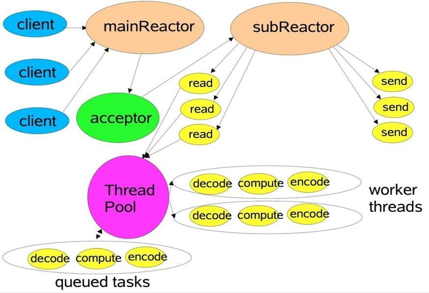
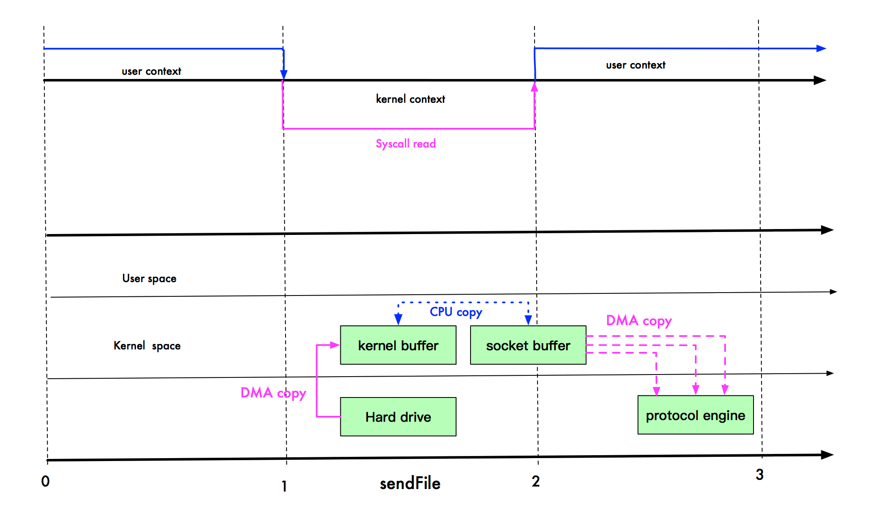

# JAVA IO

Java的IO也叫BIO（Blocking IO），即阻塞IO，所以BIO的操作是会阻塞线程的。

## 流

流是Java IO的核心。流是一个存放连续数据的流，可以从流中读取数据，也可以往流中写入数据；流可以分为**字节流和字符流**。

- **字节流**：**InputStream、OutputStream**，是存放一连串**字节数据**的流，操作字节流时是直接操作文件的，而没有使用缓冲区，字节流可以操作所有类型的数据
- **字符流**：**Reader 、Writer**，是存放一连串**字符数据**的流，字符流会创建一块内存空间作为缓冲区，然后把数据流拷贝到缓冲区中再做其他的操作，所以字符流是直接操作缓冲区的，字符流只能操作字符类型的数据

## 流的分类

jdk1.8中IO流使用到了装饰设计模式

**InputStream字节输入流**


**OutputStream字节输出流**


**Reader字符输入流**


**Writer字符输出流**


流也分为节点流和处理流，其中节点流是原数据存放的流，处理流是对节点流进行包装或者再加工等操作的流

**节点流**有：

- **数组流：**ByteArrayInputStream、ByteArrayOutputStream、CharArrayReader、CharArrayWriter

- **字符串流：**~~StringBufferInputStream~~（已弃用，官方推荐使用StringReader）、StringReader、StringWriter

- **对象流：**ObjectInputStream、ObjectOutputStream

- **管道流：**PipedInputStream、PipedOutputStream、PipedReader、PipedWriter

- **文件流：**FileInputStream、FileOutputStream、FileReader、FileWriter
- **打印流：**PrintStream、PrintWriter

**处理流**有：

- **转换流**（字节流到字符流的转换）：InputStreamReader、OutputStreamWriter
- **缓冲流**（提供一个缓冲区对节点流进行操作）：BufferedInputStream、BufferedOutputStream、BufferedReader、BufferedWriter
- **数据流**（可以处理各种类型的数据，输出输入流的读取写入顺序要一致）：DataInputStream、DataOutputStream
- **合成流**（将两个或多个输入流(按先后顺序)合成成一个流）：SequenceInputStream

## 流的使用

**InputStream有如下公共方法**


**read()：**读取输入流中的下一位字节

**read(byte b[])：**把输入流中的字节读到参数指定(b[])的字节数组中

**read(byte b[], int off, int len)：**从目标数组(b[])的第off位开始，读取输入流中len长度的字节到目标数组中

**skip(long n)：**跳过输入流中的n个字节

**available()：**返回输入流中还有多少个字节，即剩余长度

**mark(int readlimit)：**记录输入流的位置readlimit，与reset配合使用

**reset()：**将输入流指针指向的位置返回到mark()方法记录的位置，然后再读时就从mark()记录的位置开始读取

**close()：**关闭输入流，可以被gc


**OutputStream有如下公共方法**


**write(int b)：**将一个字节b写入到输出流中

**write(byte b[])：**将b[]字节数组中的字节写入到输出流中

**write(byte b[], int off, int len)：**将b[]字节数组中从第off位开始取len个字节写入到输出流中

**flush()：**如果有用到缓冲区，则调用flush()方法清空缓冲区，并且把缓冲区的数据刷新到某些媒介中(根据使用那种输出流而定，如FileOutputStream就写到文件中)。注意：如果输出流中使用到了缓冲区，不对该流进行flush()操作就关闭流的话，那么数据可能会丢失，因为数据还存在缓冲区中，并没有真正写到媒介上。

**close()：**关闭输出流，可以被gc


**reader有如下公共方法**


基本和字节输入流一样，不过单位从字节变成了字符而已


**writer有如下公共方法**


**ByteArrayInputStream与ByteArrayOutputStream的简单使用：**

```java
// 简单使用ByteArrayInputStream和ByteArrayOutputStream
    public static void useByteArrayStream1() throws IOException {
        byte[] bytes = "Stream".getBytes();  // 字节数组
        ByteArrayInputStream bais = new ByteArrayInputStream(bytes); // 创建输入流
        ByteArrayOutputStream baos = new ByteArrayOutputStream();  // 创建输出流
        System.out.println("字节数组的长度："+bytes.length);

        // 1.------
//        byte[] bytes1 = new byte[bytes.length];
//        int read1 = bais.read(bytes1); // 把输入流（bais）中的字节读取到bytes1数组中
//        int read = bais.read(bytes1,0,4); // 读取输入流（bais）中前4个字节到bytes1中，其中bytes1数组的索引从0开始

        long skip = bais.skip(2); // 跳过前两个字节

        // 2.------
//        bais.mark(3);  // 记录输入流的第3个字节
//        int flag = 0;

        int d;  // 记录读取输入流中的字节，当d为-1时则表明输入流已经读完了
        while ((d = bais.read()) != -1){

            int i = bais.available();  // 获取输入流中还有几个字节

            System.out.println("剩余长度："+i);
            System.out.println("读取到的字节："+d);
            // 2.------
//            flag++;
//            if (flag == 3){
//                bais.reset(); // 当flag等于3时把输入流的指针指向返回到bais.mark(3)记录的位置，即第3个字节
//            }
            baos.write(d);  // 将字节写入输出流
        }
        System.out.println("把输入流的字节写如输出流："+baos.toString());

        baos.flush(); // 关闭输出流
        bais.close(); // 关闭输入流
    }
```

```java
    public static void useByteArrayStream2() throws IOException {
        byte[] bytes = "Stream".getBytes();  // 字节数组
        ByteArrayInputStream bais = new ByteArrayInputStream(bytes); // 创建输入流
        ByteArrayOutputStream baos = new ByteArrayOutputStream();  // 创建输出流
        byte[] bytes1 = new byte[bytes.length];
        bais.read(bytes1);  // 将输入流中的字节读取到bytes1中
        baos.write(bytes1);  // 把bytes1中的字节写入到输出流中
//        baos.write(bytes1,0,3); // 把bytes1从第0位开始取3个字节写入到输出流中
        System.out.println(baos.toString());
        baos.close();  // 关闭输出流
        bais.close();  // 关闭输入流
    }
```


**BufferedReader与BufferedWriter的简单使用：**

```java
    public static void useBufferedReader() throws IOException {
        String msg = "字符输入流\n 第二行";
        BufferedReader br = new BufferedReader(new StringReader(msg)); // 将字符输入流写入到输入缓冲区中
        char[] chars = new char[msg.length()];
        br.read(chars);  // 将输入缓冲区中的字符读取到chars中
        StringWriter sw = new StringWriter();  // 创建一个字符输出流
        BufferedWriter bw = new BufferedWriter(sw); // 创建一个输出缓冲区
        bw.write(chars);  // 将chars写入到缓冲输出流中（注意:还没有输出到字符流中）
        bw.close(); 
        br.close();
        System.out.println(sw.toString());
    }
```

这个方法的运行结果：


上图中什么都没有输出，原因就是输出缓冲区没有调用flush()方法清空缓冲区，所以数据还再缓冲区中，并没有写入到StringWriter字符输出流中，所以我加上输出缓冲区的flush()方法：

```java
    public static void useBufferedReader() throws IOException {
        String msg = "字符输入流\n 第二行";
        BufferedReader br = new BufferedReader(new StringReader(msg)); // 将字符输入流写入到输入缓冲区中
        char[] chars = new char[msg.length()];
        br.read(chars);  // 将输入缓冲区中的字符读取到chars中
        StringWriter sw = new StringWriter();  // 创建一个字符输出流
        BufferedWriter bw = new BufferedWriter(sw); // 创建一个输出缓冲区
        bw.write(chars);  // 将chars写入到缓冲输出流中（注意:还没有输出到字符流中）
        bw.flush();   // 刷新缓冲区，将缓冲区的数据写入到StringWriter字符输出流中
        bw.close(); 
        br.close();
        System.out.println(sw.toString());
    }
```

运行结果：


可以看到加上了flush()方法后有能把字符输出了。


**FileInputStream与FileOutputStream的简单使用**

```java
    public static void useFileInputStream() throws IOException {
        File file = new File("D:\\aa.txt");  // 创建一个文件对象
        FileInputStream fis = new FileInputStream(file); // 将文件读取到输入流中,文件不能会报异常
        byte[] bytes = new byte[(int) file.length()];
        fis.read(bytes);  // 将文件内容读取到bytes中
        System.out.println(new String(bytes));
        FileOutputStream fos = new FileOutputStream(file);  // 创建一个文件输出流
        fos.write("更改文件内容".getBytes());  // 给输出流写入内容，并把内容写入到文件中
        fos.close();  // 关闭输出流
        fis.close();  // 关闭输入流
    }
```


**RandomAccessFile的使用**

这个类不属于IO，但它是一个很强大的处理文件的类，它可以随机访问文件的任意位置，可以修改任意位置的内容

```java
    public static void useRandomAccessFile() throws IOException {
        File file = new File("D:\\aa.txt");
        RandomAccessFile raf = new RandomAccessFile(file,"rw"); // 创建一个可读可写的随机访问文件对象
        raf.write("给aa文件添加内容".getBytes());  // 写入内容到文件
        raf.close();  // 关闭文件
        RandomAccessFile raf2 = new RandomAccessFile(file,"r");  //创建一个只读的文件独享

        byte[] bytes = new byte[(int) file.length()];
        raf2.read(bytes); // 将文件内容读取到bytes中, 指针指向字节的位置是尾部
        System.out.println(new String(bytes));
        raf2.seek(4);  // 将指针移到第4个字节处(注意:一个中文3个字节)
        byte[] bytes1 = new byte[bytes.length];
        int read = raf2.read(bytes1);  // 将从第4个字节到最后的字节读取到bytes1中
        System.out.println(new String(bytes1));
        raf2.close();  // 关闭文件
    }
```

运行结果：


## 实现socket通信

socket在等待客户端连接、读客户端发送过来的数据报、写数据报返回给客户端这些过程都是阻塞的。

**实现一对一的socket通信（一个客户端，一个服务端）：**

socket服务端

```java
public static void socketServer1(){
    try {
        ServerSocket socket = new ServerSocket(port); // 创建一个socket服务器，并绑定8888端口
        System.out.println("启动socket服务端成功，绑定的端口号："+port);
        System.out.println("正在等待客户端的链接。。。。。");
        Socket accept = socket.accept();  // 等待socket客户端连接（阻塞等待）
        System.out.println("接收到客户端 "+accept.getInetAddress() +" 的连接");
        // 创建缓冲流来读取socket客户端发送过来的数据
        BufferedReader br = new BufferedReader(new InputStreamReader(accept.getInputStream()));
        String data;
        while ((data = br.readLine()) != null){  // 无限循环读取socket客户端发送过来消息
            System.out.println("接收到客户端的内容："+data);
        }
    }catch (IOException e) {
        e.printStackTrace();
    }
}
```

socket客户端

```JAVA
public static void socketClient1(){
    try {
        Socket socket = new Socket("127.0.0.1",8888); // 创建一个socket客户端并连接8888端口
        System.out.println("连接socket服务器成功。。。。");
        // 创建一个数据流来发送数据报
        BufferedWriter bw = new BufferedWriter(new OutputStreamWriter(socket.getOutputStream()));
        // 读取控制台输入的数据
        BufferedReader br = new BufferedReader(new InputStreamReader(System.in, StandardCharsets.UTF_8));
        while (true){
            String data = br.readLine(); // 读取一行数据
            bw.write(data);  // 发送数据报内容
            bw.write("\n");   // 发送数据报结束符，告诉服务器已经发送完了
            bw.flush();   // 刷新缓冲区，将数据发送给服务器
        }
    } catch (IOException e) {
        e.printStackTrace();
    }
}
```

先启动服务端，再启动客户端


这样就可以进行通信了，其中服务端与客户端都是使用IO流来发送接受数据的，因此在读取和写数据报的时候，线程是阻塞的。

如果我停掉客户端，服务端会抛出一个`java.net.SocketException: Connection reset`异常并且停止，由于线程会在

data = br.readLine()阻塞，知道IO读到数据才会有返回，如果在阻塞的过程中，客户端断开了，相当于br不能接受到客户端的数据，所以会抛出Connection reset异常。

目前socket服务端只能连接一个客户端，我们可以使用多线程来实现一个服务端可以连接多个客户端。

**实现一对多的socket通信（多个客户端，一个服务端）：**

服务端：

```JAVA
    public static void socketServer2(){
        // 创建一个线程池
        ThreadPoolExecutor executor = new ThreadPoolExecutor(8,16,60,
                TimeUnit.SECONDS,new ArrayBlockingQueue<>(8), new ThreadPoolExecutor.AbortPolicy());

        try {
            ServerSocket socket = new ServerSocket(port); // 创建一个socket服务器，并绑定8888端口
            System.out.println("启动socket服务端成功，绑定的端口号："+port);
            System.out.println("正在等待客户端的链接。。。。。");
            while (true){  // 无限循环等待socket客户端发送过来消息
                Socket accept = socket.accept();  // 等待socket客户端连接（阻塞等待）
                System.out.println("接收到客户端 "+accept.getRemoteSocketAddress() +" 的连接");
                // 从线程池中获取一个线程资源
                executor.execute(() -> {
                    DataInputStream dis = null; // 创建数据流来读取socket客户端发送过来的数据
                    DataOutputStream dos = null; // 创建数据流来发送响应到客户端
                    try {
                        dis = new DataInputStream(accept.getInputStream());
                        dos = new DataOutputStream(accept.getOutputStream());
                    } catch (IOException ioException) {
                        ioException.printStackTrace();
                    }
                    // 无限循环等待客户端发送过来的数据报
                    while (true){
                        try {
                            int len = dis.readInt(); // 读取客户端中数据报的长度
                            byte[] data = new byte[len];
                            dis.read(data);     // 将数据报内容读取到data中
                            System.out.println("数据长度："+len);
                            System.out.println("数据内容："+new String(data));
                            
                            // 响应给客户端的数据报
                            byte[] res = "已收到".getBytes();
                            dos.writeInt(res.length+5); // 响应数据的长度
                            dos.write(res); // 响应数据写到输出流
                            dos.flush();   // 响应数据到客户端
                        } catch (IOException ioException) {
                            ioException.printStackTrace();
                            try {
                                accept.close();  // 关闭socket连接
                            } catch (IOException e) {
                                e.printStackTrace();
                            }
                            break;
                        }
                    }

                });
            }
        }catch (IOException e) {
            e.printStackTrace();
        }
    }
```

客户端：

```java
    public static void socketClient2() {
        try {
            Socket socket = new Socket("127.0.0.1", 8888); // 创建一个socket客户端并连接8888端口
            System.out.println("连接socket服务器成功。。。。");
            // 创建一个数据流来发送数据报
            DataOutputStream dos = new DataOutputStream(socket.getOutputStream());
            DataInputStream dis = new DataInputStream(socket.getInputStream());
            // 开启一个线程来接受服务端返回来的数据报
            new Thread(() -> {
                while (true){
                    try {
                        int len = dis.readInt();  // 读取服务端响应的长度
                        byte[] b = new byte[len];
                        dis.read(b);   // 读取服务端响应的数据
                        System.out.println("服务端响应："+new String(b));
                    } catch (IOException ioException) {
                        ioException.printStackTrace();
                    }
                }
            }).start();

            // 读取控制台输入的数据
            BufferedReader br = new BufferedReader(new InputStreamReader(System.in, StandardCharsets.UTF_8));
            // 无限循环等待获取控制台输入的数据(一行发送一次)
            while (true) {
                String data = br.readLine();   // 读取控制台输入的一行数据
                byte[] bytes = data.getBytes();
                dos.writeInt(bytes.length+5);  // 发送数据报长度
                dos.write(bytes);   // 发送数据报内容
                dos.flush();   // 刷新缓冲区，将数据发送给服务器
            }
        } catch (IOException e) {
            e.printStackTrace();
        }
    }
```

运行测试结果：


使用阻塞IO进行数据的传输，每一个I/O操作都会阻塞当前线程，在socket中通信时虽然可以实现一个服务端对多个客户端，但是每个客户端连接都需要为服务端开启一个线程，当很多客户端时就会导致创建很多个线程。

# JAVA NIO

NIO（Non-blocking IO）是非阻塞IO，即在进行IO操作时不会阻塞线程，当然也可以设置配置来阻塞线程做IO操作。NIO的核心有三个，channel、buffer、selector。NIO不再是使用**流**来操作数据，NIO引入了**channel（通道）**和**buffer（缓冲区）**来对数据进行操作，一个channel对应一个buffer。通道是双向的，而流是单向的，所以NIO对数据的操作方式更多。NIO的缓冲区分为**直接缓冲区和非直接缓冲区**。

- **直接缓冲区：**在JVM外创建一块缓冲区，即不会拷贝一份副本到JVM内存中，它绕过JVM直接操作物理内存，效率更高
- **非直接缓冲区：**在JVM内创建的缓冲区，会拷贝一份副本到JVM内存中，它比直接缓冲区多了一个拷贝操作，效率比直接缓冲区低

## channel（通道）

channel是通道，它跟流的作用类似，不过通道是双向的，而流是单向的。在BIO中，操作数据时是直接操作流的，而在NIO中，操作数据时不会直接在channel中，而是在buffer中，先把数据写入buffer中，然后再把buffer给channel。读数据时也是要先把数据从channel中读到buffer中，然后再对buffer进行数据操作。

channel有以下实现类：

- **FileChannel：**文件通道，用来对文件进行处理的
- **SocketChannel：**socket通道，对应socket编程中的Socket，即连接ServerSocket的客户端
- **ServerSockectChannel：**socket服务端通道，对应socket编程中的ServerSocket
- **DatagramChannel：**UDP通信的通道，对应DatagramSocket类

## buffer（缓冲区）

buffer就是一个连续数组，不过它还有自己特有的数据结构，可以记录操作的字节的位置。NIO操作数据的流程是先将数据写入buffer（缓冲区）,在把缓冲区的内容写入到channel（通道中），所以buffer才是NIO操作数据的真正媒介。

**buffer源码中有4个核心的属性：**

- **mark = -1：**表示记录数组的索引（position），mark()方法可以记录，配合reset()方法使用，调用reset()方法则把position设置为记录的position
- **position = 0：**数组的下标，读/写到第几个元素
- **limit：**限制只能读/写多少个元素
- **capacity：**数组的容量

它们的关系是**mark <= position <= limit <= capacity**

**Buffer抽象类里重要的方法：**

- **capacity()：**返回buffer的容量
- **position()：**返回buffer当前元素的位置
- **position(int newPosition)：**设置一个新的位置
- **limit()：**返回限制到第几个元素的位置
- **limit(int newLimit)：**设置一个新的限制数
- **mark()：**记录当前元素的位置
- **reset()：**将position重置到mark()记录的位置
- **clear()：**重置buffer的**mark、position、limit**到初始状态，通常在数据的大小**大于buffer的容量**，需要**多次**将数据写入buffer的时候用
- **flip()：**反转buffer，即将position的值赋值limit后移回到第一个元素（position=0），并把mark初始化，每次读完/写完都要使用flip反转
- **hasRemaining()：**判断当前位置是否还有元素


如上代码每一步在buffer中**mark、position、limit、capacity**的变化


里面buffer中的abcde对应的应该是字节，只是用字符代替好看一点

## selector（选择器）

selector是NIO的一个很强大组件，它相当于一个事件监听器。它可以管理多个channel，只需要一个线程就可以对很多channel进行操作，如果把channel看作流，那么就是说selector只需要用一个线程可以操作很多个流。

只需要把channel注册到selector中，就可以通过selector一个线程来对channel进行多种操作。selector有四种监听事件：

- **可读 : SelectionKey.OP_READ**   通道准备好读数据时可以对通道进行读数据操作
- **可写 : SelectionKey.OP_WRITE**   通道准备好写数据时可以对通道进行写数据操作
- **连接 : SelectionKey.OP_CONNECT**   成功连接通道时会到这里做某些操作
- **接收 : SelectionKey.OP_ACCEPT**    接受到连接请求时会到这里做某些操作

**selector的一些重要的方法：**

- **open()：**打开一个selector
- **keys()：**返回注册到selector的channel的集合，即**selected-key**的总数
- **selectedKeys()：**返回channel捕获到channel事件（read、write、connect、accept）的**selected-key**的集合
- **select()：**阻塞监听channel事件，通过轮询不断对（read、write、connect、accept）事件进行判断
- **selectNow()：**不阻塞监听channel事件，立刻返回捕获到的事件，如没有就返回0
- **select(long timeout)：**监听channel，阻塞timeout秒，每timeout秒返回一次结果，无论有没有捕获到事件
- **weakup()：**唤醒阻塞在select()的selector，如果使用**无参**的**selector.select()**阻塞捕获事件的话，新注册事件前必须得先调用**selector.weakup()**唤醒阻塞的线程，然后再注册到selector中。

**selected-key**是channel注册到selector后返回的**SelectionKey**对象，一个**SelectionKey**对象代表channel注册到selector后的关联，即可以通过**SelectionKey**获取channel对象，也可以获取到selector对象，要删除一个**SelectionKey**对象必须先调用**cancel()**取消该channel的注册，即从selector中把该channel从注册集合中移除，并且会把取消注册的channel存入到一个**cancelled-key**集合。

## NIO实现socket通信

服务端：

```java
package com.hat.javaadvance.io.nio;

import java.io.IOException;
import java.net.InetSocketAddress;
import java.nio.ByteBuffer;
import java.nio.channels.*;
import java.util.HashMap;
import java.util.Iterator;
import java.util.Map;

public class NioSocketServer {
    private static Map<String,String> data = new HashMap<>();
    public static void main(String[] args) throws IOException {
        // 打开一个socket服务端通道channel
        ServerSocketChannel socketChannel = ServerSocketChannel.open();
        // 打开一个选择器selector
        Selector selector = Selector.open();
        // 绑定8888端口
        socketChannel = socketChannel.bind(new InetSocketAddress(8888));
        // 设置socket为非阻塞的
        socketChannel.configureBlocking(false);
        // 将socket服务端注册到选择器selector中，并且注册事件是OP_ACCEPT,这里注册的是ServerSocketChannel
        socketChannel.register(selector, SelectionKey.OP_ACCEPT);

        while (true){
            // 监听是否有selectKey，每1秒返回一次
            int events = selector.select();
            if (events > 0){
                // 如果有捕获到事件selectedKeys一定存在SelectionKey，
                // 获取SelectionKey集合的迭代器
                Iterator<SelectionKey> iterator = selector.selectedKeys().iterator();
                // 遍历迭代器
                while (iterator.hasNext()){
                    // 遍历出的SelectionKey对象
                    SelectionKey selectionKey = iterator.next();
                    if (selectionKey.isAcceptable()){ // 如果事件是OP_ACCEPT，捕获到客户端的连接事件
                        // 通过SelectionKey对象获取到触发OP_ACCEPT事件的channel
                        ServerSocketChannel channel = (ServerSocketChannel) selectionKey.channel();
                        // 因为已经触发了OP_ACCEPT事件，所以socket的accept()方法一定立刻返回，所以不存在阻塞问题
                        // 获取连接到socket服务端的socket客户端的SocketChannel
                        SocketChannel accept = channel.accept();
                        accept.configureBlocking(false);
                        System.out.println("来自客户端 "+ accept.getRemoteAddress()+" 的连接~~");

                        // 再注册OP_READ事件到selector中，将OP_READ事件的处理交给其他方法处理
                        // 第3个参数是SelectionKey的一个附带属性对象，等SelectionKey的channel读事件被捕获到时可以获取这个对象来进行数据操作
                        // 这里注册的是SocketChannel
                        accept.register(selector,SelectionKey.OP_READ, ByteBuffer.allocate(1024));

                    }else if (selectionKey.isReadable()){ // 如果事件是OP_READ，捕获到读取客户端的发送过来的数据的事件
                        // 通过SelectionKey获取到触发OP_READ的channel（这里的channel是SocketChannel而不是ServerSocketChannel）
                        SocketChannel channel = (SocketChannel) selectionKey.channel();
                        // 获取SelectionKey设置的附带对象attachment，就是在注册OP_READ事件时的第3个参数（ByteBuffer）
                        ByteBuffer attachment = (ByteBuffer) selectionKey.attachment();
                        StringBuilder sb = new StringBuilder(); // 保存客户端发送过来的内容
                        // 将SocketChannel中读取到的数据写入attachment
                        int read = channel.read(attachment);
                        System.out.print("客户端 " + channel.getRemoteAddress() + " 说：");
                        // 循环读取SocketChannel中的数据
                        // read == -1时表明客户端已经写完，并且取消了对应的SelectionKey或者调用shutdownOutput()关闭写
                        // read == 0时，客户端没有新数据发送过来
                        // read > 0时，客户端又数据发送过来
                        while (read > 0){
                            attachment.flip(); // 反转attachment字节buffer
                            sb.append(new String(attachment.array(),0,read));
                            attachment.clear();  // 重置attachment字节buffer
                            read = channel.read(attachment);  // 接着读取SocketChannel中的数据
                        }
                        System.out.println(sb.toString()); //打印客户端发送过来的数据
                        com.hat.javaadvance.netty.nio.NioSocketServer.data.put(channel.getRemoteAddress().toString(),sb.toString());
                        // 将该channel注册到selector中的事件改成OP_WRITE
                        // 相当于channel.register(selector,SelectionKey.OP_WRITE,attachment);
                        selectionKey.interestOps(SelectionKey.OP_WRITE);

                    }else if (selectionKey.isWritable()){ // 如果事件是OP_WRITE，触发服务端的写事件，写入内容返回给客户端
                        // 获取SocketChannel
                        SocketChannel channel = (SocketChannel) selectionKey.channel();
                        String msg = "我已收到您的消息："+data.get(channel.getRemoteAddress().toString());
                        channel.write(ByteBuffer.wrap(msg.getBytes())); // 组装响应信息并写入channel
                        selectionKey.interestOps(SelectionKey.OP_READ); // 将注册的事件更改为OP_READ
                    }
                    iterator.remove(); // 操作完后把捕获到事件的SelectionKey移除掉
                }
            }
        }
    }
}
```

客户端：

```java
package com.hat.javaadvance.io.nio;

import java.io.IOException;
import java.net.InetSocketAddress;
import java.nio.ByteBuffer;
import java.nio.channels.ClosedChannelException;
import java.nio.channels.SelectionKey;
import java.nio.channels.Selector;
import java.nio.channels.SocketChannel;
import java.util.Iterator;
import java.util.Scanner;

public class NioSocketClient {
    public static void main(String[] args) throws IOException {
        SocketChannel socketChannel = SocketChannel.open();  // 创建一个SocketChannel
        Selector selector = Selector.open();  // 创建一个Selector
        socketChannel.configureBlocking(false);  // 设置SocketChannel为非阻塞的
        socketChannel.register(selector, SelectionKey.OP_CONNECT);  // SocketChannel注册OP_CONNECT事件（连接服务端触发）
        // 创建一个线程监听控制台输入
        new Thread(() -> {
            try {
                Scanner scanner = new Scanner(System.in);
                // 按行读取控制台输入的数据
                while (scanner.hasNextLine()) {
                    String next = scanner.nextLine();
                    // 没有数据时继续，不发送给服务端
                    if ("".equals(next)){
                        continue;
                    }
                    // 包装控制台输入的数据成ByteBuffer
                    ByteBuffer buffer = ByteBuffer.wrap(next.getBytes());
                    // 唤醒selector.select();中的阻塞的线程，如果使用无参的select()时必须得使用wakeup()唤醒线程再注册事件，
                    // 否则注册的事件不会触发selector的监听，因此还会一直阻塞在select()
                    selector.wakeup();
                    // socketChannel注册OP_WRITE事件，发送数据给客户端
                    socketChannel.register(selector, SelectionKey.OP_WRITE, buffer);
                }
            } catch (ClosedChannelException e) {
                e.printStackTrace();
            }
        }).start();

        // 连接服务端
        socketChannel.connect(new InetSocketAddress("127.0.0.1", 8888));

        // 循环执行Selector
        while (true) {
            int events = selector.select();  // 阻塞监听事件的触发，只有触发了事件后才有返回
            if (events > 0) {  // 触发的事件
                // 获取触发的事件的SelectionKey集合的迭代器
                Iterator<SelectionKey> iterator = selector.selectedKeys().iterator();
                while (iterator.hasNext()) { // 遍历
                    SelectionKey selectionKey = iterator.next();  // 获取SelectionKey对象
                    if (selectionKey.isReadable()) {  // 如果是OP_READ事件
                        SocketChannel channel = (SocketChannel) selectionKey.channel(); // 获取通道，其实跟上面的socketChannel是同一个对象
                        StringBuilder sb = new StringBuilder(); // 保存服务端发送过来的内容
                        ByteBuffer buffer = ByteBuffer.allocate(1024); // 初始化一个ByteBuffer
                        // 将SocketChannel中读取到的数据写入buffer
                        int read = channel.read(buffer);
                        System.out.print("服务端 " + channel.getRemoteAddress() + " 说：");
                        // 循环读取SocketChannel中的数据
                        // read == -1时表明服务端已经写完，并且取消了对应的SelectionKey或者调用shutdownOutput()关闭写
                        // read == 0时，服务端没有新数据发送过来
                        // read > 0时，服务端又数据发送过来
                        while (read > 0) {
                            buffer.flip(); // 反转attachment字节buffer
                            sb.append(new String(buffer.array(), 0,read));
                            buffer.clear();  // 重置attachment字节buffer
                            read = channel.read(buffer);  // 接着读取SocketChannel中的数据
                        }
                        System.out.print(sb.toString()); //打印客户端发送过来的数据
                        selectionKey.interestOps(0); // 取消当前的事件（OP_READ）

                    } else if (selectionKey.isConnectable()) {  // 触发OP_CONNECT事件，连接服务端时触发
                        while (!socketChannel.finishConnect()) ; // 无限循环判断连接是否成功
                        // 连接成功后注册OP_READ事件
                        socketChannel.register(selector, SelectionKey.OP_READ);

                    } else if (selectionKey.isWritable()) {  // 触发OP_WRITE事件，写数据发送给服务端
                        ByteBuffer attachment = (ByteBuffer) selectionKey.attachment();  // 读取刚才注册写事件时传入的附加对象
                        int write = socketChannel.write(attachment);// 写数据发送给服务端
                        selectionKey.interestOps(SelectionKey.OP_READ); // 注册事件改为OP_READ
                    }
                    iterator.remove();  // 把当前的selectionKey从迭代器删除
                }
            }
        }
    }
}
```

启动服务端和两个客户端


NIO实现socket通信的代码其实是挺复杂的，而且如果客户端发送的数据长度大于1024（ON_READ读事件中的bytebuffer初始化大小）时，会出现bytebuffer容量越界的情况，bytebuffer本身的API不支持扩容，所以这就需要我们自己去实现一套解决方案。

比如可以在客户端要发送的数据前加上长度，然后服务端再解析这个长度。也可以自定义一种协议，客户端与服务端都按照自定义的协议来进行数据交互。。。。

```java
sb.append(new String(buffer.array(), 0,read));  // 客户端
sb.append(new String(attachment.array(),0,read));  // 服务端
```

上面这两句代码有可能会出现乱码问题。如果buffer的容量无法一次接受客户端/服务端的数据，那么buffer.array()只是将一部分数据的字节转换成字符串，如果最后一位是中文，一个中文占3个字节，恰好buffer只读到这个中文的前2个字节，那么最后转成字符串就会出现乱码。造成这个的原因还是bytebuffer容量越界。

# Netty

Netty 是一款异步的**事件驱动**的网络应用程序框架，支持快速地开发可维护的高性能的面向协议的服务器。它支持多种协议，比如常见的http、socket、UDP等等。官方关于netty的一张图


## Reactor 线程模型

- **单Reactor单线程**：BIO传统阻塞IO

  - 模型图：

    

    **单Reactor单线程**模式的处理客户端的请求至始至终都只有一个线程，所以每一步操作都是阻塞的

- **单Reactor多线程**：NIO非阻塞IO

  - 模型图：

    

    **单Reactor多线程**模式的多线程是处理handler的线程，即为每个handler创建一个线程来做具体的业务操作，应用程序会维护一个线程池，然后有新的handler需要处理时就分配一个线程来处理这个handler的业务操作。这样Reactor专注于接受客户端的连接和分发handler给woker线程池。

- **主从Reactor多线程：**

  - 模型图：

    **主从Reactor多线程**是在**单Reactor多线程**的基础上对**Reactor**再分割，**主Reactor**只负责接受客户端的请求然后分发Handler给**从Reactor**，**从Reactor**再为每个Handler创建一个线程来执行各自的业务操作。

## Netty原理模型图



Netty在**主从Reactor多线程**模型中再进行了一些优化，最终Netty的模型图如上

Netty服务端的运行架构图：


## Netty模块组件

### Bootstrap与ServerBootstrap

这两个类都继承AbstractBootstrap，并且它们根据自己的一些特性重写了AbstractBootstrap的一些方法

- **Bootstrap**：客户端启动类
- **ServerBootstrap**：服务端启动类

一个Netty启动都是从Bootstrap与ServerBootstrap开始，这两个类是引导启动类，它给一个Netty程序装载程序所需的其他组件。

常用的一些方法：

- **group(EventLoopGroup group)**：装载一个EventLoopGroup，一般客户端（**Bootstrap**）使用，相当于把**parentGroup**与**childGroup**都装载同一个EventLoopGroup

- **group(EventLoopGroup parentGroup, EventLoopGroup childGroup)**：装载两个EventLoopGroup，第一个相当于mainReactor，第二个相当于subReactor。一般服务端（**ServerBootstrap**）使用
- **channel(Class<? extends C> channelClass)**：创建一个通道（channel），根据不同协议创建不同的通道
- **option(ChannelOption<T> option, T value)**：设置**parentGroup**的属性
- **attr(AttributeKey<T> key, T value)**：设置**parentGroup**的channel中的附带属性AttributeKey
- **handler(ChannelHandler handler)**：设置一个操作**parentGroup**的handler，相当于acceptor监听到客户端连接后做的处理
- **childOption(ChannelOption<T> childOption, T value)**：设置**childGroup**的属性
- **childAttr(AttributeKey<T> childKey, T value)**：设置**childGroup**的channel中的附带属性AttributeKey

- **childHandler(ChannelHandler childHandler)**：设置一个操作**childGroup**的handler，相当于接受客户端的数据后做read、write、send等操作

带有child的方法一般是给**childGroup**设置的，这个也就是subReactor，主要是做客户端成功连接后的一些列操作

不带child的方法一般是给**parentGroup**设置的，这个就是mainReactor，主要做一些网络IO操作，然后把这个连接分发给**childGroup**进一步做处理

### **NioEventLoop**与**NioEventLoopGroup**

- **NioEventLoopGroup**相当于是一个线程池，**NioEventLoop**相当于是**NioEventLoopGroup**中的一个线程。**NioEventLoopGroup**管理**NioEventLoop**的生命周期。**NioEventLoopGroup**在初始化时，线程池的大小默认是cpu逻辑处理器数（线程）*2，线程池的大小也就是NioEventLoop对象的最大个数。

- **NioEventLoop**维护了一个**selector**和一个**taskQueue**，其中的**selector**作用跟NIO一样，不断轮询监听某种事件的发生。由于**NioEventLoop**持有**selector**对象，所以**NioEventLoop**也能获取到**channel**。**queue**队列是一个任务队列，**NioEventLoop**在监听到**read**/**write**事件后，可以把具体的业务操作扔进**taskQueue**执行，这样就不会阻塞在耗时的业务操作上了，不过**taskQueue**是一个队列，如果把多个业务操作扔进队列中，执行顺序永远是先进队的先执行。

  **NioEventLoop**需要执行两种任务，一种是IO任务，一种是非IO任务，IO任务就是**selector**中的**read、write、accept、connect**这几种事件的监听；非IO任务就是**taskQueue**，也就是执行触发上面几种事件后扔到queue中的具体业务操作。

### Channel

channel是Netty实现网络通信的通道，其实与NIO中的通道类似，具体要看使用什么协议来通信，然后使用对应的通道。

一些常用的channel

- **NioSocketChannel：Socket客户端连接。**
- **NioServerSocketChannel：Socket 服务端连接。**
- **NioDatagramChannel： UDP 连接。**
- **NioSctpChannel： Sctp 客户端连接。**
- **NioSctpServerChannel：Sctp 服务端连接**

### option

option是给channel设置参数用的，具体的属性含义：https://www.jianshu.com/p/0bff7c020af2

### ChannelHandler与ChannelPipeline与ChannelHandlerContext

在源码上官方对ChannelPipeline与ChannelHandler的关系的解释

```java
 *                                                 I/O Request
 *                                            via {@link Channel} or
 *                                        {@link ChannelHandlerContext}
 *                                                      |
 *  +---------------------------------------------------+---------------+
 *  |                           ChannelPipeline         |               |
 *  |                                                  \|/              |
 *  |    +---------------------+            +-----------+----------+    |
 *  |    | Inbound Handler  N  |            | Outbound Handler  1  |    |
 *  |    +----------+----------+            +-----------+----------+    |
 *  |              /|\                                  |               |
 *  |               |                                  \|/              |
 *  |    +----------+----------+            +-----------+----------+    |
 *  |    | Inbound Handler N-1 |            | Outbound Handler  2  |    |
 *  |    +----------+----------+            +-----------+----------+    |
 *  |              /|\                                  .               |
 *  |               .                                   .               |
 *  | ChannelHandlerContext.fireIN_EVT() ChannelHandlerContext.OUT_EVT()|
 *  |        [ method call]                       [method call]         |
 *  |               .                                   .               |
 *  |               .                                  \|/              |
 *  |    +----------+----------+            +-----------+----------+    |
 *  |    | Inbound Handler  2  |            | Outbound Handler M-1 |    |
 *  |    +----------+----------+            +-----------+----------+    |
 *  |              /|\                                  |               |
 *  |               |                                  \|/              |
 *  |    +----------+----------+            +-----------+----------+    |
 *  |    | Inbound Handler  1  |            | Outbound Handler  M  |    |
 *  |    +----------+----------+            +-----------+----------+    |
 *  |              /|\                                  |               |
 *  +---------------+-----------------------------------+---------------+
 *                  |                                  \|/
 *  +---------------+-----------------------------------+---------------+
 *  |               |                                   |               |
 *  |       [ Socket.read() ]                    [ Socket.write() ]     |
 *  |                                                                   |
 *  |  Netty Internal I/O Threads (Transport Implementation)            |
 *  +-------------------------------------------------------------------+
```

按照如下顺序往**pipeline**中添加**handler**

```java
ch.pipeline().addLast(new Outbound1());
ch.pipeline().addLast(new Outbound2());
ch.pipeline().addLast(new Inbound1());
ch.pipeline().addLast(new Inbound2());
```

则**ChannelHandler与ChannelPipeline与ChannelHandlerContext**三者有如下的关系


**`ChannelPipeline`**：

ChannelPipeline是一个双向链表，它存放了一系列ChannelHandler来处理一个channel（客户端成功连接的channel）的read、write等事件。每新增一个ChannelHandler到ChannelPipeline中，就会创建一个ChannelHandler与ChannelPipeline的上下文，即ChannelHandlerContext。ChannelPipeline中**fire开头**的方法都是将**当前操作**传播给**下一个ChannelHandler**进一步处理，而且基本都是传播给下一个Inbound。

**`ChannelHandlerContext`**

ChannelHandlerContext是在ChannelHandler添加进ChannelPipeline的时候创建的，该上下文对象是ChannelHandler与ChannelPipeline关联的上下文，它同时拥有ChannelHandler与ChannelPipeline，是个很大重量级的对象

**`ChannelHandler`**：

ChannelHandler可以处理一个IO事件或者拦截一个IO事件，也可以转发到其他ChannelHandler继续对IO事件进行处理。ChannelHandler一般可以分为两种，一种是ChannelInboundHandler**入站**Handler，一种是ChannelOutboundHandler是**出站**Handler。

出站与入站是相对的，如果当前channel是服务端。那么入站就是接受客户端channel发送过来的数据，出站就是服务端channel响应数据回客户端channel，否则反之。

Netty封装了很多**Decoder**解码器和**Encoder**编码器，这些编/解码器可以对传输的数据进行一定程度的处理。然后我们只需要去处理具体的数据业务操作(inbound和outbound)。编/解码器的种类具体可以查看继承了**ChannelHandler**的那些实现类。

一般我们都自定义**InboundHandler**和**OutboundHandler**来完成数据的交互，通过**继承ChannelInboundHandlerAdapter**、**ChannelOutboundHandlerAdapter**或者**ChannelDuplexHandler**来实现。也可以通过继承**SimpleChannelInboundHandler**来实现。

- **ChannelInboundHandlerAdapter**：处理入站数据的类（客户端发送过来的数据）,以下是生命周期
  - **handlerAdded()**：添加一个handler后触发
  - **channelRegistered()：** channel注册到EventLoop
  - **channelActive()：**channel已准备就绪，准备接受数据
  - **channelRead(ChannelHandlerContext ctx, Object msg)：**可以读取客户端或者上一个InboundHandler转发过来的数据，msg是传输的数据
  - **channelReadComplete()：**已经读完数据
  - **channelInactive()：**channel被关闭了
  - **channelUnregistered()：**channel从EventLoop中注销
  - **handlerRemoved()：**移除一个handler后触发
- **ChannelOutboundHandlerAdapter**：处理出站数据的类。以下常用方法
  - **write(ChannelHandlerContext ctx, Object msg, ChannelPromise promise)：**这个方法是接受**ctx.write()**等写方法后回调的，这里可以进一步处理数据
- **ChannelDuplexHandler**：这是一个组合类，它可以处理入站与出站的数据

多个ChannelHandler的添加到**ChannelPipeline**是**有顺序要求**的。比如我上面的图中添加了4个ChannelHandler，它们在一开始就已经确定了每个ChannelHandler的位置。**入站**操作是按照添加进Pipeline的**正序执行**的，而**出站**操作是按照**反序执行**的，上面例子的执行顺序是：**Inbound1=====》Inbound2=====》Outbound2=====》Outbound1**  。

如果还有解码器和编码器，则需要把编解码器放在它们之前。

但是这种顺序不是绝对的，它可能会出现其他情况，比如在**Inbound1**中想要把数据**转发到Inbound2**中，需要调用**ctx.fireChannelRead(msg)**方法,如果调用了**ctx.writeAndFlush(msg)**方法，则会**跳过Inbound2**，**直接到Outbound2**。

**ctx.writeAndFlush(msg)**与**ctx.channel().writeAndFlush(msg)**

- **ctx.writeAndFlush(msg)**：使用ctx的write方法，**上下文**会从**当前Handler**开始，**往前**寻找下一个Outbound。
- **ctx.channel().writeAndFlush(msg)**：使用channel的write方法，**每次**都会从Pipeline的**最后一个Handler**开始**往前**寻找下一个Outbound，在**最后一个Outbound类**中**不要使用**ctx.channel().writeAndFlush(msg)，否则会造成死循环

测试代码：

NettyServer服务端

```java
package com.hat.javaadvance.netty.netty;

import io.netty.bootstrap.ServerBootstrap;
import io.netty.channel.*;
import io.netty.channel.nio.NioEventLoopGroup;
import io.netty.channel.socket.SocketChannel;
import io.netty.channel.socket.nio.NioServerSocketChannel;

/**
 * Netty实现Socket服务端
 */
public class NettyServer {
    public static void main(String[] args) throws InterruptedException {
        // bossGroup，一个线程池监听channel的accpet事件,这里指定了线程的数量，默认是cpu逻辑处理器的个数*2
        EventLoopGroup boss = new NioEventLoopGroup(2);
        // workerGroup，这个线程池完成channel的各种交互事件
        EventLoopGroup worker = new NioEventLoopGroup();
        try {
            ServerBootstrap serverBootstrap = new ServerBootstrap(); // 创建一个服务端启动器
            serverBootstrap.group(boss,worker)   // 设置两个EventLoopGroup
                    .channel(NioServerSocketChannel.class) // 使用的channel，根据具体协议而定，这里是socket协议
                    .option(ChannelOption.SO_BACKLOG,1000) // 设置bossGroup的最大连接数，windows默认200，linux默认128
                    .childOption(ChannelOption.SO_KEEPALIVE,true)  // 设置workerGroup为保持连接
                    .childHandler(new ChannelInitializer<SocketChannel>() {

                        @Override
                        protected void initChannel(SocketChannel ch) {  // 设置ChannelHandler
                            // 添加4个Handler
                            ch.pipeline().addLast(new ServerOutHandler());
                            ch.pipeline().addLast(new ServerOutHandler2());
                            ch.pipeline().addLast(new ServerInHandler());
                            ch.pipeline().addLast(new ServerInHandler2());
                        }
                    });
            // 同步监听绑定8888端口，阻塞到绑定成功
            ChannelFuture future = serverBootstrap.bind(8888).sync();
            System.out.println("服务器启动成功~~");
            // 同步监听关闭channel
            future.channel().closeFuture().sync();
        }finally {
            // 优雅关闭两个EventLoopGroup
            boss.shutdownGracefully();
            worker.shutdownGracefully();
        }

    }
}

```

ServerInHandler

```java
package com.hat.javaadvance.netty.netty;

import io.netty.buffer.ByteBuf;
import io.netty.buffer.Unpooled;
import io.netty.channel.ChannelHandlerContext;
import io.netty.channel.ChannelInboundHandlerAdapter;
import io.netty.util.CharsetUtil;

public class ServerInHandler extends ChannelInboundHandlerAdapter {
    @Override
    public void channelRead(ChannelHandlerContext ctx, Object msg) throws Exception {
        ByteBuf data = (ByteBuf) msg;
        String m = "ServerInHandler《====="+data.toString(CharsetUtil.UTF_8);
        System.out.println(m);
        ctx.fireChannelRead(Unpooled.copiedBuffer(m,CharsetUtil.UTF_8)); // 转发给下一个inbound继续执行
    }
}

```

ServerInHandler2

```java
package com.hat.javaadvance.netty.netty;

import io.netty.buffer.ByteBuf;
import io.netty.buffer.Unpooled;
import io.netty.channel.ChannelHandlerContext;
import io.netty.channel.ChannelInboundHandlerAdapter;
import io.netty.util.CharsetUtil;

public class ServerInHandler2 extends ChannelInboundHandlerAdapter {
    @Override
    public void channelRead(ChannelHandlerContext ctx, Object msg) throws Exception {
        ByteBuf data = (ByteBuf) msg;
        String m = "ServerInHandler2《=====" + data.toString(CharsetUtil.UTF_8);
        System.out.println(m);
        ctx.writeAndFlush(Unpooled.copiedBuffer(m,CharsetUtil.UTF_8));
    }

}

```

ServerOutHandler

```java
package com.hat.javaadvance.netty.netty;

import io.netty.buffer.ByteBuf;
import io.netty.buffer.Unpooled;
import io.netty.channel.ChannelHandlerContext;
import io.netty.channel.ChannelOutboundHandlerAdapter;
import io.netty.channel.ChannelPromise;

import java.nio.charset.StandardCharsets;

public class ServerOutHandler extends ChannelOutboundHandlerAdapter {
    @Override
    public void write(ChannelHandlerContext ctx, Object msg, ChannelPromise promise) throws Exception {
        ByteBuf data = (ByteBuf) msg;
        String s = "ServerOutHandler《=====" + data.toString(StandardCharsets.UTF_8);
        System.out.println(s);
        ctx.writeAndFlush(Unpooled.copiedBuffer(s,StandardCharsets.UTF_8));
    }
}

```

ServerOutHandler2

```java
package com.hat.javaadvance.netty.netty;

import io.netty.buffer.ByteBuf;
import io.netty.buffer.Unpooled;
import io.netty.channel.ChannelHandlerContext;
import io.netty.channel.ChannelOutboundHandlerAdapter;
import io.netty.channel.ChannelPromise;

import java.nio.charset.StandardCharsets;

public class ServerOutHandler2 extends ChannelOutboundHandlerAdapter {
    @Override
    public void write(ChannelHandlerContext ctx, Object msg, ChannelPromise promise) throws Exception {
        ByteBuf data = (ByteBuf) msg;
        String s = "ServerOutHandler2《=====" + data.toString(StandardCharsets.UTF_8);
        System.out.println(s);
        ctx.writeAndFlush(Unpooled.copiedBuffer(s,StandardCharsets.UTF_8));
    }
}
```

NettyClient

```java
package com.hat.javaadvance.netty.netty;

import io.netty.bootstrap.Bootstrap;
import io.netty.buffer.Unpooled;
import io.netty.channel.ChannelFuture;
import io.netty.channel.ChannelInitializer;
import io.netty.channel.ChannelOption;
import io.netty.channel.EventLoopGroup;
import io.netty.channel.nio.NioEventLoopGroup;
import io.netty.channel.socket.nio.NioSocketChannel;
import io.netty.util.CharsetUtil;

/**
 * Netty实现socket的客户端
 */
public class NettyClient {
    public static void main(String[] args) throws InterruptedException {
        EventLoopGroup group = new NioEventLoopGroup();  // 创建一个EventLoopGroup
        try {
            Bootstrap bootstrap = new Bootstrap(); // 创建一个客户端启动器
            bootstrap.group(group) // 设置创建一个EventLoopGroup，boss与worker都设置为group
                    .channel(NioSocketChannel.class)  // 使用的channel
                    .option(ChannelOption.SO_KEEPALIVE,true)  // 设置group为长连接
                    .handler(new ChannelInitializer<NioSocketChannel>() {
                        @Override
                        protected void initChannel(NioSocketChannel ch) { // 设置ChannelHandler
                            // 只添加了一个入站Handler，这个入站是站在客户端角度的
                            ch.pipeline().addLast(new ClientInHandler());
                        }
                    });
            // 异步连接一个socket服务器
            ChannelFuture future = bootstrap.connect("127.0.0.1", 8888);
            // 设置一个监听器，监听channel连接的状态
            future.addListener(future1 -> {
                        if (future1.isSuccess()) {
                            System.out.println("连接服务端成功");
                            future.channel().writeAndFlush(Unpooled.copiedBuffer("我是客户端", CharsetUtil.UTF_8));
                        }
                        if (future1.isDone()) {
                            System.out.println("客户端已完成");
                        }
                        if (future1.isCancellable()) {
                            System.out.println("已取消");
                        }
                        if (future1.isCancelled()) {
                            System.out.println("未完成操作被取消");
                        }
                    });
            // 同步监听关闭channel
            future.channel().closeFuture().sync();
        }finally {
            // 优雅的关闭EventLoopGroup
            group.shutdownGracefully();
        }
    }
}

```

ClientInHandler

```java
package com.hat.javaadvance.netty.netty;

import io.netty.buffer.ByteBuf;
import io.netty.channel.ChannelHandlerContext;
import io.netty.channel.ChannelInboundHandlerAdapter;
import io.netty.util.CharsetUtil;

public class ClientInHandler extends ChannelInboundHandlerAdapter {
    @Override
    public void channelRegistered(ChannelHandlerContext ctx) throws Exception {
        System.out.println("进入Registered");
    }

    @Override
    public void channelUnregistered(ChannelHandlerContext ctx) throws Exception {
        System.out.println("进入Unregistered");

    }

    @Override
    public void channelActive(ChannelHandlerContext ctx) throws Exception {
        System.out.println("进入Active");
    }

    @Override
    public void channelInactive(ChannelHandlerContext ctx) throws Exception {
        System.out.println("进入Inactive");

    }

    @Override
    public void channelRead(ChannelHandlerContext ctx, Object msg) throws Exception {
        System.out.println("进入Read");
        ByteBuf data = (ByteBuf) msg;
        System.out.println("客户端读取到内容："+data.toString(CharsetUtil.UTF_8));

    }

    @Override
    public void channelReadComplete(ChannelHandlerContext ctx) throws Exception {
        System.out.println("进入ReadComplete");

    }

    @Override
    public void userEventTriggered(ChannelHandlerContext ctx, Object evt) throws Exception {
        System.out.println("进入userEventTriggered");

    }

    @Override
    public void channelWritabilityChanged(ChannelHandlerContext ctx) throws Exception {
        System.out.println("进入WritabilityChanged");

    }

    @Override
    public void exceptionCaught(ChannelHandlerContext ctx, Throwable cause) throws Exception {
        System.out.println("进入exceptionCaught");

    }
}

```

**测试一：均使用ctx.writeAndFlush()**

```java
// Handler绑定顺序 O→O2→I→I2
ch.pipeline().addLast(new ServerOutHandler());
ch.pipeline().addLast(new ServerOutHandler2());
ch.pipeline().addLast(new ServerInHandler());
ch.pipeline().addLast(new ServerInHandler2());
```

结果：


**测试二：均使用ctx.writeAndFlush()**

```JAVA
// 顺序：I→I2→O→O2
ch.pipeline().addLast(new ServerInHandler());
ch.pipeline().addLast(new ServerInHandler2());
ch.pipeline().addLast(new ServerOutHandler());
ch.pipeline().addLast(new ServerOutHandler2());
```

结果：


测试二的结果发现两个OutboundHandler都没有进入，Pipeline里的Handler顺序是`I→I2→O→O2`，上面例子中调用ctx.writeAndFlush()的是`I2`,由于**ctx.writeAndFlush()**方法是**从当前Handler开始往前**寻找`O`和`O2`，但是Pipeline里的`O`与`O2`是在`I2`的后面，所以不会进入到`O`与`O2`里面去。

**测试三：`I2`使用ctx.channel().writeAndFlush()，O与O2使用ctx.writeAndFlush()**

```java
// 顺序：I→I2→O→O2
ch.pipeline().addLast(new ServerInHandler());
ch.pipeline().addLast(new ServerInHandler2());
ch.pipeline().addLast(new ServerOutHandler());
ch.pipeline().addLast(new ServerOutHandler2());
```

结果：


发现只要`I2`使用ctx.channel().writeAndFlush()，那`O`和`O2`就可以进入了。这是因为ctx.channel().writeAndFlush()会从Pipeline的尾部tail开始，往前寻找`O`与`O2`。所以`O`与`O2`无论在哪个位置添加都能进入

**测试四：在任意一个Outbound中使用ctx.channel().writeAndFlush()**

这里我在`O`上使用ctx.channel().writeAndFlush()，其他跟测试三一样

```java
// 顺序：I→I2→O→O2
ch.pipeline().addLast(new ServerInHandler());
ch.pipeline().addLast(new ServerInHandler2());
ch.pipeline().addLast(new ServerOutHandler());
ch.pipeline().addLast(new ServerOutHandler2());
```

结果：


在**任意一个Outbound**中使用了**ctx.channel().writeAndFlush()**的话，一定会造成死循环。

因此**在Outbound中一定不要使用**ctx.channel().writeAndFlush()

### ChannelFuture

ChannelFuture是一个异步的IO操作，在Netty中所有I/O操作都是异步的。ChannelFuture可以返回一个I/O操作的状态。因此每个I/O操作都是立刻返回一个ChannelFuture实例，这个实例拥有每个I/O操作的完成状态信息。它有isDone()、isSuccess()、isCancelled()、cause()四种状态。如下是ChannelFuture源码中官方的解释

```java
 *                                      +---------------------------+
 *                                      | Completed successfully    |  I/O操作成功状态
 *                                      +---------------------------+
 *       I/O操作未完成状态            +---->      isDone() = true      |  
 * +--------------------------+    |    |   isSuccess() = true      |
 * |        Uncompleted       |    |    +===========================+
 * +--------------------------+    |    | Completed with failure    |  I/O操作失败状态
 * |      isDone() = false    |    |    +---------------------------+
 * |   isSuccess() = false    |----+---->      isDone() = true      |
 * | isCancelled() = false    |    |    |       cause() = non-null  |
 * |       cause() = null     |    |    +===========================+
 * +--------------------------+    |    | Completed by cancellation |  I/O操作被取消状态
 *                                 |    +---------------------------+
 *                                 +---->      isDone() = true      |
 *                                      | isCancelled() = true      |
 *                                      +---------------------------+
```

ChannelFuture默认是异步的，也可以使用**sync()**方法将异步改成同步，如果改成同步的话，I/O操作不会立刻返回。

如果向要监听ChannelFuture目前执行到哪一步，可以给它添加监听器来监听它的状态，并且可以在不同状态做一些额外的操作

```java
// 监听器是的类型是GenericFutureListener<? extends Future<? super Void>> listener
future.addListener(future1 -> {
    if (future1.isSuccess()) {
        System.out.println("连接服务端成功");
        future.channel().writeAndFlush(Unpooled.copiedBuffer("我是客户端", CharsetUtil.UTF_8));
    }
    if (future1.isDone()) {
        System.out.println("客户端已完成");
    }
    if (future1.isCancellable()) {
        System.out.println("已取消");
    }
    if (future1.isCancelled()) {
        System.out.println("未完成操作被取消");
    }
});
```

在Netty中，所有I/O操作都会返回一个ChannelFuture对象，如果想要在这个I/O操作的不同状态做一些额外的操作，可以给它设置一个监听器。

### ByteBuf

ByteBuf是是Netty传输数据的缓冲区，ByteBuf默认使用的是堆外内存，因此它不会被JVM的垃圾回收GC掉，并且ByteBuf申请的内存是直接被操作系统管理的，在使用时会少了一个从堆内存拷贝到直接内存的步骤，所以它的速度会更加快。

ByteBuf的源码上有它的结构介绍：

```java
 *      +-------------------+------------------+------------------+
 *      | discardable bytes |  readable bytes  |  writable bytes  |
 *      |                   |     (CONTENT)    |                  |
 *      +-------------------+------------------+------------------+
 *      |                   |                  |                  |
 *      0      <=      readerIndex   <=   writerIndex    <=    capacity
```

- **discardable bytes：**已读的区域
- **readable bytes(CONTENT)：**未读的内容区域
- **writable bytes：**可写的区域
- **0：**ByteBuf缓冲区的起始位置
- **readerIndex：**读索引，该索引记录读取当前字节的位置
- **writerIndex：**写索引，该索引记录写到当前字节的位置
- **capacity：**ByteBuf缓冲区的总容量

对于ByteBuf的结构，它有readerIndex和writerIndex两个索引来记录读与写的位置。因此它不用跟NIO的ByteBuffer一样写完/读完后要调用flip()反转。

通常使用Unpooled工具类来创建ByteBuf

[Netty内存分配](https://blog.csdn.net/a159357445566/article/details/107091073/?utm_medium=distribute.pc_relevant.none-task-blog-title-2&spm=1001.2101.3001.4242)

### zero-copy

零拷贝可以避免一些不必要的CPU数据拷贝操作，使得I/O操作的性能更高。

对于零拷贝中使用到操作系统的一些专业术语：

- **user space（用户空间）：**操作系统中应用程序运行所在的空间，比如我们在电脑上启动的软件等
- **kernel space（内核空间）：**操作系统和驱动程序所在的空间，操作系统通过驱动程序与硬件进行交互，一般用户涉及到硬件的交互先把数据从user space拷贝到kernel space中，再进行交互
- **用户态：**当前上下文是在用户空间时
- **内核态：**当前上下文是在内核空间时
- **硬件/网络**：内核态与硬件的交互
- **DMA**：Direct Memory Access，直接内存访问，不使用 CPU 拷贝数据到内存，而是 DMA 引擎传输数据到内存

一、传统IO在进行一次网络IO通信时操作系统会有以下操作

传统read()、write()实现一个I/O操作的时序图


流程图：


流程：

1. **用户态(user)**调用操作系统的read()会先把**把当前上下文切换到内核态(kernel)**；一次上下文切换(user→kernel)
2. **内核态(kernel)**通过驱动程序**从硬件(hardware)读取数据**，
3. **硬件(hardware)**通过**DMA copy**把数据**拷贝到内核页缓存(kernel buffer)**中；一次DMA copy
4. **内核(kernel)**再将**页缓存(kernel buffer)**中的数据通过**CPU copy**拷贝到**用户(user)**中，一次上下文切换(kernel→user)、一次CPU copy
5. **用户(uesr)**调用操作系统的write()**切换到内核态(kernel)**，并且将数据通过**CPU copy**拷贝到**内核socket缓冲区(socket buffer)**；一次上下文切换(user→kernel)，一次CPU copy
6. **内核(kernel)**将**socket缓冲区(socket buffer)**写入到**硬件/network**中；一次DMA copy
7. **内核(kernel)**返回write()的结果到**用户(user)**；一次上下文切换(kernel→user)

其中上下文切换状态与拷贝次数：

**四次上下文切换、两次CPU 拷贝、两次DMA 拷贝**

二、mmap内存映射

通过mmap技术对传统的read()、write()方法进行了一些改进，以下是使用mmap技术后一个I/O操作的时序图


流程图：

通过mmap技术将**内核页缓存(kernel buffer)映射**到**用户空间(user space)**中，从而只需要在**内核空间(kernel space)内**进行数据的拷贝，不需要再通过用户空间(user space)。相比传统的IO操作，减少了一次CPU copy。

**经过四次上下文切换、一次CPU 拷贝、两次DMA 拷贝**

三、sendfile(Linxu2.1引入)

使用sendfile()来完成一个I/O操作的时序图


流程图：



sendfile()来完成一次I/O操作，数据完全不会经过用户空间(user space)，所有操作均在内核空间(kernel)内完成。所以它减少了两次上下文切换。

**经过两次上下文切换、一次CPU 拷贝、两次DMA 拷贝**

四、sendfile使用带scatter/gather的DMA（Linux2.4）

在Linux2.1版本的sendfile中，内核空间内的内核页缓存与socket缓冲区还是会进行一次CPU copy，在Linux2.4版本中，引入了带有scatter/gather的DMA来将**内核页缓存(kernel buffer)**和**socket缓冲区(socket buffer)**的数据**直接拷贝**到network

时序图：


流程图：


从流程图中，内核页缓存只将文件描述拷贝到socket缓冲区，然后通过带有Scatter/Gather的DMA可以通过链式查找两个缓冲区的数据，然后将他们聚集起来拷贝到协议引擎/network.。所以这种方式才是真正的实现了零拷贝。即它只有两次上下文切换、两次DMA拷贝。

其中的一次CPU 拷贝只会拷贝文件描述，这一点点信息可以忽略不计，而且在内核空间中，数据只有一份。

零拷贝也就是说在内核空间中，数据的只有一份，即在内核页缓存(kernel buffer)和socket缓冲区(socket buffer)中，数据是没有重复的。而在Linux2.1版本中，内核页缓存(kernel buffer)和socket缓冲区(socket buffer)均持有一份数据，所以他有两份数据，不是零拷贝。

1. 在NIO中，FileChannel使用transferTo()和transferFrom()来实现零拷贝

2. 在Netty中，CompositeByteBuf的wrap()、slice()和FileRegion的taransferTo()实现零拷贝，其中FileRegion的transferTo底层使用的是NIO的FileChannel中的transferTo实现的零拷贝

## Netty实现简单的http协议通信

Netty提供了几个可以对http请求和响应的编码/解码的解码器

- **HttpServerCodec：**HttpRequestDecoder、HttpResponseEncoder的组合，服务端使用
- **HttpClientCodec：**HttpResponseDecoder、HttpRequestEncoder的组合，客户端使用
- **HttpObjectAggregator：**HttpObject、HttpMessage、HttpContent、FullHttpMessage的组合，将数据转换成http协议所需的各种对象

服务端：

```java
import io.netty.bootstrap.ServerBootstrap;
import io.netty.channel.ChannelFuture;
import io.netty.channel.EventLoopGroup;
import io.netty.channel.nio.NioEventLoopGroup;
import io.netty.channel.socket.nio.NioServerSocketChannel;

public class NettyHttpServer {
    public static void main(String[] args) {
        // 监听连接的线程池
        EventLoopGroup boss = new NioEventLoopGroup(1);
        // 监听读写的线程池
        EventLoopGroup worker = new NioEventLoopGroup();
        try {
            // 服务端启动器
            ServerBootstrap bootstrap = new ServerBootstrap();
            // 设置启动器的参数
            bootstrap.group(boss,worker)
                    .channel(NioServerSocketChannel.class)
                    .childHandler(new HttpServerChannelHandler());
            // 同步启动服务端
            ChannelFuture future = bootstrap.bind(8888).sync();
            // 同步关闭服务端
            future.channel().closeFuture().sync();
        }catch (Exception e){
            System.out.println("发生异常");
        }finally {
            // 关闭两个EventLoopGroup
            boss.shutdownGracefully();
            worker.shutdownGracefully();
        }
    }
}
```

HttpServerChannelHandler自定义的服务端channel初始化器

```java
import io.netty.channel.ChannelInitializer;
import io.netty.channel.socket.nio.NioSocketChannel;
import io.netty.handler.codec.http.HttpObjectAggregator;
import io.netty.handler.codec.http.HttpServerCodec;

public class HttpServerChannelHandler extends ChannelInitializer<NioSocketChannel> {

    @Override
    protected void initChannel(NioSocketChannel ch) throws Exception {
        ch.pipeline().addLast("httpServer",new HttpServerCodec());
        ch.pipeline().addLast("httpAggregator", new HttpObjectAggregator(65535));
        ch.pipeline().addLast("myHttpServerHandler",new MyHttpServerHandler());
    }
}
```

MyHttpServerHandler，处理请求的handler

```java
import io.netty.buffer.ByteBuf;
import io.netty.buffer.Unpooled;
import io.netty.channel.ChannelFutureListener;
import io.netty.channel.ChannelHandlerContext;
import io.netty.channel.SimpleChannelInboundHandler;
import io.netty.handler.codec.http.*;
import io.netty.handler.codec.http.multipart.*;
import io.netty.util.CharsetUtil;

import java.io.IOException;
import java.util.List;
import java.util.Map;

public class MyHttpServerHandler extends SimpleChannelInboundHandler<FullHttpRequest> {
    @Override
    protected void channelRead0(ChannelHandlerContext ctx, FullHttpRequest msg) throws Exception {
        // chrome浏览器会先请求/favicon.ico获取网页图标，直接return
        if ("/favicon.ico".equals(msg.uri())) {
            return;
        }
        String name = msg.method().name();
        System.out.println("请求的方法：" + name);

        // 预组装一个httpResponse响应对象
        FullHttpResponse response = new DefaultFullHttpResponse(HttpVersion.HTTP_1_1,
                HttpResponseStatus.NOT_FOUND);
        response.headers().add(HttpHeaderNames.CONTENT_TYPE, "application/json;charset=utf-8");

        // GET请求
        if ("GET".equals(name)) {
            // 使用QueryStringDecoder解码器来解析get请求的uri和参数
            QueryStringDecoder decoder = new QueryStringDecoder(msg.uri());
            String uri = decoder.uri().split("\\?")[0];  // 获取uri
            Map<String, List<String>> parameters = decoder.parameters();  // 获取参数
            parameters.forEach((s, strings) -> System.out.println("参数：" + s + "=" + strings.get(0))); // 遍历输出所有参数
            System.out.println("请求的uri：" + uri);
            if ("/getSth".equals(uri)) {  // uri是getSth的get请求
                String res = "getSth接口已收到，这是响应~~~";
                System.out.println("响应内容长度：" + res.getBytes().length);
                ByteBuf byteBuf = Unpooled.copiedBuffer(res, CharsetUtil.UTF_8);  // 组装响应内容
                response.setStatus(HttpResponseStatus.OK);   // 设置响应状态码
                response = response.replace(byteBuf);  // 设置响应内容
            }
            // POST请求
        } else if ("POST".equals(name)) {
            HttpPostRequestDecoder decoder = new HttpPostRequestDecoder(msg); // 使用HttpPostRequestDecoder解析参数
            List<InterfaceHttpData> bodyHttpDatas = decoder.getBodyHttpDatas();  // 获取所有参数
            bodyHttpDatas.forEach(interfaceHttpData -> {  // 遍历所有参数
                // 判断是哪种参数类型，Attribute是普通key=value类型表单参数
                if (interfaceHttpData.getHttpDataType() == InterfaceHttpData.HttpDataType.Attribute) {
                    Attribute data = (Attribute) interfaceHttpData; // 将参数转换成Attribute类型
                    try {
                        System.out.println("参数：" + data.getName() + "=" + data.getValue());
                    } catch (IOException ioException) {
                        ioException.printStackTrace();
                    }
                }
                // 参数是文件
                else if (interfaceHttpData.getHttpDataType() == InterfaceHttpData.HttpDataType.FileUpload) {
                    System.out.println("参数是文件~~~~");
                    FileUpload data = (FileUpload) interfaceHttpData; // 将参数转换成FileUpload类型
                }

            });
            decoder.destroy();  // 使用完要销毁
            // 一般在content-type在postman中的raw参数才会使用，其他情况可以用以上方法获取参数
            String content = msg.content().toString(CharsetUtil.UTF_8);
            System.out.println("请求的参数体：" + content);

            String uri = msg.uri();
            System.out.println("请求的uri：" + uri);
            if ("/postSth".equals(uri)) {
                response.setStatus(HttpResponseStatus.OK); // 响应状态码
                String res = "/postSth接口收到请求";
                ByteBuf byteBuf = Unpooled.copiedBuffer(res, CharsetUtil.UTF_8);
                response = response.replace(byteBuf);  // 设置响应参数
            }
        }
        // 把响应数据响应给客户端，发送完毕后需关闭通道
        ctx.writeAndFlush(response).addListener(ChannelFutureListener.CLOSE);
    }
}

```

客户端：

```java
import io.netty.bootstrap.Bootstrap;
import io.netty.channel.ChannelFuture;
import io.netty.channel.EventLoopGroup;
import io.netty.channel.nio.NioEventLoopGroup;
import io.netty.channel.socket.nio.NioSocketChannel;

public class NettyHttpClient {
    public static void main(String[] args) {
        EventLoopGroup worker = new NioEventLoopGroup(); // 创建一个线程池
        try {
            Bootstrap bootstrap = new Bootstrap(); // 客户端启动器
            // 设置启动器
            bootstrap.group(worker)
                    .channel(NioSocketChannel.class)
                    .handler(new MyClientChannelHandler());
            // 同步连接服务器
            ChannelFuture future = bootstrap.connect("127.0.0.1", 8888).sync();
            // 同步监听关闭连接
            future.channel().closeFuture().sync();

        } catch (InterruptedException e) {
            System.out.println("发生异常");
        } finally {
            worker.shutdownGracefully();
        }
    }
}
```

MyClientChannelHandler自定义的客户端channel初始化器

```java
import io.netty.channel.ChannelInitializer;
import io.netty.channel.socket.SocketChannel;
import io.netty.handler.codec.http.HttpClientCodec;
import io.netty.handler.codec.http.HttpObjectAggregator;

public class MyClientChannelHandler extends ChannelInitializer<SocketChannel> {
    @Override
    protected void initChannel(SocketChannel ch) throws Exception {
        ch.pipeline().addLast("httpClient",new HttpClientCodec()); // http客户端编解码器
        ch.pipeline().addLast("aggregator",new HttpObjectAggregator(65535)); // http客户端编解码器
        ch.pipeline().addLast("myHttpClientHandler",new MyHttpClientHandler()); // 自定义一个客户端处理
    }
}

```

MyHttpClientHandler发送请求与接受响应的handler

```java
import io.netty.buffer.ByteBuf;
import io.netty.buffer.Unpooled;
import io.netty.channel.ChannelHandlerContext;
import io.netty.channel.ChannelInboundHandlerAdapter;
import io.netty.handler.codec.http.*;
import io.netty.util.CharsetUtil;

public class MyHttpClientHandler extends ChannelInboundHandlerAdapter {
    @Override
    public void channelActive(ChannelHandlerContext ctx) throws Exception {
        // GET请求
//        FullHttpRequest request = new DefaultFullHttpRequest(HttpVersion.HTTP_1_1,
//                HttpMethod.GET, "/getSth?p1=aaa&p2=333");  // 构建http GET请求
        // 设置请求头
//        request.headers().add(HttpHeaderNames.ACCEPT,"*/*");
//        request.headers().add(HttpHeaderNames.CONTENT_LENGTH,request.content().readableBytes());
//        request.headers().add(HttpHeaderNames.CONNECTION,HttpHeaderValues.KEEP_ALIVE);
//        request.headers().add(HttpHeaderNames.ACCEPT_ENCODING,HttpHeaderValues.GZIP_DEFLATE);
//        request.headers().add(HttpHeaderNames.HOST,ctx.channel().localAddress());


        // POST请求 json参数
        String param = "{\"json1\":\"数据\",\"jsonNum\":55555}";
        ByteBuf byteBuf = Unpooled.copiedBuffer(param, CharsetUtil.UTF_8);
        // 构建HTTP POST请求
        FullHttpRequest request = new DefaultFullHttpRequest(HttpVersion.HTTP_1_1,
                HttpMethod.POST, "/postSth", byteBuf);
        // 设置请求头
        request.headers().add(HttpHeaderNames.ACCEPT,"*/*");
        request.headers().add(HttpHeaderNames.CONTENT_LENGTH,request.content().readableBytes());
        request.headers().add(HttpHeaderNames.CONNECTION,HttpHeaderValues.KEEP_ALIVE);
        request.headers().add(HttpHeaderNames.ACCEPT_ENCODING,HttpHeaderValues.GZIP_DEFLATE);
        request.headers().add(HttpHeaderNames.HOST,ctx.channel().localAddress());
        request.headers().add(HttpHeaderNames.CONTENT_TYPE,HttpHeaderValues.APPLICATION_JSON);

        ctx.writeAndFlush(request);  // 发送数据

    }

    @Override
    public void channelRead(ChannelHandlerContext ctx, Object msg) throws Exception {
        FullHttpResponse response = (FullHttpResponse) msg;  // 接受服务端的响应内容
        ByteBuf content = response.content();   // 响应内容
        HttpHeaders headers = response.headers();   // 响应头
        System.out.println("服务端响应内容："+content.toString(CharsetUtil.UTF_8));
        System.out.println("服务端响应头：");
        headers.forEach(o -> {
            System.out.println(o.getKey()+"="+o.getValue());
        });

    }
}
```

发送GET请求结果：


