# Java并发编程

# Java多线程

进程与线程：一个项目就是一个**进程**，一个**进程里**可以**开启多个线程**来**并行**执行处理不同的逻辑。

使用多线程可以充分发挥CPU的性能，对于**毫无关联**但又**必须执行**的**多个**业务逻辑代码，并且其中的有些业务逻辑代码可能会很耗时，如果不使用多线程，比如要执行A、B、C三种业务逻辑，这三个业务逻辑代码必须按顺序执行，A执行完后再执行B，B执行完后再执行C，如果A是很耗时的，此时B和C都不需要A的结果，那么B和C只能干等着A执行完。如果分别给A、B、C都开启一个线程来执行，那么A、B、C都不需要等待前一个代码执行完成，它们可以并行执行，这样就会提高了程序的执行效率。

## 线程的4种创建方式

-  **1、继承Thread**

```java
    // 1、继承Thread来创建一个线程
    private static void wayOne(){
        myThread myThread = new myThread();
        myThread.start(); // 启动线程
    }

    static class myThread extends Thread{
        @Override
        public void run() {
            System.out.println("通过继承Thread创建一个线程");
        }
    }
```

- **2、实现runnable接口，重写run()方法**

```java
    // 2、实现runnable接口重写run()方法创建线程
    private static void wayTwo(){
        Thread thread = new Thread(new myRunnable());
        thread.start();
    }
    static class myRunnable implements Runnable{

        @Override
        public void run() {
            System.out.println("通过实现Runnable接口创建一个线程");
        }
    }
```

-  **3、实现callable接口实现call()接口，借助FutureTask来创建线程**

```java
    // 3、实现callable接口实现call()接口，借助FutureTask来创建线程
    private static void wayThree() throws ExecutionException, InterruptedException {
        FutureTask<String> task = new FutureTask<>(new myCallable());
        new Thread(task).start(); // 启动线程
        String s = task.get();  // call()方法的返回值
        System.out.println(s);
    }
    static class myCallable implements Callable<String>{

        @Override
        public String call() throws Exception {
            System.out.println("使用Callable创建线程");
            return "callable返回值";
        }
    }
```

- **4、通过线程池来创建线程**

```java
    // 4、通过线程池来创建线程
    private static void wayFour(){
        // 创建一个线程池
        ThreadPoolExecutor executor = new ThreadPoolExecutor(5,10,
                30, TimeUnit.SECONDS,new LinkedBlockingQueue<>(10),
                Executors.defaultThreadFactory(),new ThreadPoolExecutor.AbortPolicy());
        executor.submit(new myCallable());  // 通过submit()添加线程任务可以是callable或者是runnable，并且有返回值
        executor.execute(new myRunnable()); // 通过execute()添加线程任务只能是runnable，没有返回值
    }
```

## 线程的状态(生命周期)

- **new :**   创建状态，new Thread()后进入new状态
- **runnable :** 可运行状态，调用thread.start()后进入runnable状态
- **blocked :** 阻塞状态，调用Thread.sleep()、thread.join()或者Object.wait()后进入blocked状态，阻塞完后重新进入runnable状态
- **running :** 运行状态，处于runnable状态且线程竞争到cpu资源后进入running状态
- **terminated: ** 销毁状态，线程执行完毕、调用thread.interrupt()中断后进入terminated状态

线程的生命周期运行图：

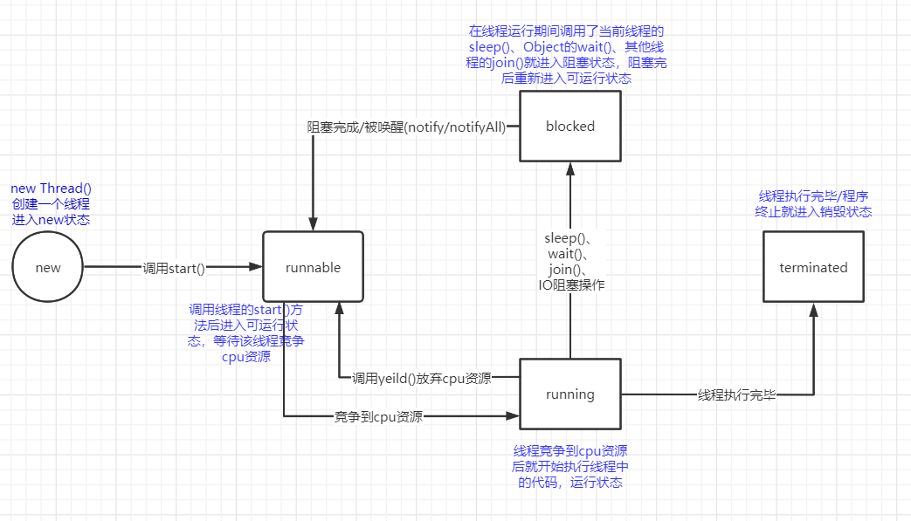

## Java线程的状态

- **NEW:** 线程**创建状态**，线程还未启动，new Thread()
- **RUNNABLE:** 线程**启动状态**，在JVM内启动但是还未运行，直到竞争到CPU时间片才开始运行，thread.start()
- **BLOCKED:** 线程**阻塞状态**，运行到使用synchronized关键字修饰的代码块/方法则处于阻塞状态，或者调用Object.wait()
- **WAITING:** 线程**等待状态**，调用无参Object.wait()、thread.join()、LockSupport.park()会进入等待状态，分别等待Object.notify()/Object.notifyAll()、thread执行完会重新进入RUNNABLE状态
- **TIMED_WAITING:** 线程**等待状态(有等待时间)**，调用Thread.sleep()、有参Object.wait(long)、有时间限制的thread.join()、LockSupport.parkNanos()、LockSupport.parkUntil()会等待指定时间后重新回到RUNNABLE状态
- **TERMINATED:** 线程**终止状态**，线程执行完毕后进入TERMINATED

各种状态的代码实现例子：

- 线程的**NEW与RUNNABLE与TERMINATED状态**

```java
public class ThreadState {
    public static void main(String[] args) {
        ThreadState state = new ThreadState();
        state.state();
    }
    
    // 线程的NEW与RUNNABLE与TERMINATED状态
    private void state(){
        Thread thread = new Thread(() -> {
            // 开始执行线程种的代码 RUNNABLE状态
            System.out.println("A状态："+Thread.currentThread().getState());
            System.out.println("进入到线程:"+Thread.currentThread().getName());
        }); // 创建一个线程 NEW状态
        System.out.println("B状态："+thread.getState());
        thread.start();  // 启动一个线程 RUNNABLE状态
        System.out.println("C状态："+thread.getState());
        try {
            Thread.sleep(3000);  // 主线程等待3秒等带thread线程执行完毕
        } catch (InterruptedException e) {
            e.printStackTrace();
        }
        // 3秒后thread已经执行完毕 TERMINATED状态
        System.out.println("D状态："+thread.getState());
    }
}
```

运行结果：

```
B状态：NEW
C状态：RUNNABLE
A状态：RUNNABLE
进入到线程:Thread-0
D状态：TERMINATED

Process finished with exit code 0
```

- **线程的所有状态：**

```java
import java.util.concurrent.TimeUnit;

public class ThreadState {
    public static void main(String[] args) throws InterruptedException {
        ThreadState state = new ThreadState();
        state.state2();
    }

    private void state2() throws InterruptedException {
        Thread thread = new Thread(() -> {
            test();
        }); // 开启一个thread线程调用同步方法 NEW状态
        thread.start();  // 启动thread线程 RUNNABLE状态
        Thread.sleep(500);   // 主线程睡眠500ms等待thread线程进入test()同步方法
        System.out.println("线程："+thread.getName()+" A状态：" + thread.getState()); // 对应test()方法的1. WAITING状态

        // Object.wait()与Object.notify()/Object.notifyAll()必须在同步代码块里面调用，
        // 否则会抛出java.lang.IllegalMonitorStateException异常
        synchronized (this) {
            this.notifyAll();  // 唤醒thread线程
            System.out.println("线程："+thread.getName()+" B状态：" + thread.getState()); // 对应test()方法的1. BLOCKED状态
        }

        // 开启第二个线程来模拟join()
        Thread thread1 = new Thread(() -> {
            try {
                thread.join(); // thread1线程等待thread执行完毕后再继续执行
            } catch (InterruptedException e) {
                e.printStackTrace();
            }
        });
        thread1.start();  // 启动thread1线程
        TimeUnit.MILLISECONDS.sleep(500L); // 休眠500毫秒等待thread1执行线程代码
        // thread1线程中使用了join()方法后会进入WAITING状态
        System.out.println("线程："+thread1.getName()+" A状态：" + thread1.getState());

        // thread已经被唤醒，在执行代码
        System.out.println("线程："+thread.getName()+" C状态：" + thread.getState()); // 对应test()方法的2. TIMED_WAITING状态

        thread1.join();  // 等待thread1执行完成，模拟thread执行完成
        System.out.println("线程："+thread.getName()+" D状态：" + thread.getState()); // 对应test()方法的3. TERMINATED状态
    }

    // 模拟同步代码方法
    private synchronized void test() {
        System.out.println("进入同步方法~~~");
        try {
            // 1.
            this.wait();  // 当前对象放弃cpu时间片进入WAITING状态，等待被notify唤醒，BLOCKED状态（A、B状态）
            System.out.println("线程被唤醒~~~");
            // 2.
            Thread.sleep(3000);  // 调用sleep(long)后当前线程会进入 TIMED_WAITING状态（C状态）
        } catch (InterruptedException e) {
            e.printStackTrace();
        }
        // 3.
        System.out.println("同步方法执行完毕~~"); // 执行完毕后进入TERMINATED状态 （D状态）
    }
}
```

运行结果：

```
进入同步方法~~~
线程：Thread-0 A状态：WAITING
线程：Thread-0 B状态：BLOCKED
线程被唤醒~~~
线程：Thread-1 A状态：WAITING
线程：Thread-0 C状态：TIMED_WAITING
同步方法执行完毕~~
线程：Thread-0 D状态：TERMINATED

Process finished with exit code 0
```

## Java线程的补充

- **线程的优先级**

线程有优先级之分，优先级大的竞争到CPU时间片的几率就大点，优先级只会提高线程获取CPU时间片的几率，并不是优先级大的一定比优先级小的线程先获取到CPU时间片。

线程的优先级范围是[1,10]，默认的优先级是5

```java
    /**
     * The minimum priority that a thread can have.
     */
    public final static int MIN_PRIORITY = 1;   // 最小优先级 1

   /**
     * The default priority that is assigned to a thread.
     */
    public final static int NORM_PRIORITY = 5;  // 默认优先级 5

    /**
     * The maximum priority that a thread can have.
     */
    public final static int MAX_PRIORITY = 10;   // 最大优先级 10
```

可以通过Thread.setPriority(int newPriority)来设置线程的优先级

- **线程的yeild()方法**

线程调用yeild()方法后会**放弃**当前的CPU时间片，**重新进入**RUNNABLE状态，与其他线程**再次竞争**CPU时间片。而且当前线程可能会再次竞争到CPU时间片，然后继续执行**接下来**的代码。

例子：

```java
    private static void threadYeild() throws InterruptedException {
        Thread thread = new Thread(() -> {
            int i = 0;
            System.out.println("进入线程~~");
            try {
                // 打印1到10，没打印一次休眠100ms
                while (i<10){
                    System.out.println(i);
                    i++;
                    TimeUnit.MILLISECONDS.sleep(100L);
                }
                System.out.println("耗时任务完成~~~");
            } catch (InterruptedException e) {
                e.printStackTrace();
            }
            System.out.println("线程执行完毕~~");
        });
        thread.start();
        TimeUnit.MILLISECONDS.sleep(500L);  
        // 线程启动后延迟500ms调用yield()方法放弃CPU时间片重回RUNNABLE状态再次竞争CPU时间片
        thread.yield();
        System.out.println("thread放弃CPU时间片");
    }
```

运行结果：

```
进入线程~~
0
1
2
3
4
thread放弃CPU时间片
5
6
7
8
9
耗时任务完成~~~
线程执行完毕~~

Process finished with exit code 0
```

- **Object.wait()和Thread.sleep()的区别**

调用Object.wait()的线程**会释放**当前持有的**锁**，而调用Thread.sleep()并**不会释放**当前**锁**，而是阻塞当前线程。

- **线程的interrupt()方法**

interrupt是中断的意思，线程调用interrupt()方法，就会给线程发起一个中断信号，然后抛出java.lang.InterruptedException中断异常，

调用了interrupt()方法后，并且捕获了中断异常，那么try{}里的代码不会继续执行，而外面的代码还是会继续执行，直到执行完毕。所以一个线程调用了interrupt()方法只是抛出一个中断异常而不是立刻终止线程。

例子：

```java
    private static void ThreadInterrupt() throws InterruptedException {
        Thread thread = new Thread(() -> {
            int i = 0;
            System.out.println("进入线程~~");
            try {
                // 打印1到10，没打印一次休眠300ms
                while (i < 10) {
                    System.out.println(i);
                    i++;
                    TimeUnit.MILLISECONDS.sleep(300L);
                }
                System.out.println("耗时任务完成~~~");
            } catch (InterruptedException e) {
                e.printStackTrace();
            }
            // 线程被中断时，捕获了中断异常且未在try{}内的代码会接着执行
            System.out.println("线程执行完毕~~");
        });
        thread.start();
        TimeUnit.SECONDS.sleep(1L);
        thread.interrupt();  // 1s后中断thread线程
    }
```

运行结果: 在打印异常信息后接下来还有信息打印

```
进入线程~~
0
1
2
3
java.lang.InterruptedException: sleep interrupted
	at java.lang.Thread.sleep(Native Method)
	at java.lang.Thread.sleep(Thread.java:340)
	at java.util.concurrent.TimeUnit.sleep(TimeUnit.java:386)
	at com.hat.javaadvance.thread.Thread_.lambda$ThreadInterrupt$1(Thread_.java:40)
	at java.lang.Thread.run(Thread.java:748)
线程执行完毕~~

Process finished with exit code 0
```

- **守护线程**

线程分为两种，用户线程和守护线程

用户线程就是我们平时创建的线程new Thread()。

守护线程是一种特殊的用户线程，守护线程的存在必须依赖用户线程，如果用户线程都执行完毕了，那么守护线程也会直接中止，不管守护线程中的业务代码有没有执行完毕。比如Java中的GC垃圾回收线程，它是一个守护线程，它会随着JVM的启动而启动，如果JVM退出了，也就是说没有垃圾可以回收了，那么GC线程也会退出。

可以通过thread.setDaemon(true);来将用户线程设置为守护线程。**在守护线程内开启的线程也是守护线程**

注意：将用户线程设置为守护线程**必须**在线程**启动之前**设置，否者会抛出java.lang.IllegalThreadStateException异常

例子：

```java
    private static void daemonThread() throws InterruptedException {
        Thread thread = new Thread(() -> {
            int i = 0;
            System.out.println("进入守护线程~~");
            try {
                // 打印1到10，没打印一次休眠300ms
                while (i < 10) {
                    System.out.println(i);
                    i++;
                    TimeUnit.MILLISECONDS.sleep(300L);
                }
                System.out.println("耗时任务完成~~~");
            } catch (InterruptedException e) {
                e.printStackTrace();
            }
            System.out.println("守护线程执行完毕~~");
        });
        thread.setDaemon(true); // 设置该线程为守护线程，必须再启动前设置，否则会抛出异常
        thread.start();  // 启动守护线程
        TimeUnit.SECONDS.sleep(1L);  // 主线程休眠1s后执行完毕
        System.out.println("主线程执行完毕~~~");
    }
```

运行结果：可以看出主线程完了后相当于没有用户线程了，那么守护线程也会跟着终止

```java
进入守护线程~~
0
1
2
3
主线程执行完毕~~~

Process finished with exit code 0
```

## ThreadLocal

ThreadLocal即线程局部变量，该变量是线程私有的，只有当前线程能存储/读取ThreadLocal保存的对象，其他线程是无法访问到的，所以这是解决线程安全的方法之一。它与锁不同的是，锁是让其他线程等待该线程执行完(释放锁)，所以时间占用会长点；ThreadLocal是在线程内部开辟一块内存空间来存放对象，所以它的内存占用会高点。

也就是说，**锁是时间换安全、ThreadLocal是空间换安全**

ThreadLocal的使用很简单，例子：

```java
public class Thread_ {
    ThreadLocal<Integer> local = new ThreadLocal<>(); // 创建一个ThreadLocal对象，泛型是存放的对象类型
    public static void main(String[] args) throws InterruptedException {
        Thread_ thread_ = new Thread_();
        thread_.threadLocal();
    }

    private void threadLocal(){
        local.set(99); // 当前线程(main)设置一个线程本地变量
        Thread thread = new Thread(() -> {
            Integer integer = local.get();  // thread线程获取本地变量(没设置过，所以null)
            System.out.println("thread:"+integer);
            local.set(888);  // 设置thread线程的本地变量
            Integer integer1 = local.get();  // 888
            System.out.println("thread after:"+integer1);
        });
        thread.start();  // 启动thread线程
        Integer integer = local.get();  // 读取当前线程(main)本地变量 99
        System.out.println("main:"+integer);
    }
}
```

运行结果：

```
main:99
thread:null
thread after:888

Process finished with exit code 0
```

ThreadLocal的内部实现：

一般我们可以调用的方法有3个：get()、set(T value)、remove()，分别是读取、设置、删除对象
当我们创建了一个线程后，这个线程一般会持有一个**ThreadLocalMap**对象，

```java
    /* ThreadLocal values pertaining to this thread. This map is maintained
     * by the ThreadLocal class. */
    ThreadLocal.ThreadLocalMap threadLocals = null;
```

ThreadLocal就是通过**ThreadLocalMap**用来存放我们的数据对象的。而**ThreadLocalMap**内部又维护了一个**Entry**，这个**Entry**才是真正存放数据的对象

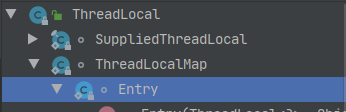

Entry的结构很简单，它是以线程为key值的key-value结构，继承了弱引用，因此当线程终止后这条数据也会被GC掉

```java
        static class Entry extends WeakReference<ThreadLocal<?>> {
            /** The value associated with this ThreadLocal. */
            Object value;

            Entry(ThreadLocal<?> k, Object v) {
                super(k);
                value = v;
            }
        }
```

**ThreadLocalMap**中有几个属性：

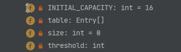

的**Entry[] table**属性就是存放的多条数据，其中初始化table的容量是16，threshold是table长度的阈值，当长度大于阈值后会进行扩容，其中阈值是总容量的三分之二，扩容的大小是原大小的2倍。

# 线程池

- **线程池是什么**

线程池可以帮我们创建、管理线程，我们只需要把任务交给线程池，线程池会调度一个空闲的线程来执行我们的任务。

- **为什么要线程池**

如果不使用线程池，每次开一个线程都要new Thread()，这样我们的代码也会变得冗余，而且频繁的创建/销毁线程会对CPU造成很大的消耗，JVM也会频繁的开创内存空间和垃圾回收，这样会影响性能。


使用线程池的话，线程池会维护一个存在N个线程的线程池，并且会预先创建M个线程，如果有任务时会把任务分配给预先创建的线程，执行完后线程进入空闲状态，等待下一个任务的分配，这样不会频繁的创建/销毁线程，一定程度的减少了对CPU的开销。

线程池的工作原理：


## ThreadPoolExecutor

JUC并发包中提供了ThreadPoolExecutor来创建线程池。

创建线程池的方法只需要new ThreadPoolExecutor()；传递构造方法所需的参数，以下是包含所有参数的构造方法：

```java
public ThreadPoolExecutor(int corePoolSize,
                          int maximumPoolSize,
                          long keepAliveTime,
                          TimeUnit unit,
                          BlockingQueue<Runnable> workQueue,
                          ThreadFactory threadFactory,
                          RejectedExecutionHandler handler)
```

- **corePoolSize：**核心线程数，即预先创建的线程数，这些线程不会销毁，空闲时会等待新任务到来，，然后执行
- **maximumPoolSize：**最大线程数，线程池最大可创建的线程数，必须大于等于corePoolSize，只有当workQueue满了后且又有新任务进来时才会创建线程
- **keepAliveTime：**大于corePoolSize小于等于maximumPoolSize的线程在空闲keepAliveTime时间后销毁，相当于线程无任务执行时最大的等待时间，只有当前线程数大于corePoolSize小于等于maximumPoolSize时才会销毁多出的这部分线程
- **unit：**keepAliveTime的时间单位
- **workQueue：**工作队列，有新任务时会先把任务交给队列，然后线程池寻找空闲线程来执行任务
- **threadFactory：**线程工厂，用来创建线程的工厂，一般都使用默认的Executors.defaultThreadFactory()
- **handler：**拒绝策略，当当前线程池已满(线程数到达maximumPoolSize)且workQueue也满了后，有新任务进来后会执行指定的拒绝策略，默认是AbortPolicy，拒绝新任务入队且抛出RejectedExecutionException异常

### Executors

官方文档上建议使用**Executors**工厂类来创建线程池，它提供了多种线程池的创建，我们可以根据具体业务需求创建相对匹配的线程池。

- **创建固定线程数的线程池newFixedThreadPool**：

它的corePoolSize与maximumPoolSize相同，所以不需要销毁多余的线程，keepAliveTime为0，使用的LinkedBlockingQueue无边界的队列作为工作队列。它也可以使用自定义的线程工厂ThreadFactory

适用于执行时间长的的任务，当线程池满了后，由于工作队列是无界的，所以它可以堆积很多任务，当然内存消耗肯定会大一些

```java
    /**
     * Creates a thread pool that reuses a fixed number of threads
     * operating off a shared unbounded queue.  At any point, at most
     * {@code nThreads} threads will be active processing tasks.
     * If additional tasks are submitted when all threads are active,
     * they will wait in the queue until a thread is available.
     * If any thread terminates due to a failure during execution
     * prior to shutdown, a new one will take its place if needed to
     * execute subsequent tasks.  The threads in the pool will exist
     * until it is explicitly {@link ExecutorService#shutdown shutdown}.
     *
     * @param nThreads the number of threads in the pool
     * @return the newly created thread pool
     * @throws IllegalArgumentException if {@code nThreads <= 0}
     */
    public static ExecutorService newFixedThreadPool(int nThreads) {
        return new ThreadPoolExecutor(nThreads, nThreads,
                                      0L, TimeUnit.MILLISECONDS,
                                      new LinkedBlockingQueue<Runnable>());
    }


    /**
     * Creates a thread pool that reuses a fixed number of threads
     * operating off a shared unbounded queue, using the provided
     * ThreadFactory to create new threads when needed.  At any point,
     * at most {@code nThreads} threads will be active processing
     * tasks.  If additional tasks are submitted when all threads are
     * active, they will wait in the queue until a thread is
     * available.  If any thread terminates due to a failure during
     * execution prior to shutdown, a new one will take its place if
     * needed to execute subsequent tasks.  The threads in the pool will
     * exist until it is explicitly {@link ExecutorService#shutdown
     * shutdown}.
     *
     * @param nThreads the number of threads in the pool
     * @param threadFactory the factory to use when creating new threads
     * @return the newly created thread pool
     * @throws NullPointerException if threadFactory is null
     * @throws IllegalArgumentException if {@code nThreads <= 0}
     */
    public static ExecutorService newFixedThreadPool(int nThreads, ThreadFactory threadFactory) {
        return new ThreadPoolExecutor(nThreads, nThreads,
                                      0L, TimeUnit.MILLISECONDS,
                                      new LinkedBlockingQueue<Runnable>(),
                                      threadFactory);
    }
```

- **创建单个工作线程的线程池newSingleThreadExecutor**

它的corePoolSize与maximumPoolSize都为1，keepAliveTime为0，所以这个线程池永远只有一个线程，而且这个线程不会销毁，空闲时会一直等待新任务，它同样使用了无界的工作队列LinkedBlockingQueue，也可以使用自定义的线程工厂。

它适用于一个任务一个任务按入队顺序执行的业务

```java
    /**
     * Creates an Executor that uses a single worker thread operating
     * off an unbounded queue. (Note however that if this single
     * thread terminates due to a failure during execution prior to
     * shutdown, a new one will take its place if needed to execute
     * subsequent tasks.)  Tasks are guaranteed to execute
     * sequentially, and no more than one task will be active at any
     * given time. Unlike the otherwise equivalent
     * {@code newFixedThreadPool(1)} the returned executor is
     * guaranteed not to be reconfigurable to use additional threads.
     *
     * @return the newly created single-threaded Executor
     */
    public static ExecutorService newSingleThreadExecutor() {
        return new FinalizableDelegatedExecutorService
            (new ThreadPoolExecutor(1, 1,
                                    0L, TimeUnit.MILLISECONDS,
                                    new LinkedBlockingQueue<Runnable>()));
    }

    /**
     * Creates an Executor that uses a single worker thread operating
     * off an unbounded queue, and uses the provided ThreadFactory to
     * create a new thread when needed. Unlike the otherwise
     * equivalent {@code newFixedThreadPool(1, threadFactory)} the
     * returned executor is guaranteed not to be reconfigurable to use
     * additional threads.
     *
     * @param threadFactory the factory to use when creating new
     * threads
     *
     * @return the newly created single-threaded Executor
     * @throws NullPointerException if threadFactory is null
     */
    public static ExecutorService newSingleThreadExecutor(ThreadFactory threadFactory) {
        return new FinalizableDelegatedExecutorService
            (new ThreadPoolExecutor(1, 1,
                                    0L, TimeUnit.MILLISECONDS,
                                    new LinkedBlockingQueue<Runnable>(),
                                    threadFactory));
    }
```

- **创建一个可缓存的线程池newCachedThreadPool**

它的corePoolSize为0，而maximumPoolSize为Integer的最大值，意味着它可以创建Integer.MAX_VALUE个线程。keepAliveTime为60秒，由于它没有预创建的线程，所以这个线程池里的所有线程在空闲60秒后都会被销毁，这个缓存的意思也就是说创建的线程在空闲时间缓存60秒，超过就销毁，否则就可以重用这些线程。

它是用的是同步工作队列SynchronousQueue，SynchronousQueue队列是一个单生产--单消费模型的队列，生产一个东西就会阻塞等待消费者消费。

由于SynchronousQueue的特性，所以在newCachedThreadPool线程池中，工作队列可以说是凑数的。当有一个任务进来时，它会放进SynchronousQueue工作队列，然后线程池会从池中寻找空闲的线程，直接把这个任务交给空闲的线程，如果没有空闲的线程，则创建一个线程来处理任务，也就是说SynchronousQueue工作队列里唯一的元素是会被立刻消费的，基本就是一个空队列。

它适用于执行时间短的任务，如果任务执行时间太长，当任务太多时创建的线程也就会越多，这样会对CPU造成很大的开销，影响性能

```java
    /**
     * Creates a thread pool that creates new threads as needed, but
     * will reuse previously constructed threads when they are
     * available.  These pools will typically improve the performance
     * of programs that execute many short-lived asynchronous tasks.
     * Calls to {@code execute} will reuse previously constructed
     * threads if available. If no existing thread is available, a new
     * thread will be created and added to the pool. Threads that have
     * not been used for sixty seconds are terminated and removed from
     * the cache. Thus, a pool that remains idle for long enough will
     * not consume any resources. Note that pools with similar
     * properties but different details (for example, timeout parameters)
     * may be created using {@link ThreadPoolExecutor} constructors.
     *
     * @return the newly created thread pool
     */
    public static ExecutorService newCachedThreadPool() {
        return new ThreadPoolExecutor(0, Integer.MAX_VALUE,
                                      60L, TimeUnit.SECONDS,
                                      new SynchronousQueue<Runnable>());
    }

    /**
     * Creates a thread pool that creates new threads as needed, but
     * will reuse previously constructed threads when they are
     * available, and uses the provided
     * ThreadFactory to create new threads when needed.
     * @param threadFactory the factory to use when creating new threads
     * @return the newly created thread pool
     * @throws NullPointerException if threadFactory is null
     */
    public static ExecutorService newCachedThreadPool(ThreadFactory threadFactory) {
        return new ThreadPoolExecutor(0, Integer.MAX_VALUE,
                                      60L, TimeUnit.SECONDS,
                                      new SynchronousQueue<Runnable>(),
                                      threadFactory);
    }
```

- **创建延迟执行的线程池newScheduledThreadPool**

这种线程池的corePoolSize自己指定，maximumPoolSize为Integer的最大值，keepAliveTime为0，所以超出corePoolSize后创建的线程执行完后就销毁。它使用了DelayedWorkQueue作为工作队列，这是一种优先级队列，底层的数据结构是堆。

这种线程池返回的是ScheduledExecutorService，而上面三种返回的都是ExecutorService。ScheduledExecutorService继承了ExecutorService，所以它拥有ExecutorService的所有方法，而且它独有的一些方法可以控制延迟执行任务。

```java
    /**
     * Creates a thread pool that can schedule commands to run after a
     * given delay, or to execute periodically.
     * @param corePoolSize the number of threads to keep in the pool,
     * even if they are idle
     * @return a newly created scheduled thread pool
     * @throws IllegalArgumentException if {@code corePoolSize < 0}
     */
    public static ScheduledExecutorService newScheduledThreadPool(int corePoolSize) {
        return new ScheduledThreadPoolExecutor(corePoolSize);
    }
```

ScheduledThreadPoolExecutor的实现：

```java
    /**
     * Creates a new {@code ScheduledThreadPoolExecutor} with the
     * given core pool size.
     *
     * @param corePoolSize the number of threads to keep in the pool, even
     *        if they are idle, unless {@code allowCoreThreadTimeOut} is set
     * @throws IllegalArgumentException if {@code corePoolSize < 0}
     */
    public ScheduledThreadPoolExecutor(int corePoolSize) {
        super(corePoolSize, Integer.MAX_VALUE, 0, NANOSECONDS,
              new DelayedWorkQueue());
    }
```

它提供了以下方法给线程池添加添加任务：

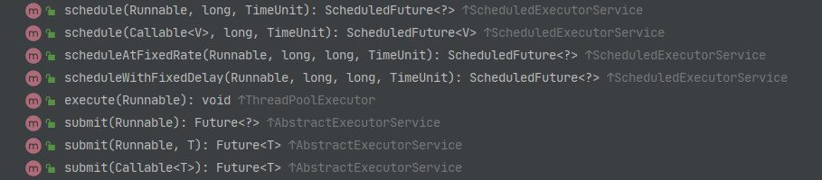

```java
// 延迟执行的任务，只执行一次
// command：任务
// delay：  延迟多长时间执行
// unit：   delay的时间单位
schedule(Runnable command,long delay,TimeUnit unit) 
    
// 延迟执行的任务，根据延迟时间执行无数次
// command：任务
// initialDelay：  延迟多长时间执行
// period： 从当前任务从开始执行起计时，延迟period时间长度后，再次执行该任务，如果period比任务的执行时间短，则先等任务执行完后立刻再执行
// unit：   delay和period的时间单位
scheduleAtFixedRate(Runnable command,long initialDelay,long period,TimeUnit unit)

// 延迟执行的任务，根据延迟时间执行无数次
// command：任务
// initialDelay：  延迟多长时间执行
// period： 从当前任务执行完成开始计时，延迟delay时间长度后，再次执行该任务
// unit：   delay和delay的时间单位
scheduleWithFixedDelay(Runnable command,long initialDelay,long delay,TimeUnit unit)
```

- **创建抢占式线程池newWorkStealingPool**

WorkStealingPool线程池是jdk1.8引入。它没有corePoolSize等这些参数，而且它的实现与上面那几种线程池不同。

WorkStealingPool是借助ForkJoinPool来实现的，ForkJoinPool采用了分散--结合的设计思想来实现的。在WorkStealingPool线程池中，每个线程都有自己的任务队列，当线程执行完自己任务队列内的线程后，就会去抢占其他线程的任务队列来执行。

WorkStealingPool线程池的创建可以指定并发等级（parallelism），也可以使用默认值，系统的可用线程数(看cpu几个线程)，创建出来的线程都是**守护线程**，所以必须得存在用户线程。

参数：

1. parallelism：并发等级，也可以说是同时执行任务的线程数
2. factory：创建线程的工厂，默认defaultForkJoinWorkerThreadFactory，是ForkJoinPool提供的默认工厂
3. handler：当线程执行发生异常后的处理
4. asyncMode：异步模式，true时是FIFO(先进先出)，false时是LIFO(后进先出)

```java
    /**
     * Creates a work-stealing thread pool using all
     * {@link Runtime#availableProcessors available processors}
     * as its target parallelism level.
     * @return the newly created thread pool
     * @see #newWorkStealingPool(int)
     * @since 1.8
     */
    public static ExecutorService newWorkStealingPool() {
        return new ForkJoinPool
            (Runtime.getRuntime().availableProcessors(),
             ForkJoinPool.defaultForkJoinWorkerThreadFactory,
             null, true);
    }

    /**
     * Creates a thread pool that maintains enough threads to support
     * the given parallelism level, and may use multiple queues to
     * reduce contention. The parallelism level corresponds to the
     * maximum number of threads actively engaged in, or available to
     * engage in, task processing. The actual number of threads may
     * grow and shrink dynamically. A work-stealing pool makes no
     * guarantees about the order in which submitted tasks are
     * executed.
     *
     * @param parallelism the targeted parallelism level
     * @return the newly created thread pool
     * @throws IllegalArgumentException if {@code parallelism <= 0}
     * @since 1.8
     */
    public static ExecutorService newWorkStealingPool(int parallelism) {
        return new ForkJoinPool
            (parallelism,
             ForkJoinPool.defaultForkJoinWorkerThreadFactory,
             null, true);
    }
```

```java
    /**
     * Creates a {@code ForkJoinPool} with the given parameters.
     *
     * @param parallelism the parallelism level. For default value,
     * use {@link java.lang.Runtime#availableProcessors}.
     * @param factory the factory for creating new threads. For default value,
     * use {@link #defaultForkJoinWorkerThreadFactory}.
     * @param handler the handler for internal worker threads that
     * terminate due to unrecoverable errors encountered while executing
     * tasks. For default value, use {@code null}.
     * @param asyncMode if true,
     * establishes local first-in-first-out scheduling mode for forked
     * tasks that are never joined. This mode may be more appropriate
     * than default locally stack-based mode in applications in which
     * worker threads only process event-style asynchronous tasks.
     * For default value, use {@code false}.
     * @throws IllegalArgumentException if parallelism less than or
     *         equal to zero, or greater than implementation limit
     * @throws NullPointerException if the factory is null
     * @throws SecurityException if a security manager exists and
     *         the caller is not permitted to modify threads
     *         because it does not hold {@link
     *         java.lang.RuntimePermission}{@code ("modifyThread")}
     */
    public ForkJoinPool(int parallelism,
                        ForkJoinWorkerThreadFactory factory,
                        UncaughtExceptionHandler handler,
                        boolean asyncMode) {
        this(checkParallelism(parallelism),
             checkFactory(factory),
             handler,
             asyncMode ? FIFO_QUEUE : LIFO_QUEUE,
             "ForkJoinPool-" + nextPoolId() + "-worker-");
        checkPermission();
    }
```

### workQueue

工作队列一般有三种：SynchronousQueue、LinkedBlockingQueue、DelayedWorkQueue，一般在不同业务场景下会选择不同的队列作为workQueue。这几种队列也是在JUC并发包下，以下是常用队列的区别：

- **SynchronousQueue：**同步队列，当它为空时，阻塞等待生产者添加元素到队列种，当队列有且只有一个元素后，阻塞等待消费者取这个元素。所以这个队列在生产者和消费者正常时大多数情况都是为空。
- **LinkedBlockingQueue：**无界的队列，该队列的长度是没有界限的
- **DelayedWorkQueue：**有优先级的队列，内部数据结构是堆。
- **ArrayBlockingQueue：**有界限的队列，实例化该实例时指定队列的长度

### RejectedExecutionHandler

线程池的拒绝策略，即当当前线程数已经等于maximumPoolSize时，且工作队列也已经满了，这时候再有新的任务进来所采取的拒绝策略，线程池提供了四种拒绝策略：


- **CallerRunsPolicy**

**被拒绝的任务直接调用当前线程(非线程池中的线程)来执行**

例子：

```java
    private void reject(){
        // 使用CallerRunsPolicy拒绝策略的线程池
        // 这种策略会调用当前线程(非线程池线程)来执行被拒绝的任务
        ThreadPoolExecutor pool = new ThreadPoolExecutor(1, 2, 20, TimeUnit.SECONDS,
                new ArrayBlockingQueue<>(3),new ThreadPoolExecutor.CallerRunsPolicy());
        for (int i = 0; i < 10; i++) {
            pool.submit(new myThread3(""+i+i,3+i)); // 每个任务耗时
        }
    }
```

结果：

```
当前线程：main 持有任务：55，需执行时间：8
当前线程：pool-1-thread-1 持有任务：00，需执行时间：3
当前线程：pool-1-thread-2 持有任务：44，需执行时间：7
当前线程：pool-1-thread-1 持有任务：00，执行完成
当前线程：pool-1-thread-1 持有任务：11，需执行时间：4
当前线程：pool-1-thread-1 持有任务：11，执行完成
当前线程：pool-1-thread-2 持有任务：44，执行完成
当前线程：pool-1-thread-1 持有任务：22，需执行时间：5
当前线程：pool-1-thread-2 持有任务：33，需执行时间：6
当前线程：main 持有任务：55，执行完成
当前线程：main 持有任务：99，需执行时间：12
当前线程：pool-1-thread-1 持有任务：22，执行完成
当前线程：pool-1-thread-1 持有任务：66，需执行时间：9
当前线程：pool-1-thread-2 持有任务：33，执行完成
当前线程：pool-1-thread-2 持有任务：77，需执行时间：10
当前线程：main 持有任务：99，执行完成
当前线程：pool-1-thread-1 持有任务：66，执行完成
当前线程：pool-1-thread-1 持有任务：88，需执行时间：11
当前线程：pool-1-thread-2 持有任务：77，执行完成
当前线程：pool-1-thread-1 持有任务：88，执行完成
```

说明：

创建了最大线程数为2，队列大小为3的线程池，每次最多只能容纳5个任务，代码中遍历0~9次提交到线程池。

1. 任务0~4在线程池中(2个任务正在执行，3个任务在队列中)

2. 任务5被拒绝，所以调用当前线程来执行5，由于当前线程要执行任务5，所以当前线程处于阻塞状态

3. 任务5执行完后，当前线程继续for循环往线程池中提交任务，

4. 在当前线程阻塞期间，线程池已经执行完了3个任务，因此它有3个空闲位置留给接下来的任务

5. 任务6~8提交给线程池执行

6. 任务9被拒绝，继续调用当前线程来执行任务9

- **AbortPolicy**

**被拒绝的任务直接丢弃且抛出异常**，默认使用该策略

例子：

```java
    private void reject(){
        // 使用AbortPolicy拒绝策略的线程池
        // 这种策略会丢弃被拒绝的任务，并抛出异常
        ThreadPoolExecutor pool = new ThreadPoolExecutor(1, 2, 20, TimeUnit.SECONDS,
                new ArrayBlockingQueue<>(3),new ThreadPoolExecutor.AbortPolicy());
        for (int i = 0; i < 10; i++) {
            pool.submit(new myThread3(""+i+i,3+i)); // 每个任务耗时
        }
    }
```

运行结果：

```
当前线程：pool-1-thread-1 持有任务：00，需执行时间：3
当前线程：pool-1-thread-2 持有任务：44，需执行时间：7
Exception in thread "main" java.util.concurrent.RejectedExecutionException: Task java.util.concurrent.FutureTask@5a07e868 rejected from java.util.concurrent.ThreadPoolExecutor@76ed5528[Running, pool size = 2, active threads = 2, queued tasks = 3, completed tasks = 0]
	at java.util.concurrent.ThreadPoolExecutor$AbortPolicy.rejectedExecution(ThreadPoolExecutor.java:2063)
	at java.util.concurrent.ThreadPoolExecutor.reject(ThreadPoolExecutor.java:830)
	at java.util.concurrent.ThreadPoolExecutor.execute(ThreadPoolExecutor.java:1379)
	at java.util.concurrent.AbstractExecutorService.submit(AbstractExecutorService.java:112)
	at com.hat.javaadvance.thread.threadpool.ThreadPool.reject(ThreadPool.java:39)
	at com.hat.javaadvance.thread.threadpool.ThreadPool.main(ThreadPool.java:25)
当前线程：pool-1-thread-1 持有任务：00，执行完成
当前线程：pool-1-thread-1 持有任务：11，需执行时间：4
当前线程：pool-1-thread-2 持有任务：44，执行完成
当前线程：pool-1-thread-2 持有任务：22，需执行时间：5
当前线程：pool-1-thread-1 持有任务：11，执行完成
当前线程：pool-1-thread-1 持有任务：33，需执行时间：6
当前线程：pool-1-thread-2 持有任务：22，执行完成
当前线程：pool-1-thread-1 持有任务：33，执行完成
```

说明：

被拒绝的任务直接丢弃，不会进入任务队列，也不会被执行，并且抛出异常

- DiscardPolicy

**丢弃被拒绝的任务，不会抛出异常**

例子：

```java
    private void reject(){
        // 使用DiscardPolicy拒绝策略的线程池
        // 这种策略会丢弃被拒绝的任务，不会抛出异常
        ThreadPoolExecutor pool = new ThreadPoolExecutor(1, 2, 20, TimeUnit.SECONDS,
                new ArrayBlockingQueue<>(3),new ThreadPoolExecutor.DiscardPolicy());
        for (int i = 0; i < 10; i++) {
            pool.submit(new myThread3(""+i+i,3+i)); // 每个任务耗时
        }
    }
```

结果：

```
当前线程：pool-1-thread-1 持有任务：00，需执行时间：3
当前线程：pool-1-thread-2 持有任务：44，需执行时间：7
当前线程：pool-1-thread-1 持有任务：00，执行完成
当前线程：pool-1-thread-1 持有任务：11，需执行时间：4
当前线程：pool-1-thread-2 持有任务：44，执行完成
当前线程：pool-1-thread-2 持有任务：22，需执行时间：5
当前线程：pool-1-thread-1 持有任务：11，执行完成
当前线程：pool-1-thread-1 持有任务：33，需执行时间：6
当前线程：pool-1-thread-2 持有任务：22，执行完成
当前线程：pool-1-thread-1 持有任务：33，执行完成
```

说明：

被拒绝的任务直接丢弃，但是不会抛出异常

- **DiscardOldestPolicy**

被拒绝的任务不会丢弃，而是丢弃**最先进入**任务队列中的任务，不会抛出异常

例子：

```java
    private void reject(){
        // 使用DiscardOldestPolicy拒绝策略的线程池
        // 这种策略不会丢弃被拒绝的任务，而是丢弃最先进入任务队列的任务，不会抛出异常
        ThreadPoolExecutor pool = new ThreadPoolExecutor(1, 2, 20, TimeUnit.SECONDS,
                new ArrayBlockingQueue<>(3),new ThreadPoolExecutor.DiscardOldestPolicy());
        for (int i = 0; i < 10; i++) {
            pool.submit(new myThread3(""+i+i,3+i)); // 每个任务耗时
        }
    }
```

结果：

```
当前线程：pool-1-thread-1 持有任务：00，需执行时间：3
当前线程：pool-1-thread-2 持有任务：44，需执行时间：7
当前线程：pool-1-thread-1 持有任务：00，执行完成
当前线程：pool-1-thread-1 持有任务：77，需执行时间：10
当前线程：pool-1-thread-2 持有任务：44，执行完成
当前线程：pool-1-thread-2 持有任务：88，需执行时间：11
当前线程：pool-1-thread-1 持有任务：77，执行完成
当前线程：pool-1-thread-1 持有任务：99，需执行时间：12
当前线程：pool-1-thread-2 持有任务：88，执行完成
当前线程：pool-1-thread-1 持有任务：99，执行完成
```

说明：

任务1~3、5~6这些最先进入任务队列的任务被丢弃了，而最后进的7~9正常执行

### ThreadPoolExecutor的一些常用方法

- **shutdown()**

ThreadPoolExecutor.shutdown()会终止线程池，不再接受新任务，等执行完**正在执行、在工作队列种等待执行**的任务后终止线程池

如果在调用了shutdown()之后继续往线程池添加任务，则会抛出java.util.concurrent.RejectedExecutionException异常。

例子：

```java
package com.hat.javaadvance.thread.threadpool;

import ch.qos.logback.core.util.TimeUtil;
import lombok.SneakyThrows;

import java.io.IOException;
import java.time.LocalDateTime;
import java.util.concurrent.*;

public class ThreadPool {
    public static void main(String[] args) throws InterruptedException, IOException {
        ThreadPool threadPool = new ThreadPool();
        threadPool.poolShutdown();
    }

    // 线程池调用shutdown()方法
    public void poolShutdown() throws InterruptedException {
        ExecutorService executorService = Executors.newFixedThreadPool(4);
        for (int i = 0; i < 10; i++) {
            executorService.submit(new myThread3(""+i+i,i+1));
        }
        TimeUnit.SECONDS.sleep(5);
        executorService.shutdown();  // 测试shutdown()方法
        executorService.submit(new myThread3("12",12));
        executorService.submit(new myThread3("13",13));
    }

    class myThread3 implements Runnable{
        private String name;
        private long time;
        public myThread3(String name,long time) {
            this.name = name;
            this.time = time;
        }

        @SneakyThrows
        @Override
        public void run() {
            System.out.println("任务："+name+"，当前线程："+Thread.currentThread().getName()+"，需执行时间："+time);
            TimeUnit.SECONDS.sleep(time);
            System.out.println("任务："+name+"，当前线程："+Thread.currentThread().getName()+"执行完成");
        }
    }
}

```

运行结果：可以看到调用了shutdown()方法后再向线程池添加任务，则会抛出异常。

```java
Connected to the target VM, address: '127.0.0.1:53837', transport: 'socket'
任务：00，当前线程：pool-1-thread-1，需执行时间：1
任务：11，当前线程：pool-1-thread-2，需执行时间：2
任务：22，当前线程：pool-1-thread-3，需执行时间：3
任务：33，当前线程：pool-1-thread-4，需执行时间：4
任务：00，当前线程：pool-1-thread-1执行完成
任务：44，当前线程：pool-1-thread-1，需执行时间：5
任务：11，当前线程：pool-1-thread-2执行完成
任务：55，当前线程：pool-1-thread-2，需执行时间：6
任务：22，当前线程：pool-1-thread-3执行完成
任务：66，当前线程：pool-1-thread-3，需执行时间：7
任务：33，当前线程：pool-1-thread-4执行完成
任务：77，当前线程：pool-1-thread-4，需执行时间：8
Exception in thread "main" java.util.concurrent.RejectedExecutionException: Task java.util.concurrent.FutureTask@5474c6c rejected from java.util.concurrent.ThreadPoolExecutor@2fc14f68[Shutting down, pool size = 4, active threads = 4, queued tasks = 2, completed tasks = 4]
	at java.util.concurrent.ThreadPoolExecutor$AbortPolicy.rejectedExecution(ThreadPoolExecutor.java:2063)
	at java.util.concurrent.ThreadPoolExecutor.reject(ThreadPoolExecutor.java:830)
	at java.util.concurrent.ThreadPoolExecutor.execute(ThreadPoolExecutor.java:1379)
	at java.util.concurrent.AbstractExecutorService.submit(AbstractExecutorService.java:112)
	at com.hat.javaadvance.thread.threadpool.ThreadPool.poolMethod(ThreadPool.java:28)
	at com.hat.javaadvance.thread.threadpool.ThreadPool.main(ThreadPool.java:18)
任务：44，当前线程：pool-1-thread-1执行完成
任务：88，当前线程：pool-1-thread-1，需执行时间：9
任务：55，当前线程：pool-1-thread-2执行完成
任务：99，当前线程：pool-1-thread-2，需执行时间：10
任务：66，当前线程：pool-1-thread-3执行完成
任务：77，当前线程：pool-1-thread-4执行完成
Disconnected from the target VM, address: '127.0.0.1:53837', transport: 'socket'

Process finished with exit code 130
```

- **shutdownNow()**

shutdownNow()方法同样会终止线程池，不再接受新任务，不过不会等待正在执行、在工作队列中等待执行的任务，调用后就立即终止所有正在执行的任务。

线程池调用shutdownNow()后再往线程池添加任务时，也会直接抛出java.util.concurrent.RejectedExecutionException异常

shutdownNow()这个方法有返回值，它返回的是List<Runnable>，一个Runnable的列表，而这个列表存放的Runnable就是还在工作队列中等待执行的任务，也就是说，shutdownNow()的返回值是workQueue中的任务。

例子：

```java
    public void poolShutdown() throws InterruptedException {
        ExecutorService executorService = Executors.newFixedThreadPool(4);
        for (int i = 0; i < 10; i++) {
            executorService.submit(new myThread3(""+i+i,i+1));
        }
        TimeUnit.SECONDS.sleep(5);
//        executorService.shutdown();  // 测试shutdown()方法
        List<Runnable> runnables = executorService.shutdownNow();// 测试shutdown()方法
//        executorService.submit(new myThread3("12",12));  // 这里会抛出异常，并且后面的代码不会再执行
//        executorService.submit(new myThread3("13",13));
        runnables.forEach(System.out::println);
    }
```

运行结果：由于已经执行了8个任务，所以最后的List<Runnable>的长度是2

```
任务：00，当前线程：pool-1-thread-1，需执行时间：1
任务：22，当前线程：pool-1-thread-3，需执行时间：3
任务：11，当前线程：pool-1-thread-2，需执行时间：2
任务：33，当前线程：pool-1-thread-4，需执行时间：4
任务：00，当前线程：pool-1-thread-1执行完成
任务：44，当前线程：pool-1-thread-1，需执行时间：5
任务：11，当前线程：pool-1-thread-2执行完成
任务：55，当前线程：pool-1-thread-2，需执行时间：6
任务：22，当前线程：pool-1-thread-3执行完成
任务：66，当前线程：pool-1-thread-3，需执行时间：7
任务：33，当前线程：pool-1-thread-4执行完成
任务：77，当前线程：pool-1-thread-4，需执行时间：8
java.util.concurrent.FutureTask@4fca772d
java.util.concurrent.FutureTask@9807454

Process finished with exit code 0
```

- **allowCoreThreadTimeOut(boolean)**

是否允许核心线程超时。

在创建线程池的时候，一般maximumPoolSize减去corePoolSize的这部分线程是**非核心线程**，而keepAliveTime参数是设置**非核心线程**最大的空闲存活时间，如果**非核心线程**超时了还没有新任务，那么就会被销毁。

如果想让**核心线程**也有空闲超时机制，就可以使用allowCoreThreadTimeOut(true)方法来设置，设置为true时， **核心线程**就会跟**非核心线程**一样，达到最大空闲时间就会被销毁。

例子：

```java
    private void pool_() throws InterruptedException {
        // 创建一个拥有4个核心线程，5个非核心线程，非核心线程最大空闲时间20秒，无界队列的线程池
        ThreadPoolExecutor pool = new ThreadPoolExecutor(4, 5, 20, TimeUnit.SECONDS,
                new LinkedBlockingQueue<>());
        for (int i = 0; i < 10; i++) {
            pool.submit(new myThread3(""+i+i,12)); // 每个任务都耗时12秒
        }
        TimeUnit.SECONDS.sleep(1L); // 休眠1秒等待提交10个任务
        pool.allowCoreThreadTimeOut(true);  // 设置允许核心线程与非核心线程一样拥有超时销毁机制
        // 每10秒打印一次线程池的状态信息
        while (true){
            System.out.println("-----------------------------------------------------------");
            System.out.println("正在运行的任务数："+pool.getActiveCount());
            System.out.println("当前存活线程数："+pool.getPoolSize());
            System.out.println("已完成的任务数："+pool.getCompletedTaskCount());
            System.out.println("工作队列中的任务数："+pool.getQueue().size());
            TimeUnit.SECONDS.sleep(10L);
        }
    }

```

运行结果：

```
Connected to the target VM, address: '127.0.0.1:52067', transport: 'socket'
任务：00，当前线程：pool-1-thread-1，需执行时间：12
任务：22，当前线程：pool-1-thread-3，需执行时间：12
任务：11，当前线程：pool-1-thread-2，需执行时间：12
任务：33，当前线程：pool-1-thread-4，需执行时间：12
-----------------------------------------------------------
正在运行的任务数：4
核心线程数：4
已完成的任务数：0
工作队列中的任务数：6
-----------------------------------------------------------
正在运行的任务数：4
核心线程数：4
已完成的任务数：0
工作队列中的任务数：6
任务：22，当前线程：pool-1-thread-3执行完成
任务：00，当前线程：pool-1-thread-1执行完成
任务：44，当前线程：pool-1-thread-3，需执行时间：12
任务：55，当前线程：pool-1-thread-1，需执行时间：12
任务：11，当前线程：pool-1-thread-2执行完成
任务：66，当前线程：pool-1-thread-2，需执行时间：12
任务：33，当前线程：pool-1-thread-4执行完成
任务：77，当前线程：pool-1-thread-4，需执行时间：12
-----------------------------------------------------------
正在运行的任务数：4
核心线程数：4
已完成的任务数：4
工作队列中的任务数：2
任务：55，当前线程：pool-1-thread-1执行完成
任务：44，当前线程：pool-1-thread-3执行完成
任务：99，当前线程：pool-1-thread-3，需执行时间：12
任务：88，当前线程：pool-1-thread-1，需执行时间：12
任务：77，当前线程：pool-1-thread-4执行完成
任务：66，当前线程：pool-1-thread-2执行完成
-----------------------------------------------------------
正在运行的任务数：2
核心线程数：4
已完成的任务数：8
工作队列中的任务数：0
任务：99，当前线程：pool-1-thread-3执行完成
任务：88，当前线程：pool-1-thread-1执行完成
-----------------------------------------------------------
正在运行的任务数：0
核心线程数：4
已完成的任务数：10
工作队列中的任务数：0
-----------------------------------------------------------
正在运行的任务数：0
核心线程数：2
已完成的任务数：10
工作队列中的任务数：0
-----------------------------------------------------------
正在运行的任务数：0
核心线程数：0
已完成的任务数：10
工作队列中的任务数：0
-----------------------------------------------------------
正在运行的任务数：0
核心线程数：0
已完成的任务数：10
工作队列中的任务数：0
```

- **submit()与execute()**

这两种方式都可以给线程池添加任务。

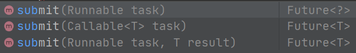


其中execute()方法只能接受Runnable类型的任务，并且没有返回值

而submit()方法可以接受Runnable，也可以接受Callable类型的任务，并且返回一个Future对象，这个Future对象可以对线程的各种状态进行监控，可以判断线程是否执行完毕

例子：

```java
    private void submitTask() throws InterruptedException {
        ExecutorService executorService = Executors.newFixedThreadPool(4);
        Future future = executorService.submit(new myThread3("aaa", 10));
        while (true){
            if (future.isDone()){
                System.out.println("已执行完成");
                break;
            }else if (future.isCancelled()){
                System.out.println("已被取消");
                break;
            }else{
                System.out.println("线程正在执行中~~~~~~");
            }
            TimeUnit.SECONDS.sleep(2L); // 每两秒监控一次future状态
        }
    }
```

运行结果：

```
Connected to the target VM, address: '127.0.0.1:52443', transport: 'socket'
线程正在执行中~~~~~~
任务：aaa，当前线程：pool-1-thread-1，需执行时间：10
线程正在执行中~~~~~~
线程正在执行中~~~~~~
线程正在执行中~~~~~~
线程正在执行中~~~~~~
任务：aaa，当前线程：pool-1-thread-1执行完成
已执行完成
```


### 线程池的状态

线程池有五种状态，分别是RUNNING、SHUTDOWN、STOP、TIDYING、TERMINATED

- **RUNNING：**可以接受新任务和处理任务队列的任务
- **SHUTDOWN：**不接受新任务，但会继续处理任务队列里的任务
- **STOP：**不接受新任务，不处理任务队列里的任务，终止正在运行的任务
- **TIDYING：**所有任务已经终止，任务队列里也为空
- **TERMINATED：**已经终止

官方文档对这几种状态的转换的说明:

```java
     * RUNNING -> SHUTDOWN
     *    On invocation of shutdown(), perhaps implicitly in finalize()
     * (RUNNING or SHUTDOWN) -> STOP
     *    On invocation of shutdownNow()
     * SHUTDOWN -> TIDYING
     *    When both queue and pool are empty
     * STOP -> TIDYING
     *    When pool is empty
     * TIDYING -> TERMINATED
     *    When the terminated() hook method has completed
```

# 多线程的三大特性

多线程并发编程中，为了保证数据的安全性，必须遵循三大特性：**可见性、有序性、原子性**

- **可见性：多个线程访问同一个变量，要保证这个变量被任意一个线程改变时，其他线程也能立即看到。**

在JVM虚拟机中，全局变量是在**堆内存**中，而**堆内存**里的数据都是**线程共享**的，也可以成为**主内存**。每个线程都会有一片非共享的内存区域称为**工作内存**，线程在操作变量时，都要先从**主内存**中**拷贝一份变量副本**到**线程自己的工作内存**中，然后**在工作内存内**进行数据操作，操作完后刷新到**主内存**。

例子：

```java
import java.util.concurrent.TimeUnit;

public class Visibility {
    // 加和不加volatile关键字的区别
    // 没加volatile： 程序不会退出
    //      主线程修改的flag不会被Thread线程得到，因为主线程在修改flag之前，Thread线程就已经得到flag的副本了，
    //      因此while (!flag)永远成立
    // 加volatile：   程序会退出
    //      加了volatile关键字后，主线程修改了flag并刷新到主存，这时Thread线程里的flag变量副本会无效，
    //      所以它需要去主存中重新获取flag的值，新的flag副本的值已经是true，所以while (!flag)不成立
    private static /*volatile*/ boolean flag = false;
    public static void main(String[] args) throws InterruptedException {
        // 启动一个线程判断flag，这时该线程已经从主存中拿到flag = false，而且只读这个变量，并没有修改
        new Thread(() -> {
            System.out.println("程序开始运行~~~~");
            while (!flag){
            }
            System.out.println("~~~程序结束运行");
        }).start();
        // 主线程休眠1秒等上面的线程先启动运行
        TimeUnit.SECONDS.sleep(1L);
        flag = true;  // 这时主线程修改flag的值，修改完后会刷新到主存
    }
}
```

**不加volatile关键字**的结果：

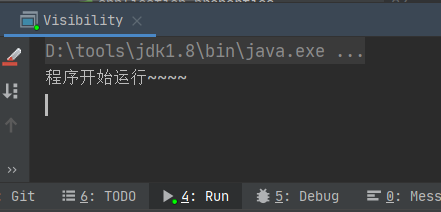

**加了volatile关键字**的结果：

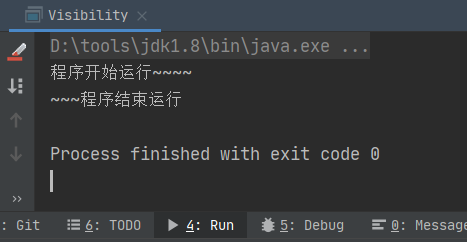

保证可见性的方案有：**全局变量使用volatile关键字、在做运算操作时加锁、使用JUC提供的AtomicInteger等原子变量**

- **有序性：程序按照代码的顺序执行。**

CPU为了提高运行效率，通常会对一些没有关联的代码进行重排序，虽然代码执行的顺序会变化，但是结果是不会变的，因此在单线程中一般不会出现有序性问题，但是在多线程中就有可能出现有序性的问题。

要执行java代码，JVM会先把java文件解析成字节码（.class）文件，字节码的文件中的指令交给CPU来处理，由于有些指令是没有关联的，所以它们有可能会被CPU、编译器重排序，如果多条指令之间是有关联的，那么它们会遵守某些规则来防止这些指令的重排序。

例子：

```java
/**
 * 并发编程线程的三大特性----有序性
 */
public class Order {
    // 加上volatile关键字保证可见性与防止被编译器重排序
    private static /*volatile*/ int a, b = 0;
    private static int x, y;
    private static long count = 0;

    public static void main(String[] args) throws InterruptedException {
        Order order = new Order();
        order.orderTest();
    }
    private void orderTest() throws InterruptedException {
        while (true) {
            a = 0;
            b = 0;
            x = 0;
            y = 0;
            // 线程t1与t2按照代码顺序来说，1.先于2.执行，3.先于4.执行，
            // 但是由于1.和2.  3.和4.没有关联，编译器与CPU为了效率可能会对1.2.或者3.4.进行指令重排序，
            // 这就导致了结果可能是2.先于1.  4.先于3.执行，所以结果有可能x, y = 0
            // 解决：使用volatile关键字不仅可以保证变量的可见性，还可以防止指令重排序。
            Thread t1 = new Thread(() -> {
                a = 1;  // 1.
                x = b;  // 2.
            });
            Thread t2 = new Thread(() -> {
                b = 1;  // 3.
                y = a;  // 4.
            });
            t1.start();
            t2.start();
            t1.join();
            t2.join();
            count++;
            if (y == 0 && x == 0) {
                System.out.println("x:" + x + ", y:" + y + "  ---  " + count);
                break;
            } else if ((y == 1 && x == 0) || (y == 0 && x == 1)) {
                System.out.println("x:" + x + ", y:" + y + "  ---  " + count);
            }
        }
    }
}

```

**不加volatile结果**：第559次就出现了x,y = 0的问题

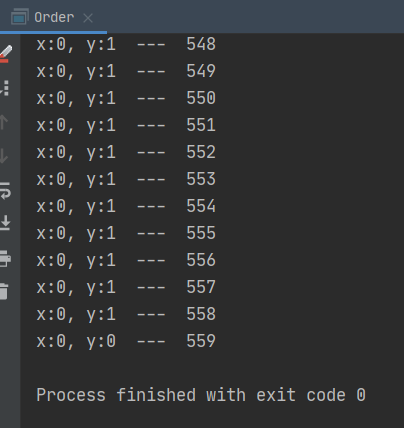

**加volatile结果**：即将20万次都没有出现上面的情况

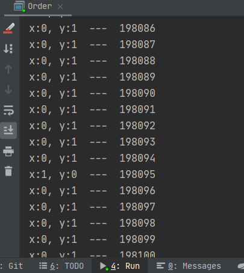

- **原子性：一个操作或者一系列操作，只有执行与不执行这两种结果。一系列操作不会被其他线程中断、干扰就符合原子性**

假如**i++（i = i + 1）**这个代码，这不是一个原子操作，因为它的执行有三步。

1. 从主存读取**i**到工作内存
2. 在工作内存中**i + 1**
3. 将**i + 1**赋值给**i**

如果有线程A和B，都要执行**i++**操作，线程A还没有执行完这三步时，线程B也在执行，这时线程A中的操作就是被线程B干扰了，这就不符合原子性。

例子：将一个变量从0自增到200

```java
import java.util.concurrent.TimeUnit;
public class Atomic {
    private static /*volatile*/ int num = 0;

    public static void main(String[] args) throws InterruptedException {
        way1();
    }

    private static void way1() throws InterruptedException {
        for (int i = 0; i < 200; i++) {
            new Thread(() -> {
                num++;  // 这不是一个原子操作，会出现线程安全问题
                System.out.println("线程：" + Thread.currentThread().getName() + "   " + num);
            }).start();
        }
        TimeUnit.SECONDS.sleep(1L);//等待线程都执行完毕
        System.out.println("num的值：" + num);
    }
}
```

结果：会出现日志输出num值相同的情况，且最终结果是199，它是线程不安全的

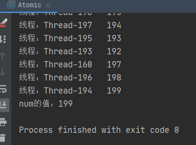

**改动1：给num加上volatile关键字**

```java
private static volatile int num = 0;
```

结果：还是会出现重复值的情况，且num的最终值不到200，所以**volatile并不能保证原子性**

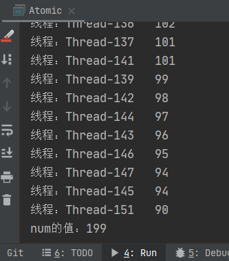

**改动2：使用synchronized关键字对num++操作加锁**

```java
import java.util.concurrent.TimeUnit;

public class Atomic {
    private static /*volatile*/ int num = 0;

    public static void main(String[] args) throws InterruptedException {
        way2();
    }

    private static void way2() throws InterruptedException {
        for (int i = 0; i < 200; i++) {
            new Thread(() -> {
                // 加锁保证原子性
                synchronized (Atomic.class) {
                    num++;  // 这不是一个原子操作，会出现线程安全问题
                    System.out.println("线程：" + Thread.currentThread().getName() + "   " + num);
                }
            }).start();
        }
        TimeUnit.SECONDS.sleep(1L);//等待线程都执行完毕
        System.out.println("num的值：" + num);
    }
}

```

结果：num的值不会出现重复，且最终值是200，符合原子性，如果把System.out.println这条语句放在synchronized同步代码块外面，则打印的日志可能会出现重复值，这是由于num++与System.out.println不是原子操作。但是日志只是打印方便看，先不考虑这种情况

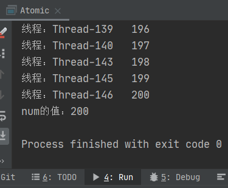

**改动3：使用AtomicInteger原子操作类。**

```java
import java.util.concurrent.atomic.AtomicInteger;

public class Atomic {
    // 使用原子操作类，这个类的方法都是符合原子操作的
    private static AtomicInteger atomicNum = new AtomicInteger(0);
    public static void main(String[] args) throws InterruptedException {
        way3();
    }
    
    private static void way3() throws InterruptedException {
        for (int i = 0; i < 200; i++) {
            new Thread(() -> {
                int num2 = atomicNum.incrementAndGet();// 这是自增的原子操作，返回新值
                System.out.println("线程：" + Thread.currentThread().getName() + "   " + num2);
            }).start();
        }
        TimeUnit.SECONDS.sleep(1L);//等待线程都执行完毕
        System.out.println("atomicNum的值：" + atomicNum);
    }
}
```

结果：它也是符合原子性的

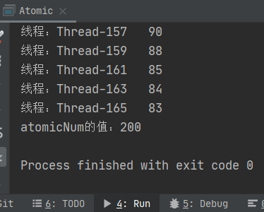

# 锁

## volatile

volatile关键字不是锁，但是它可以实现并发编程中三大特性的**可见性**与**有序性**，而且volatile比锁更轻量，很很多业务场景下volatile是个很不错的选择。

在单线程编程中，不必关心数据的可见性和有序性问题，只有在多线程编程中，才会出现那三大特性。

- **volatile保证数据的可见性**

**在CPU层面：**

多个CPU核心处理多线程任务，由于CPU的计算速度比内存快的多，为了减少CPU访问主内存的频率，提高访问数据的效率，CPU引入了3级缓存，L1、L2、L3，其中L3级别的缓存时CPU共享的，L1、L2级别的缓存每个核心都有，缓存的大小则是级别越高大小越大。

CPU每次处理某个数据时，都会依次从L1、L2、L3、主内存读取数据，读到就停止。如果时从主内存中读到数据，则会先将数据保存到CPU缓存中，然后对缓存内的数据进行操作。

如果其中一个核心修改了这个数据，CPU使用某种机制对其他核心发送一个信号，通知这个数据已经无效，其他核心想对这个数据进行操作则需要重新从主存中读取，确保在多线程情况下数据的可见性，这就保证了**缓存一致性**，不同架构的CPU具体的实现方法都会有区别，但是结果都是为了保证缓存一致性。

**在JMM层面：**

被volatile关键字修饰的变量num，这个变量分别被两个线程A、 B修改和读写。

由于线程都有自己的工作内存，所以两个线程都有一份num的副本，A线程修改了num后，num值会立刻刷新到主存中，而线程B每次读取num值都会从主存中读，所以num的值永远是最新的。

所以**被volatile修饰的变量，一旦被修改，会立刻刷新到主存，每次读这个变量都会从主存中去读**

- **volatile保证数据的有序性**

volatile使用了内存屏障来防止指令的重排序，从而保证了数据的有序性。

在volatile的实现源码里，其实被volatile修饰的变量，在其实现的汇编源码上是加了一个lock前缀指令，这个lock指令是cpu级别的，因此它其实也是加了锁。

这个lock指令也相当于是一个内存屏障，在**其之前**的代码**必定会先**于**其之后**的代码执行，所以它不会被指令重排序导致有序性的问题。

- **内存屏障**

内存屏障是对一个指令添加一道墙，墙两边的指令不能越过墙，也就是在进行指令重排序的时候，墙后的指令不能排到墙前面，墙前的指令不能排到前后面。

内存屏障有两种，读屏障（**Load Barrier**）和写屏障（**Store Barrier**）

| 屏障类型          | 例子                  | 说明                                                         |
| ----------------- | --------------------- | ------------------------------------------------------------ |
| LoadLoadBarrier   | load1-barrier-load2   | load2读操作必须在load1读操作完成之后                         |
| StoreStoreBarrier | store1-barrier-store2 | store2写操作之前必须在store1写操作立即刷新到主存(其他处理器可见)之后 |
| LoadStoreBarrier  | load1-barrier-store2  | store2写操作前必须在load1读操作完成之后                      |
| StoreLoadBarrier  | store1-barrier-load2  | load2读操作之前必须在store1写操作立即刷新到主存(其他处理器可见)之后 |

volatile中的内存屏障：

一个被volatile修饰的变量

在写操作前加入StoreStoreBarrier，防止后面的写操作重排序到前面

在写操作后加入StoreLoadBarrier，防止后面的读操作重排序到写前面

在读操作前加入LoadLoadBarrier，防止后面的读操作重排序到前面

在读操作后加入LoadStoreBarrier，防止后面的写操作重排序到读前面

## 锁的分类

通常我们使用到的锁就只有**synchronized**和**Lock（ReentrantLock、ReentrantReadWriteLock）**这两大类。

但是又冒出来各种锁的叫法，比如乐观锁、悲观锁、轻量级锁、重量级锁、读写锁等等。

这些锁有的是锁的状态，有些是锁的设计或者特性。

## 1.乐观锁、悲观锁

- **乐观锁**

线程认为当前使用的数据**不会被其他线程更改**，因此不添加锁，但是在更新数据时会先校验一下有没有其他线程修改过这个数据，如果没修改过的话，则当前线程直接写入数据到内存中，如果被其他线程修改过的话，则执行相应的策略（重试或报错或其他）。

一般乐观锁也可称为无锁，因为它并没有加锁。而且乐观锁很多是基于CAS算法来实现的。

CAS（Compare And Swap）比较并交换。这种算法有3个参数V、A、B

V：在内存上的值

A：上一次从内存上获取到的值

B：即将更新的值

CAS算法会使用一个无限循环来判断V是否等于A，如果V等于A则把B值刷新到内存上，否则就重新获取V值，继续循环判断V是否等于A，直到V=A时循环才会停止。

CAS的ABA问题：

如果原来的内存值是A，后来改成B，最后又改成A，所以在外面看这个值没有改变，但是实际上这个值是改变了两次。为了避免这个问题，可是在变量前加一个版本号，每改变一次这个版本号就加一，就会变成1A，2B，3A。这样就可以知道这个值其实改变了。

在JUC并发包中的原子类atomic就是使用CAS算法来实现的。

- **悲观锁**

线程认为当前使用的数据**一定会被其他线程更改**，所以每次操作数据时都要加一个锁，防止其他线程修改这些数据。比如我们常用的**synchronized、Lock的实现、数据库**使用的都是悲观锁

一般**乐观锁常用在读多写少的场景，悲观锁用在写多读少的场景**

## 2.公平锁、非公平锁

- **公平锁**

多个线程按照线程申请锁的顺序来获取锁，即线程想要获取锁，先进入一个等待队列，等待前面的线程都释放锁了，才能获取锁。通俗来讲也就是先到先得

**优点**：

公平锁可以让在等待队列中的线程不会饿死（一般都可以吃到锁）

**缺点：**

当一个线程占有锁的时候，其他线程都会被阻塞，CPU唤醒阻塞的线程开销会大一点，效率变低

- **非公平锁**

线程想要获取锁，直接尝试去获取，如果获取到则占有锁，获取不到则到等待队列中排队，然后等带前面的线程都释放锁，才能获取锁。通俗来讲就是刚来时刚好拿到就拿，拿不到就到后面去排队

**优点：**

当一个线程刚好释放锁时，这时刚好另一个线程尝试获取锁，这样第二个线程直接获取锁，不需要被CPU唤醒，提高了效率和吞吐量

**缺点：**

在等待队列中的线程可能会被饿死（永远吃不到锁或者等很久才能获取到锁）

synchronized用的就是非公平锁，但是它不能改成公平锁。

ReentrantLock默认使用的也是非公平锁，但是它可以通过构造方法指定使用公平锁。

```java
    /**
     * Creates an instance of {@code ReentrantLock} with the
     * given fairness policy.
     *
     * @param fair {@code true} if this lock should use a fair ordering policy
     */
    public ReentrantLock(boolean fair) {   // 构造方法参数为true时则使用公平锁，默认是非公平锁
        sync = fair ? new FairSync() : new NonfairSync();
    }
```

## 3.独享锁、共享锁

- **独享锁（排他锁、互斥锁）**

一把锁只能被一个线程占有

比如**ReadWriteLock读写锁**，在写时给数据添加**写锁**，一旦加了**写锁**，那么这个数据只有当前线程可以读取和修改，其他线程不能再获取该数据，所以**写锁**是独享锁

**synchronized**也是独享锁

- **共享锁**

一把锁可以被多个线程占有

**ReadWriteLock读写锁**，在读时给数据添加**读锁**，这个数据可以被多个线程添加**读锁**，所以读锁是共享锁


如果一个线程获取了写锁，其他线程尝试获取读锁是不会成功的，只有写锁释放后读锁才会被获取到。一般只有读读锁是共享锁，读写、写读、写写锁都是互斥的。

## 4.可重入锁

可重入锁也称递归锁。一个线程在外层获取锁后，进入内层后会自动获得锁。它可以防止死锁。

例如下面的例子：

一个线程调用A方法时，此时线程已经拥有一把锁了，然后再在A方法内调用B方法，此时线程自动获取锁，这两个是同一把锁（都是当前对象）。如果没有重入锁的话，A、B两个方法的锁对象都是当前对象，因此线程执行A方法时持有的锁是当前对象，想要再执行B方法，那么就需要当前线程先释放锁才能在获取锁来执行B方法，可是A方法没有执行完，没法释放锁，执行B方法又需要获取锁，这就会导致死锁的发生。

```java
    private synchronized void A(){
        System.out.println("A同步方法");
        B(); // 同步方法内调用另外一个同步方法（锁内调用一个加锁的方法）
    }
    
    private synchronized void B(){
        System.out.println("B同步方法");
    }
```

我们常用的**synchronized**是可重入锁，ReentrantLock也是可重入锁，而且ReentrantLock的命名就是可重入锁

## 5.自旋锁

自旋锁指的是一个线程在尝试获取锁的时候，如果获取失败，线程不会挂起，而是重新尝试获取锁，一直循环，知道获取锁为止。自旋相当于自己循环。

线程之间的切换需要依赖操作系统，而且需要在用户态和内核态之间切换，这个用户态和内核态切换开销非常大，如果锁住的内容很少，执行时间很短，可能用户态与内核态的切换所消耗的时间比执行代码时间还长。

自旋锁可以大大减少用户态跟内核态的切换次数，从而效率更高，可是一旦这个锁一直被占用，或者过了很久才释放，那么它就会一直占着cpu时间片，这又会浪费CPU资源。

自旋锁的实现原理也是基于CAS算法。

**自适应自旋锁**是对自旋锁的一些优化，如果一个锁自旋成功了，JVM会认为这个锁可以获取，那么它下次自旋的时间就会长一点，如果一个锁自旋成功率很低，那么它下次自旋的时间就会短一点，甚至不自旋。自适应自旋锁是JVM控制的。

一般在**执行时间短**的情况下会使用自旋锁，这样效率会大大提高，如果执行时间长的话，自旋锁就不太合适了。

## 6.偏向锁、轻量级锁、重量级锁

这3种锁代表锁的状态，都是针对**synchronized**的，jdk引入这3种锁实现**锁升级**目的是提升**synchronized**的性能。

**3种锁的效率：偏向锁 > 轻量级锁 > 重量级锁**

- 偏向锁

如果总是同一个线程执行一段加了synchronized的代码，那这个线程就会自动获取该锁，也就是这个线程一直持有偏向锁，这样就可以降低了获取锁的开销。

如果另外一个线程尝试执行这段代码，也就是尝试获取锁，那么该线程就会释放偏向锁，将锁升级为轻量级锁

- 轻量级锁

当偏向锁被另外一个线程访问时升级为轻量级锁，然后另一个线程就会通过自旋来获取该锁。

- 重量级锁

当一个线程持有轻量级锁，第二个线程自旋获取轻量级锁时，第二个线程自旋次数超过一定值或者又有第三个线程来尝试获取锁，就会将锁升级为重量级锁

### 6.1.**对象头**

对象头有两部分：**Mark Word**（标记字段） 和 **Klass Pointer**（类型指针）

- **Mark Word**

存储对象的HashCode，分代年龄和锁的状态信息。这些信息都与对象自身的定义关系不大，因此**Mark Word**被设计的用极少的内存存放尽可能多的数据，synchronized的锁状态就是标记在对象头中的**Mark Word**中。

- **Klass Pointer**

存储对象的类型指针，该指针指向方法去中的对象元信息，JVM可以根据这个指针来确定对象属于哪个类的实例。32位的JVM的长度是32位，64位的JVM长度是64位。

- **array length（数组长度）**

只有数组对象才会有这部分


**32位和64位虚拟机的对象头组成**

源码：

```java
//  32 bits:
//  --------
//             hash:25 ------------>| age:4    biased_lock:1 lock:2 (normal object)
//             JavaThread*:23 epoch:2 age:4    biased_lock:1 lock:2 (biased object)
//             size:32 ------------------------------------------>| (CMS free block)
//             PromotedObject*:29 ---------->| promo_bits:3 ----->| (CMS promoted object)
//
//  64 bits:
//  --------
//  unused:25 hash:31 -->| unused:1   age:4    biased_lock:1 lock:2 (normal object)
//  JavaThread*:54 epoch:2 unused:1   age:4    biased_lock:1 lock:2 (biased object)
//  PromotedObject*:61 --------------------->| promo_bits:3 ----->| (CMS promoted object)
//  size:64 ----------------------------------------------------->| (CMS free block)
//
//  unused:25 hash:31 -->| cms_free:1 age:4    biased_lock:1 lock:2 (COOPs && normal object)
//  JavaThread*:54 epoch:2 cms_free:1 age:4    biased_lock:1 lock:2 (COOPs && biased object)
//  narrowOop:32 unused:24 cms_free:1 unused:4 promo_bits:3 ----->| (COOPs && CMS promoted object)
//  unused:21 size:35 -->| cms_free:1 unused:7 ------------------>| (COOPs && CMS free block)
```

32位：

```java
|-------------------------------------------------------|--------------------|
|                  Mark Word (32 bits)                  |       State        |
|-------------------------------------------------------|--------------------|
| identity_hashcode:25 | age:4 | biased_lock:1 | lock:2 |       无锁          |
|-------------------------------------------------------|--------------------|
|  thread:23 | epoch:2 | age:4 | biased_lock:1 | lock:2 |       偏向锁        |
|-------------------------------------------------------|--------------------|
|               ptr_to_lock_record:30          | lock:2 |       轻量级锁       |
|-------------------------------------------------------|--------------------|
|               ptr_to_heavyweight_monitor:30  | lock:2 |       重量级锁       |
|-------------------------------------------------------|--------------------|
|                                              | lock:2 |       GC标记        |
|-------------------------------------------------------|--------------------|
```

64位：

```java
|------------------------------------------------------------------------------|--------------------|
|                                  Mark Word (64 bits)                         |       State        |
|------------------------------------------------------------------------------|--------------------|
| unused:25 | identity_hashcode:31 | unused:1 | age:4 | biased_lock:1 | lock:2 |        无锁         |
|------------------------------------------------------------------------------|--------------------|
| thread:54 |       epoch:2        | unused:1 | age:4 | biased_lock:1 | lock:2 |        偏向锁       |
|------------------------------------------------------------------------------|--------------------|
|                       ptr_to_lock_record:62                         | lock:2 |        轻量级锁      |
|------------------------------------------------------------------------------|--------------------|
|                     ptr_to_heavyweight_monitor:62                   | lock:2 |        重量级锁      |
|------------------------------------------------------------------------------|--------------------|
|                                                                     | lock:2 |        GC标记       |
|------------------------------------------------------------------------------|--------------------|
```

其中64位虚拟机的对象头默认被压缩成32位的，可以通过设置JVM参数`-XX:-UseCompressedOops`关闭压缩。


**使用jol包来查看对象头的组成**

```xml
<dependency>
    <groupId>org.openjdk.jol</groupId>
    <artifactId>jol-core</artifactId>
    <version>0.9</version>
</dependency>
```

创建一个空的对象：

```java
public class MyObject {
}
```

输入压缩成32位的对象头信息：

```java
import org.openjdk.jol.info.ClassLayout;

public class ObjectLayout {

    public static void main(String[] args) {
        MyObject o = new MyObject();
        // 对象头
        System.out.println(ClassLayout.parseInstance(o).toPrintable());
    }
}
```

结果：

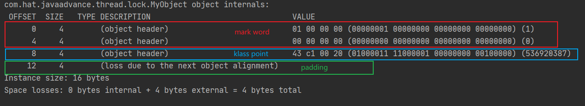

由于64位虚拟机的对象大小是**8的倍数**，所以padding这4个字节是**填充位**

关闭压缩后：

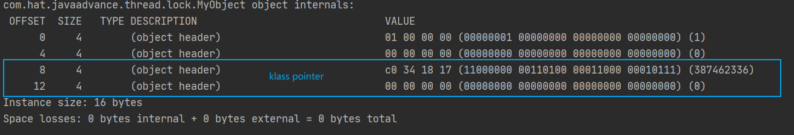

给对象添加两个属性：

```java
public class MyObject {
    private int num; // int 4字节
    private char ch; // char 2字节
}
```

结果：

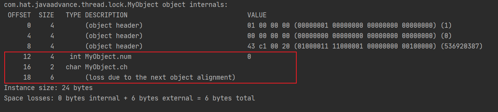

注意：

使用jol输出的对象头信息，读的顺序是**从下往上，右往左看**的，**每8位**当一个整体**往前看**

锁的状态：

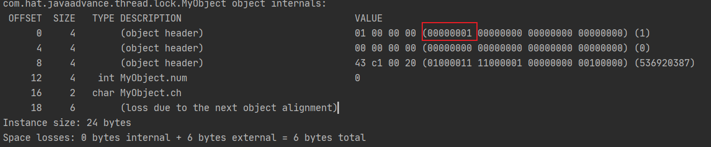

上图中的8位表示了 **|unused:1 | age:4 | biased_lock:1 | lock:2|**

```
|   0    |  0000  |      0      |   01   |
| unused |  age   | biased_lock | locked |
```

最后3位可以判断锁的状态：

| biased_lock | locked | state    |
| ----------- | ------ | -------- |
| 0           | 01     | 无锁     |
| 1           | 01     | 偏向锁   |
| 0           | 00     | 轻量级锁 |
| 0           | 10     | 重量级锁 |

**mark word：**

- **无锁状态（低3位：001）**

代码：

```java
import org.openjdk.jol.info.ClassLayout;

public class ObjectLayout {

    public static void main(String[] args) {
        unLocked();
    }

    // 无锁状态的对象头
    private static void unLocked(){
        MyObject o = new MyObject();
        System.out.println("对象 hash 之前");
        // 对象头
        System.out.println(ClassLayout.parseInstance(o).toPrintable());
        int hashcode = o.hashCode();
        System.out.println("对象 hash 之后，hash code："+hashcode+",  hex："+Integer.toHexString(hashcode));

        System.out.println(ClassLayout.parseInstance(o).toPrintable());
    }
}
```

结果：

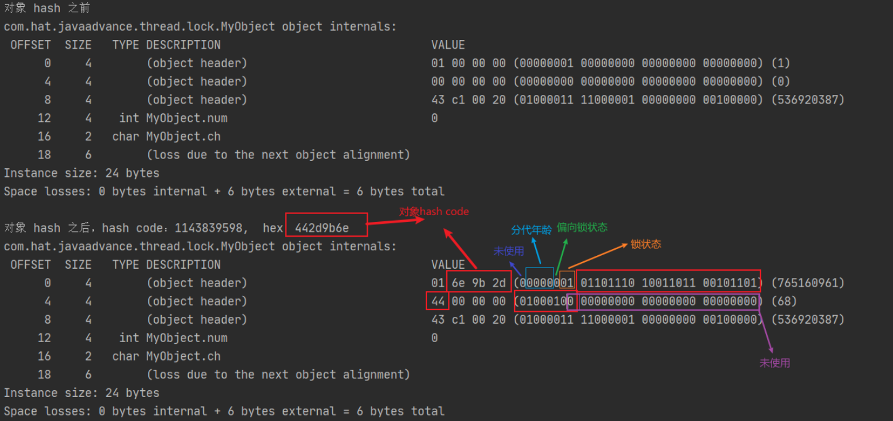

偏向锁的位是0，锁的位是01，所以这个是无锁

- **偏向锁（低3位：101）**

代码：

```java
import org.openjdk.jol.info.ClassLayout;

public class ObjectLayout {
    public static void main(String[] args) throws InterruptedException {
        biasedLock();
    }

    // 偏向锁
    private static void biasedLock() throws InterruptedException {
        // 睡眠5秒，JVM的偏向锁默认有4秒的延时，4秒后才会启用偏向锁
        // 也可以使用JVM参数 -XX:BiasedLockingStartupDelay=0 设置延时为0
        Thread.sleep(5000);   // 必须要在创建对象前休眠
        MyObject o = new MyObject();
        System.out.println("锁之前");
        System.out.println(ClassLayout.parseInstance(o).toPrintable());
        synchronized (o){
            System.out.println("进入锁");
            // 对象头
            System.out.println(ClassLayout.parseInstance(o).toPrintable());
        }
        System.out.println("锁之后");
        System.out.println(ClassLayout.parseInstance(o).toPrintable());
    }
}
```

结果：

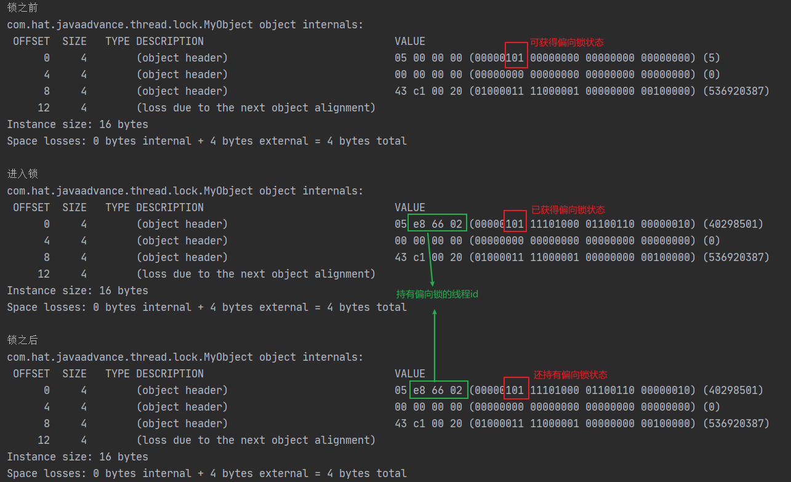

锁前、锁中、锁后三种不同情况，对象头的信息有些区别，

**锁前**：没有线程id，因此它是**可偏向状态**，实际上它还没有偏向

**锁中**：有线程id，线程已经持有该偏向锁

**锁后**：有线程id，线程执行完后还持有该偏向锁

- **轻量级锁（低2位：00）**

代码：

```java
import org.openjdk.jol.info.ClassLayout;

public class ObjectLayout {
    public static void main(String[] args) throws InterruptedException {
        lightweightLocked();
    }

    // 轻量级锁
    private static void lightweightLocked(){
        MyObject o = new MyObject();
        System.out.println("锁之前");
        System.out.println(ClassLayout.parseInstance(o).toPrintable());
        synchronized (o){
            System.out.println("进入锁");
            // 对象头
            System.out.println(ClassLayout.parseInstance(o).toPrintable());
        }
        System.out.println("锁之后");
        System.out.println(ClassLayout.parseInstance(o).toPrintable());
    }
}
```

结果：


- **重量级锁（低2位：10）**

代码：

```java
import org.openjdk.jol.info.ClassLayout;

public class ObjectLayout {
    public static void main(String[] args) throws InterruptedException {
        heavyweightLocked();
    }

    // 重量级锁
    private static void heavyweightLocked() throws InterruptedException {
        MyObject o = new MyObject();
        // 1. 无锁状态
        System.out.println("锁前："+Thread.currentThread().getName());
        System.out.println(ClassLayout.parseInstance(o).toPrintable());
        Thread thread1 = new Thread(() -> {
            // 2. thread1线程竞争o对象锁，o对象从无锁升级为轻量级锁
            synchronized (o) {
                try {
                    Thread.sleep(3000);
                } catch (InterruptedException e) {
                    e.printStackTrace();
                }
            }
            System.out.println("thread1释放锁");
        });
        thread1.start();
        Thread.sleep(1000);
        System.out.println("线程thread1锁定中");
        System.out.println(ClassLayout.parseInstance(o).toPrintable());

        // 3. 自旋等待thread1线程释放锁，o对象锁从轻量级锁升级为重量级锁
        synchronized (o){
            // 4. main线程获取到重量级锁
            System.out.println("线程main锁定中");
            System.out.println(ClassLayout.parseInstance(o).toPrintable());
        }
        // 5. main线程释放锁，o对象锁还是持有重量级锁
        System.out.println("线程main释放锁后");
        System.out.println(ClassLayout.parseInstance(o).toPrintable());
    }
}
```

结果：

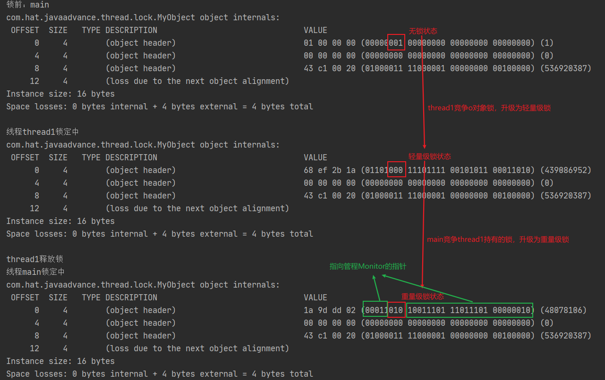

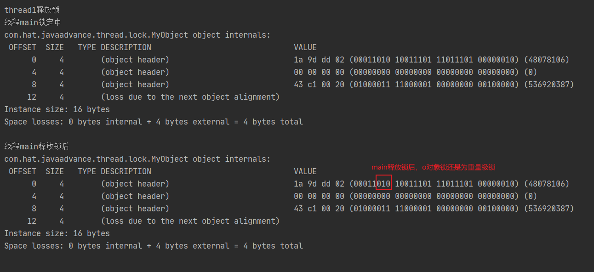

## 7. 分段锁

分段锁并不是一种锁或者一把锁，它是使用多个锁来对不同的一系列内容进行锁定，使得锁的粒度更加小。比如集合中ConcurrentHashMap的实现使用到了分段锁。

## synchronized

**synchronized**关键字可以作用于**普通方法、静态方法、代码块上**，它可以作为**对象锁**和**类锁**

- **对象锁**：普通方法、代码块上使用this或者对象

```java
// 1. 作用于普通方法
synchronized void syncMethod(){}

// 2.作用于代码块
void lockObject() throws InterruptedException {
        synchronized (this){}
}
```

- **类锁**：静态方法、代码块上使用类

```java
// 1. 作用于静态方法
static void staticMethod(){}

// 2. 作用于代码块
void lockObject() throws InterruptedException {
        synchronized (xxx.class){}
}
```

实践：

- **单一对象中对象锁与类锁**

```java
import java.time.LocalTime;
import java.util.concurrent.ExecutorService;
import java.util.concurrent.Executors;
import java.util.concurrent.TimeUnit;

public class  SynchronizedSimple {
    public static void main(String[] args) {
        testObjectLock();
    }

    private static void testObjectLock(){
        SynchronizedSimple simple1 = new SynchronizedSimple();
        ExecutorService pool = Executors.newCachedThreadPool();
        System.out.println("--------------------------------测试单一对象的对象锁与类锁--------------------------------");
        pool.submit(() -> {
            try {
                // 调用simple1对象的 对象锁 同步代码块
                simple1.lockObject("simple1");
            } catch (InterruptedException e) {
                e.printStackTrace();
            }
        });
        pool.submit(() -> {
            try {
                // 调用simple1对象的 类锁 同步代码块
                simple1.lockClass("simple1");
            } catch (InterruptedException e) {
                e.printStackTrace();
            }
        });

        pool.submit(() -> {
            try {
                // 调用simple1对象的 对象锁 同步方法
                simple1.syncMethod("simple1");
            } catch (InterruptedException e) {
                e.printStackTrace();
            }
        });

        pool.submit(() -> {
            // 调用simple1对象的 普通方法
            simple1.normalMethod("simple1");

        });
        pool.submit(() -> {
            try {
                // 调用simple1对象的 类锁 静态同步方法
                simple1.staticMethod("simple1");
            } catch (InterruptedException e) {
                e.printStackTrace();
            }
        });
    }
    // 对象锁，占有对象锁15秒
    private void lockObject(String obj) throws InterruptedException {
        synchronized (this){
            System.out.println(Thread.currentThread().getName()+"：lockObject()同步代码块进入---对象："+obj +"---"+ LocalTime.now()+"---15s");
            TimeUnit.SECONDS.sleep(15L);
        }
        System.out.println(Thread.currentThread().getName()+"：lockObject()同步代码块完成---对象："+obj +"---"+ LocalTime.now());
    }
	// 类锁，占有类锁15秒
    private void lockClass(String obj) throws InterruptedException {
        synchronized (SynchronizedSimple.class){
            System.out.println(Thread.currentThread().getName()+"：lockClass()同步代码块进入---类："+obj +"---"+ LocalTime.now()+"---15s");
            TimeUnit.SECONDS.sleep(15L);
        }
        System.out.println(Thread.currentThread().getName()+"：lockClass()同步代码块完成---类："+obj +"---"+ LocalTime.now());
    }
	// 对象锁，占有对象锁5秒
    private synchronized void syncMethod(String obj) throws InterruptedException {
        System.out.println(Thread.currentThread().getName()+"：syncMethod()同步方法进入---对象："+obj +"---"+ LocalTime.now()+"---5s");
        TimeUnit.SECONDS.sleep(5L);
        System.out.println(Thread.currentThread().getName()+"：syncMethod()同步方法完成---对象："+obj +"---"+ LocalTime.now());
    }
	// 无锁
    private void normalMethod(String obj){
        System.out.println(Thread.currentThread().getName()+"：normalMethod()普通方法："+obj +"---"+ LocalTime.now());
    }
	// 类锁，占有类锁10秒
    private synchronized static void staticMethod(String obj) throws InterruptedException {
        System.out.println(Thread.currentThread().getName()+"：staticMethod()同步方法进入---静态(类)："+obj +"---"+ LocalTime.now()+"---10s");
        TimeUnit.SECONDS.sleep(10L);
        System.out.println(Thread.currentThread().getName()+"：staticMethod()同步方法完成---静态(类)："+obj +"---"+ LocalTime.now());
    }
}
```

结果：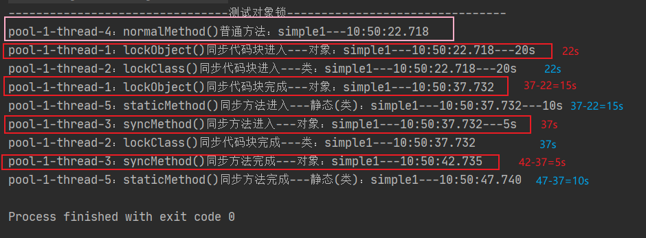

上图红色是对象锁、蓝色是类锁。

对于同一个对象simple1，**对象锁与类锁是两把锁，所以它们互不干扰，可以并行执行。类锁与类锁需等待，对象锁与对象锁需等待，对象锁与类锁不需等待**

其中对象锁执行的过程： 

lockObject() 15秒 → syncMethod() 5秒，时间：22s → 37s → 42s

类锁的执行过程：

lockClass() 15秒 → staticMethod() 10秒，时间：22s → 37s → 47s

- **多个对象中对象锁**

```java
package com.hat.javaadvance.thread.lock;

import java.time.LocalTime;
import java.util.concurrent.ExecutorService;
import java.util.concurrent.Executors;
import java.util.concurrent.TimeUnit;

public class  SynchronizedSimple {
    public static void main(String[] args) {
        testMultiObjectLock();
    }

    private static void testMultiObjectLock(){
        SynchronizedSimple simple1 = new SynchronizedSimple();
        SynchronizedSimple simple2 = new SynchronizedSimple();
        ExecutorService pool = Executors.newCachedThreadPool();
        System.out.println("--------------------------------测试多个对象的对象锁--------------------------------");
        pool.submit(() -> {
            try {
                // 调用simple1对象的 对象锁 同步代码块
                simple1.lockObject("simple1");
            } catch (InterruptedException e) {
                e.printStackTrace();
            }
        });
        pool.submit(() -> {
            try {
                // 调用simple1对象的 对象锁 同步方法
                simple1.syncMethod("simple1");
            } catch (InterruptedException e) {
                e.printStackTrace();
            }
        });
        pool.submit(() -> {
            try {
                // 调用simple2对象的 对象锁 同步代码块
                simple2.lockObject("simple2");
            } catch (InterruptedException e) {
                e.printStackTrace();
            }
        });
        pool.submit(() -> {
            try {
                // 调用simple2对象的 对象锁 同步方法
                simple2.syncMethod("simple2");
            } catch (InterruptedException e) {
                e.printStackTrace();
            }
        });
    }
    // 对象锁，占有对象锁15秒
    private void lockObject(String obj) throws InterruptedException {
        synchronized (this){
            System.out.println(Thread.currentThread().getName()+"：lockObject()同步代码块进入---对象："+obj +"---"+ LocalTime.now()+"---15s");
            TimeUnit.SECONDS.sleep(15L);
            System.out.println(Thread.currentThread().getName()+"：lockObject()同步代码块完成---对象："+obj +"---"+ LocalTime.now());
        }
    }
    // 类锁，占有类锁15秒
    private void lockClass(String obj) throws InterruptedException {
        synchronized (SynchronizedSimple.class){
            System.out.println(Thread.currentThread().getName()+"：lockClass()同步代码块进入---类："+obj +"---"+ LocalTime.now()+"---15s");
            TimeUnit.SECONDS.sleep(15L);
            System.out.println(Thread.currentThread().getName()+"：lockClass()同步代码块完成---类："+obj +"---"+ LocalTime.now());
        }
    }
    // 对象锁，占有对象锁5秒
    private synchronized void syncMethod(String obj) throws InterruptedException {
        System.out.println(Thread.currentThread().getName()+"：syncMethod()同步方法进入---对象："+obj +"---"+ LocalTime.now()+"---5s");
        TimeUnit.SECONDS.sleep(5L);
        System.out.println(Thread.currentThread().getName()+"：syncMethod()同步方法完成---对象："+obj +"---"+ LocalTime.now());
    }
    // 无锁
    private void normalMethod(String obj){
        System.out.println(Thread.currentThread().getName()+"：normalMethod()普通方法："+obj +"---"+ LocalTime.now());
    }
    // 类锁，占有类锁10秒
    private synchronized static void staticMethod(String obj) throws InterruptedException {
        System.out.println(Thread.currentThread().getName()+"：staticMethod()同步方法进入---静态(类)："+obj +"---"+ LocalTime.now()+"---10s");
        TimeUnit.SECONDS.sleep(10L);
        System.out.println(Thread.currentThread().getName()+"：staticMethod()同步方法完成---静态(类)："+obj +"---"+ LocalTime.now());
    }
}

```

结果：

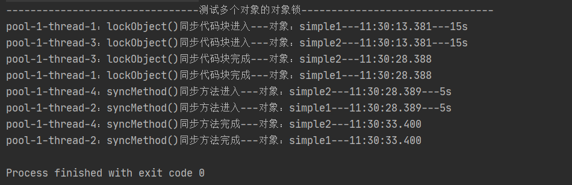

对于**不同的对象**simple1和simple2，**对象锁是互不干扰的，它们的同步代码可以并行执行**

simple1对象的执行过程：

lockObject() 15秒 → syncMethod() 5秒，时间： 13s → 28s → 33s 

simple2对象的执行过程：

lockObject() 15秒 → syncMethod() 5秒，时间： 13s → 28s → 33s 

它们两个对象的执行过程是完全一样的。

- **多个对象中类锁**

```java
package com.hat.javaadvance.thread.lock;

import java.time.LocalTime;
import java.util.concurrent.ExecutorService;
import java.util.concurrent.Executors;
import java.util.concurrent.TimeUnit;

public class  SynchronizedSimple {
    public static void main(String[] args) {
        testMultiClassLock();
    }

    private static void testMultiClassLock(){
        SynchronizedSimple simple1 = new SynchronizedSimple();
        SynchronizedSimple simple2 = new SynchronizedSimple();
        ExecutorService pool = Executors.newCachedThreadPool();
        System.out.println("--------------------------------测试多个对象的类锁--------------------------------");
        pool.submit(() -> {
            try {
                // 调用simple1对象的 类锁 同步代码块
                simple1.lockClass("simple1");
            } catch (InterruptedException e) {
                e.printStackTrace();
            }
        });
        pool.submit(() -> {
            try {
                // 调用simple1对象的 类锁 静态同步方法
                simple1.staticMethod("simple1");
            } catch (InterruptedException e) {
                e.printStackTrace();
            }
        });
        pool.submit(() -> {
            try {
                // 调用simple2对象的 类锁 同步代码块
                simple2.lockClass("simple2");
            } catch (InterruptedException e) {
                e.printStackTrace();
            }
        });

        pool.submit(() -> {
            try {
                // 调用simple2对象的 类锁 静态同步方法
                simple2.staticMethod("simple2");
            } catch (InterruptedException e) {
                e.printStackTrace();
            }
        });
    }
    
    // 对象锁，占有对象锁15秒
    private void lockObject(String obj) throws InterruptedException {
        synchronized (this){
            System.out.println(Thread.currentThread().getName()+"：lockObject()同步代码块进入---对象："+obj +"---"+ LocalTime.now()+"---15s");
            TimeUnit.SECONDS.sleep(15L);
            System.out.println(Thread.currentThread().getName()+"：lockObject()同步代码块完成---对象："+obj +"---"+ LocalTime.now());
        }
    }
    // 类锁，占有类锁15秒
    private void lockClass(String obj) throws InterruptedException {
        synchronized (SynchronizedSimple.class){
            System.out.println(Thread.currentThread().getName()+"：lockClass()同步代码块进入---类："+obj +"---"+ LocalTime.now()+"---15s");
            TimeUnit.SECONDS.sleep(15L);
            System.out.println(Thread.currentThread().getName()+"：lockClass()同步代码块完成---类："+obj +"---"+ LocalTime.now());
        }
    }
    // 对象锁，占有对象锁5秒
    private synchronized void syncMethod(String obj) throws InterruptedException {
        System.out.println(Thread.currentThread().getName()+"：syncMethod()同步方法进入---对象："+obj +"---"+ LocalTime.now()+"---5s");
        TimeUnit.SECONDS.sleep(5L);
        System.out.println(Thread.currentThread().getName()+"：syncMethod()同步方法完成---对象："+obj +"---"+ LocalTime.now());
    }
    // 无锁
    private void normalMethod(String obj){
        System.out.println(Thread.currentThread().getName()+"：normalMethod()普通方法："+obj +"---"+ LocalTime.now());
    }
    // 类锁，占有类锁10秒
    private synchronized static void staticMethod(String obj) throws InterruptedException {
        System.out.println(Thread.currentThread().getName()+"：staticMethod()同步方法进入---静态(类)："+obj +"---"+ LocalTime.now()+"---10s");
        TimeUnit.SECONDS.sleep(10L);
        System.out.println(Thread.currentThread().getName()+"：staticMethod()同步方法完成---静态(类)："+obj +"---"+ LocalTime.now());
    }
}

```

结果：

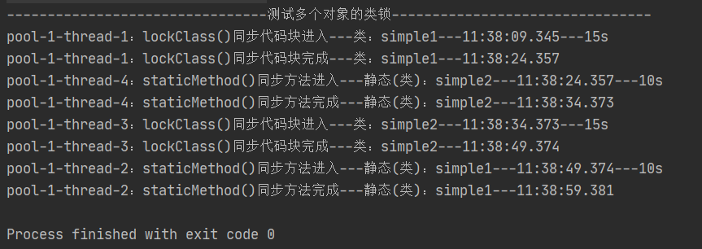

**对于不同对象访问类锁，它们用的都是同一把锁，任意一个对象持有了该类锁，那么该类其他对象想再取得类锁，只能阻塞等待前一个对象释放类锁，所以按照顺序执行。**

总结：

**当synchronized使用的是对象锁时，那么同一个类不同实例，这些实例拥有的对象锁都是不同的，因此多线程访问不同对象的同步代码是可以并行执行的。**

**当synchronized使用的是类锁时，该类的所有实例使用的都是同一把锁，因此多线程访问不同对象的同步代码是需要按顺序执行的，前一个对象释放了类锁，后一个对象才可以获取类锁。**

**synchronized的对象锁于类锁互不干扰，对象锁与类锁同时存在时同步代码（分别使用的是对象锁和类锁）是可以并行执行的**

## ReentrantLock

**ReentrantLock**是jdk1.5之后提供的API层面的锁，**synchronized**关键字是原生语法层面的锁，它们都是互斥锁，前者通过java代码实现，后者通过JVM实现。

**ReentrantLock**需要自己手动调用lock()方法加锁和unlock()方法释放锁，但是粒度更小，自由度更高，扩展性更强

**ReentrantLock**相比**synchronized**多了一些高级特性，比如：

- **等待可中断**

如果一个线程等待了很久还是没有获取到锁，这时候该线程处于阻塞状态，为了避免一直阻塞下去，**ReentrantLock**可以显式的中断该线程。**ReentrantLock**提供了一个lockInterruptibly()方法实现等待可中断，当线程调用中断方法interrupt()，阻塞的线程就会抛出java.lang.InterruptedException异常中断这个正在等待中的线程。

代码实例：

```java
import java.time.LocalTime;
import java.util.concurrent.TimeUnit;
import java.util.concurrent.locks.ReentrantLock;

public class ReentrantLockSimple {
    public static void main(String[] args) throws InterruptedException {
        testInterrupt();
    }

    private static void testInterrupt() throws InterruptedException {
        ReentrantLock lock = new ReentrantLock();
        // 线程1
        Thread t1 = new Thread(() -> {
            try {
                lock.lock(); // 获取锁
                System.out.println("线程" + Thread.currentThread().getName() + "获取到锁，将要执行6秒， " + LocalTime.now());
                TimeUnit.SECONDS.sleep(6L);
            } catch (InterruptedException e) {
                e.printStackTrace();
            } finally {
                lock.unlock();  // 释放锁
                System.out.println("线程" + Thread.currentThread().getName() + "释放锁， " + LocalTime.now());
            }
        });
        t1.start();
        // 线程2
        Thread t2 = new Thread(() -> {
            try {
                lock.lockInterruptibly();  // 实现等待可中断的方法
                System.out.println("线程" + Thread.currentThread().getName() + "获取到锁 " + LocalTime.now());
                TimeUnit.SECONDS.sleep(10L);
            } catch (InterruptedException e) {
                e.printStackTrace();
            } finally {
                lock.unlock();  // 释放锁
                System.out.println("线程" + Thread.currentThread().getName() + "释放锁， " + LocalTime.now());
            }
        });
        t2.start();

        TimeUnit.SECONDS.sleep(5L);
        System.out.println("主线程等待了5秒， " + LocalTime.now());
        if (lock.hasQueuedThread(t2)){
            System.out.println("线程2还再等待中，不等了，中断线程2");
            t2.interrupt(); //中断线程2等待获取锁
        }
    }
}

```

结果：

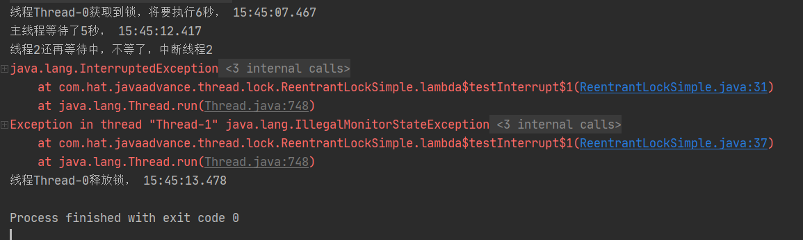

- **公平锁**

**ReentrantLock**默认创建的是非公平锁，**synchronized**也是一个非公平锁，但是**ReentrantLock**可以通过`ReentrantLock lock = new ReentrantLock(true);`创建为公平锁。

代码例子：

```java
package com.hat.javaadvance.thread.lock;

import java.time.LocalTime;
import java.util.concurrent.TimeUnit;
import java.util.concurrent.locks.ReentrantLock;

public class ReentrantLockSimple {
    static ReentrantLock fairLock = new ReentrantLock(true);  // true为公平锁

    public static void main(String[] args) throws InterruptedException {
        fairLock();
    }

    private static void fairLock(){
        myRunnable runnable = new myRunnable();
        Thread[] threads = new Thread[10];
        for (int i = 0; i < 10; i++) {
            threads[i] = new Thread(runnable);
        }
        for (int i = 0; i < 10; i++) {
            threads[i].start();
        }
    }
    static class myRunnable implements Runnable{
        @Override
        public void run() {
            System.out.println(Thread.currentThread().getName()+"已启动");
            try {
                fairLock.lock(); // 获取锁
                System.out.println("线程："+Thread.currentThread().getName()+"---得到锁 ");
            } finally {
                fairLock.unlock();
            }
        }
    }
}

```

结果：

```
Thread-0已启动
线程：Thread-0---得到锁 
Thread-1已启动
线程：Thread-1---得到锁 
Thread-2已启动
线程：Thread-2---得到锁 
Thread-4已启动
Thread-3已启动
线程：Thread-4---得到锁 
线程：Thread-3---得到锁 
Thread-5已启动
Thread-6已启动
Thread-7已启动
线程：Thread-5---得到锁 
Thread-8已启动
Thread-9已启动
线程：Thread-6---得到锁 
线程：Thread-7---得到锁 
线程：Thread-8---得到锁 
线程：Thread-9---得到锁 

Process finished with exit code 0
```

使用**公平锁**时可以看出线程获取锁的顺序是按照线程竞争锁的顺序。

当使用**非公平锁**时，

```java
 static ReentrantLock fairLock = new ReentrantLock(false);  // false或者不传则为非公平锁
```

结果如下：

```
Thread-0已启动
线程：Thread-0---得到锁 
Thread-1已启动
Thread-2已启动
线程：Thread-1---得到锁 
Thread-3已启动
线程：Thread-3---得到锁 
线程：Thread-2---得到锁 
Thread-4已启动
Thread-5已启动
线程：Thread-4---得到锁 
Thread-7已启动
线程：Thread-5---得到锁 
Thread-8已启动
线程：Thread-7---得到锁 
Thread-9已启动
线程：Thread-8---得到锁 
线程：Thread-9---得到锁 
Thread-6已启动
线程：Thread-6---得到锁 

Process finished with exit code 0
```

启动顺序是01**23**457896

得到锁的顺序是01**32**457896

- **绑定多个条件（Condition）**

Condition是一个对象，ReentrantLock使用Condition来实现线程的等待(await)与唤醒(signal、signalAll)。

synchronized使用Object.wait()、Object.notify()和Object.notifyAll()来实现线程的等待与唤醒。

synchronized只能绑定一个对象，而ReentrantLock可以绑定多个Condition。

例子：

```java
package com.hat.javaadvance.thread.lock;

import java.time.LocalTime;
import java.util.concurrent.TimeUnit;
import java.util.concurrent.locks.Condition;
import java.util.concurrent.locks.ReentrantLock;

public class ReentrantLockSimple {

    public static void main(String[] args) throws InterruptedException {
        condition();
    }

    private static void condition() throws InterruptedException {
        ReentrantLock lock = new ReentrantLock();
        Condition condition = lock.newCondition();
        Thread t1 = new Thread(() -> {
            System.out.println("进入" + Thread.currentThread().getName());
            try {
                lock.lock();
                System.out.println(Thread.currentThread().getName()+"进入等待状态，"+LocalTime.now());
                condition.await(); // 线程进入等待状态
            } catch (InterruptedException e) {
                e.printStackTrace();
            }finally {
                lock.unlock();
            }
            System.out.println(Thread.currentThread().getName()+"被唤醒，"+LocalTime.now());
        });
        t1.start();
        TimeUnit.SECONDS.sleep(3L); // 主线程阻塞3秒
        try {
            lock.lock();
            condition.signalAll(); // 唤醒进入等待状态的线程
        } finally {
            lock.unlock();
        }
    }
}

```

结果：

```
进入Thread-0
Thread-0进入等待状态，17:20:26.146
Thread-0被唤醒，17:20:29.117

Process finished with exit code 0
```

使用Condition来实现Object.wait()和Object.nofityAll()，两种方式的效果是一样的

注意：condition的**await()、signal()、signalAll()**同样**需要用在同步代码**内，即**lock()与unlock()之间**

**多条件按照顺序执行**：

```java
package com.hat.javaadvance.thread.lock;

import java.time.LocalTime;
import java.util.concurrent.TimeUnit;
import java.util.concurrent.locks.Condition;
import java.util.concurrent.locks.ReentrantLock;

public class ReentrantLockSimple {
    private static int flag = 0;

    public static void main(String[] args) throws InterruptedException {
        multiCondition();
    }

    private static void multiCondition(){
        ReentrantLock lock = new ReentrantLock();
        Condition c0 = lock.newCondition();
        Condition c1 = lock.newCondition();
        Condition c2 = lock.newCondition();
        new Thread(() -> {
            for (int i = 0; i < 3; i++) {
                try {
                    lock.lock();
                    if (flag != 0){
                        c0.await();  // 条件0等待
                    }
                    System.out.println(Thread.currentThread().getName()+"执行~~");
                    flag = 1;  // 下次线程1执行
                    c1.signalAll(); // 唤醒线程1
                } catch (InterruptedException e) {
                    e.printStackTrace();
                } finally {
                    lock.unlock();
                }
            }
        }).start();

        new Thread(() -> {
            for (int i = 0; i < 3; i++) {
                try {
                    lock.lock();
                    if (flag != 1){
                        c1.await();  // 条件1等待
                    }
                    System.out.println(Thread.currentThread().getName()+"执行~~");
                    flag = 2;  // 下次线程2执行
                    c2.signalAll(); // 唤醒线程2
                } catch (InterruptedException e) {
                    e.printStackTrace();
                } finally {
                    lock.unlock();
                }
            }
        }).start();

        new Thread(() -> {
            for (int i = 0; i < 3; i++) {
                try {
                    lock.lock();
                    if (flag != 2){
                        c2.await(); // 条件2等待
                    }
                    System.out.println(Thread.currentThread().getName()+"执行~~");
                    flag = 0;  // 下次线程0执行
                    c0.signalAll(); // 唤醒线程0
                } catch (InterruptedException e) {
                    e.printStackTrace();
                } finally {
                    lock.unlock();
                }
            }
        }).start();
    }
}

```

结果：

```
Thread-0执行~~
Thread-1执行~~
Thread-2执行~~
Thread-0执行~~
Thread-1执行~~
Thread-2执行~~
Thread-0执行~~
Thread-1执行~~
Thread-2执行~~

Process finished with exit code 0
```

- **尝试获取锁**

**ReentrantLock**提供了两个方法tryLock()和tryLock(long,TimeUnit)来实现尝试获取锁，前者立刻返回，后者阻塞long秒后返回，如果返回true则表明获取锁成功，返回false则是获取锁失败。

代码例子：

```java
package com.hat.javaadvance.thread.lock;

import java.time.LocalTime;
import java.util.concurrent.TimeUnit;
import java.util.concurrent.locks.Condition;
import java.util.concurrent.locks.ReentrantLock;

public class ReentrantLockSimple {

    public static void main(String[] args) throws InterruptedException {
        testTryLock();
    }

    private static void testTryLock() throws InterruptedException {
        ReentrantLock lock = new ReentrantLock();
        new Thread(() -> {
            try {
                lock.lock();
                System.out.println(Thread.currentThread().getName() + "得到锁，并且需要执行5秒， "+LocalTime.now());
                TimeUnit.SECONDS.sleep(5L); // 这个线程需要占有锁5秒
            } catch (InterruptedException e) {
                e.printStackTrace();
            } finally {
                lock.unlock();
                System.out.println(Thread.currentThread().getName()+"执行完毕，"+LocalTime.now());
            }
        }).start();
        boolean b; // 记录是否获取锁
        TimeUnit.SECONDS.sleep(1L);  //主线程休眠1秒，确保上面线程已经占有锁
        try {
//            b = lock.tryLock(); // 尝试获取锁，立刻返回，成功获取则返回true，失败返回false
            b = lock.tryLock(6L,TimeUnit.SECONDS); // 尝试获取锁，等待6秒后返回，成功获取则返回true，失败返回false
            System.out.println(Thread.currentThread().getName()+ "获取锁情况:"+b + "，"+LocalTime.now());
        }finally {
            lock.unlock(); // 释放锁
            System.out.println(Thread.currentThread().getName()+ "释放锁");
        }
    }
}
```

结果：

```
Thread-0得到锁，并且需要执行5秒， 09:34:03.709
Thread-0执行完毕，09:34:08.722
main获取锁情况:true，09:34:08.722
main释放锁

Process finished with exit code 0
```

如果把Thread-0的时间改的稍长一点， TimeUnit.SECONDS.sleep(10L); 让Thread-0占有锁10秒。

结果：

```
Thread-0得到锁，并且需要执行5秒， 09:36:06.621
main获取锁情况:false，09:36:13.585
Exception in thread "main" java.lang.IllegalMonitorStateException
	at java.util.concurrent.locks.ReentrantLock$Sync.tryRelease(ReentrantLock.java:151)
	at java.util.concurrent.locks.AbstractQueuedSynchronizer.release(AbstractQueuedSynchronizer.java:1261)
	at java.util.concurrent.locks.ReentrantLock.unlock(ReentrantLock.java:457)
	at com.hat.javaadvance.thread.lock.ReentrantLockSimple.testTryLock(ReentrantLockSimple.java:41)
	at com.hat.javaadvance.thread.lock.ReentrantLockSimple.main(ReentrantLockSimple.java:17)
Thread-0执行完毕，09:36:16.628

Process finished with exit code 1
```

可以看到main线程没有获取到锁，IllegalMonitorStateException异常是因为**main线程没有占有锁的情况下释放了锁**

## ReentrantReadWriteLock

**ReentrantReadWriteLock**是读写锁，是独享锁与共享锁的具体实现，其中**读锁是共享锁，写锁是独享锁**

- **读锁（读读）的实现例子：**

```java
package com.hat.javaadvance.thread.lock;

import java.time.LocalTime;
import java.util.concurrent.TimeUnit;
import java.util.concurrent.locks.ReentrantReadWriteLock;

public class ReentrantReadWriteLockSimple {
    private static int num = 0;
    private static ReentrantReadWriteLock readWriteLock = new ReentrantReadWriteLock(); // 创建读写锁
    private static ReentrantReadWriteLock.ReadLock readLock = readWriteLock.readLock();  // 创建读锁

    public static void main(String[] args) {
        testReadLock();
    }

    private static void testReadLock() {
        // 创建5个线程去获取读锁
        for (int i = 0; i < 5; i++) {
            new Thread(() -> {
                getNum();
            }).start();
        }
    }
	
    // 加了读锁的方法
    private static void getNum() {
        try {
            readLock.lock();  // 获取读锁
            System.out.println(Thread.currentThread().getName() + "得到读锁，得到num的值：" + num + "，并且站有锁5秒," + LocalTime.now());
            TimeUnit.SECONDS.sleep(5L);
        } catch (InterruptedException e) {
            e.printStackTrace();
        } finally {
            readLock.unlock();  // 释放写锁
            System.out.println(Thread.currentThread().getName() + "释放锁，" + LocalTime.now());
        }
    }
}

```

结果：

```
Thread-3得到读锁，得到num的值：0，并且站有锁5秒,09:59:40.983
Thread-1得到读锁，得到num的值：0，并且站有锁5秒,09:59:40.983
Thread-2得到读锁，得到num的值：0，并且站有锁5秒,09:59:40.983
Thread-0得到读锁，得到num的值：0，并且站有锁5秒,09:59:40.984
Thread-4得到读锁，得到num的值：0，并且站有锁5秒,09:59:40.983
Thread-0释放锁，09:59:46.001
Thread-2释放锁，09:59:46.001
Thread-3释放锁，09:59:46.001
Thread-1释放锁，09:59:46.001
Thread-4释放锁，09:59:46.001

Process finished with exit code 0
```

运行结果可以看出，5个线程同时获取到读锁，也同时释放了读锁。因此**读读是共享锁**。

- **写锁（写写）的实现例子：**

```java
package com.hat.javaadvance.thread.lock;

import java.time.LocalTime;
import java.util.concurrent.TimeUnit;
import java.util.concurrent.locks.ReentrantReadWriteLock;

public class ReentrantReadWriteLockSimple {
    private static int num = 0;
    private static ReentrantReadWriteLock readWriteLock = new ReentrantReadWriteLock(); // 创建读写锁
    private static ReentrantReadWriteLock.ReadLock readLock = readWriteLock.readLock();  // 创建读锁
    private static ReentrantReadWriteLock.WriteLock writeLock = readWriteLock.writeLock();  // 创建写锁

    public static void main(String[] args) {
        testWriteLock();
    }

    private static void testWriteLock() {
        for (int i = 0; i < 5; i++) {
            new Thread(() -> {
                setNum();
            }).start();
        }
    }

    // 使用写锁的方法
    private static void setNum() {
        try {
            writeLock.lock();
            System.out.println(Thread.currentThread().getName() + "得到写锁，num进行自增：" + num + "，并且站有锁1秒," + LocalTime.now());
            num++;
            TimeUnit.SECONDS.sleep(1L);
        } catch (InterruptedException e) {
            e.printStackTrace();
        } finally {
            System.out.println(Thread.currentThread().getName() + "释放锁，num的值：" + num + "  , " + LocalTime.now());
            writeLock.unlock();
        }
    }
}

```

结果：

```
Thread-0得到写锁，num进行自增：0，并且站有锁1秒,10:07:06.146
Thread-0释放锁，num的值：1  , 10:07:07.150
Thread-1得到写锁，num进行自增：1，并且站有锁1秒,10:07:07.150
Thread-1释放锁，num的值：2  , 10:07:08.165
Thread-2得到写锁，num进行自增：2，并且站有锁1秒,10:07:08.165
Thread-2释放锁，num的值：3  , 10:07:09.170
Thread-3得到写锁，num进行自增：3，并且站有锁1秒,10:07:09.170
Thread-3释放锁，num的值：4  , 10:07:10.184
Thread-4得到写锁，num进行自增：4，并且站有锁1秒,10:07:10.185
Thread-4释放锁，num的值：5  , 10:07:11.190

Process finished with exit code 0
```

可以看到，写锁每次只有一个线程可以占有，只有写锁释放了其他线程才能继续获取锁，所以**写写是互斥锁**。

- **读写的实现例子**

```java
    private static void testReadWriteLock(){
        new Thread(() -> {
            getNum(); // 读锁的方法
        }).start();

        new Thread(() -> {
            setNum(); // 写锁的方法
        }).start();
    }
```

结果：

```
Thread-0得到读锁，得到num的值：0，并且占有锁5秒,10:28:59.145
Thread-0释放锁，10:29:04.152
Thread-1得到写锁，num进行自增：0，并且站有锁1秒,10:29:04.152
Thread-1释放锁，num的值：1  , 10:29:05.155

Process finished with exit code 0
```

从结果可以看到读锁释放锁之后写锁才能获取锁。所以**读写是互斥锁**

- **写读的实现例子**

```java
    private static void testWriteReadLock(){
        new Thread(() -> {
            setNum();  // 写锁的方法
        }).start();

        new Thread(() -> {
            getNum();  // 读锁的方法
        }).start();
    }
```

结果：

```
Thread-0得到写锁，num进行自增：0，并且站有锁1秒,10:44:35.111
Thread-0释放锁，num的值：1  , 10:44:36.118
Thread-1得到读锁，得到num的值：1，并且占有锁5秒,10:44:36.119
Thread-1释放锁，10:44:41.130

Process finished with exit code 0
```

从结果可以看到写锁释放锁之后读锁才能获取锁。所以**写读是互斥锁**


**ReentrantLock与ReentrantReadWriteLock**都是通过**AQS（AbstractQueuedSynchronizer）**来实现的。

假如一个线程已经**占有了一把锁**，那么**锁的计数器就是1**，这时**当前**线程**再获取锁**，那么**锁的计数器就会加1**，同一个线程可以获取多把锁，但是再释放的时候必须释放相同的锁数，否则可能会因为锁没有成功释放而造成的死锁，所以**ReentrantLock**是一把重入锁，可以防止在**同步代码内再获取锁**时造成死锁的问题

## 8. 分布式锁

之前所有的锁实现都是在一个程序内的，如果程序集群部署，或者一个大项目是分布式项目，这样**synchronized**和**ReentrantLock**的锁只能锁定一个程序里的代码块，如果想让一个同步代码同一时间只能被一台机器的一个线程执行，这就需要借助分布式锁来实现。

分布式锁需要满足以下条件：

1. 在分布式系统环境下，一个方法在同一时间只能被一个机器的一个线程执行；
2. 高可用的获取锁与释放锁；
3. 高性能的获取锁与释放锁；
4. 具备可重入特性；
5. 具备锁失效机制，防止死锁；
6. 具备非阻塞锁特性，即没有获取到锁将直接返回获取锁失败。

分布式锁的实现一般有3种：数据库、redis、zookeeper

但是用的最多的是redis和zookeeper

### 8.1.mysql分布式锁

**用数据库实现分布式锁**

- **实现高可用**需要部署多个数据库，任意一数据库宕机需要切换数据库，并且数据库之间需要数据同步
- **实现可重入特性**需要多记录一些设备和线程信息。
- **实现锁失效机制**需要自己实现获取锁和释放锁失败时的处理策略

具体实现：

数据库表设计：

```mysql
CREATE TABLE `sql_lock`  (
  `id` int(0) NOT NULL AUTO_INCREMENT,
  `object_name` varchar(255) CHARACTER SET utf8mb4 COLLATE utf8mb4_general_ci NOT NULL COMMENT '锁住的方法或者资源使用的对象名或者标识（根据这个字段来加解锁）',
  `update_time` datetime(0) NULL DEFAULT CURRENT_TIMESTAMP(0) ON UPDATE CURRENT_TIMESTAMP(0) COMMENT '加锁的时间',
  `version` int(0) NOT NULL COMMENT '加锁的版本（实现重入锁）',
  `machine_thread` varchar(255) CHARACTER SET utf8mb4 COLLATE utf8mb4_general_ci NOT NULL COMMENT '机器与线程标识（实现重入锁时需再判断该字段，如果是同一机器同一线程则实现重入锁）',
  PRIMARY KEY (`id`) USING BTREE,
  UNIQUE INDEX `method_unique_index`(`object_name`) USING BTREE
) ENGINE = InnoDB AUTO_INCREMENT = 5 CHARACTER SET = utf8mb4 COLLATE = utf8mb4_general_ci ROW_FORMAT = Dynamic;
```

数据库连接：

```java
import java.sql.Connection;
import java.sql.DriverManager;
import java.sql.SQLException;

public class SqlConnectConfig {
    private static final String url = "jdbc:mysql://localhost:3306/distributed?serverTimezone=UTC";        //数据库地址
    private static final String username = "root";        //数据库用户名
    private static final String password = "123456";        //数据库密码
    private static final String driver = "com.mysql.cj.jdbc.Driver";        //mysql驱动

    protected static Connection getConn(){
        Connection conn = null;
        try {
            Class.forName(driver);  //加载数据库驱动
            conn = DriverManager.getConnection(url, username, password); // 连接数据库
        } catch (ClassNotFoundException | SQLException e) {
            e.printStackTrace();
        }
        return conn;
    }

    protected static void closeConn(Connection conn){
        if (null != conn){
            try {
                conn.close();
            } catch (SQLException throwables) {
                throwables.printStackTrace();
            }
        }
    }
}

```

锁的实现类：

```java
import java.sql.Connection;
import java.sql.PreparedStatement;
import java.sql.ResultSet;
import java.sql.SQLException;
import java.time.LocalTime;

public class SqlLock {
    private String machine; // 机器标识
    private Connection conn; // 数据库连接对象

    public SqlLock(String machine) {
        this.machine = machine;
        conn = SqlConnectConfig.getConn();
    }

    // 加锁
    public boolean lock(String key, long timeout) {
        long begin = System.currentTimeMillis();
        // 组装机器与线程标识
        String machineThread = machine + Thread.currentThread().getName();
        // 加锁超时
        while (0 == timeout || System.currentTimeMillis() - begin < timeout) {
            try {
                // 查询当前机器和当前线程是否加过锁
                ResultSet rs = get(key);
                if (rs.next()) {
                    // 如果同一个线程尝试获得锁则实现重入锁
                    if (machineThread.equals(rs.getString("machine_thread"))) {
                        int update = 0;
                        // 循环重入加锁
                        do {
                            update = updateIncrease(key,rs.getInt("version") + 1);
                        } while (update < 1 && (0 == timeout || System.currentTimeMillis() - begin < timeout));
                        // 返回是否加锁成功
                        return update >= 1;
                    }
                } else {
                    // 插入数据库，创建锁
                    int count = insert(key,machineThread);
                    if (count > 0) {
                        return true;
                    } else {
                        return false;
                    }
                }
            } catch (Exception e) {
//                System.out.println(machine +"-"+Thread.currentThread().getName() + "加锁失败~~~，重试加锁~~~");
            }
        }
        return false;
    }

    // 释放锁
    public void unlock(String key) {
        try {
            ResultSet rs = get(key);
            if (rs.next()) {
                int version = rs.getInt("version");
                if (version > 1) {
                    int count = 0;
                    do {
                        count = updateReduce(key, version - 1);  // 如果是重入锁则version减1
                    }while (count < 1);
                } else {
                    del(key);        // 删除数据库记录
                }
            }
            System.out.println(machine+"-"+Thread.currentThread().getName() + "成功释放锁~~~~~~~~"+ LocalTime.now());
        } catch (Exception e) {
            e.printStackTrace();
            unlock(key);
        }

    }

    // 插入锁信息到数据库
    private int insert(String key,String machineThread) throws SQLException {
        String insert = "insert into sql_lock(object_name,machine_thread,version) values (?,?,?)";
        PreparedStatement psInsert = conn.prepareStatement(insert);
        psInsert.setString(1, key);
        psInsert.setString(2, machineThread);
        psInsert.setInt(3, 1);
        return psInsert.executeUpdate();
    }

    // 根据object_name和version更新锁状态(解锁使用)
    private int updateReduce(String key, int version){
        try {
            String updateByObjectName = "update sql_lock set version = ? where object_name = ?";
            PreparedStatement psUpdate = conn.prepareStatement(updateByObjectName);
            psUpdate.setInt(1, version);
            psUpdate.setString(2, key);
            return psUpdate.executeUpdate();
        }catch (Exception e){
            e.printStackTrace();
            return 0;
        }
    }

    // 根据object_name和version更新锁状态(重入锁使用)
    private int updateIncrease(String key, int version) throws SQLException {
        String updateByObjectName = "update sql_lock set version = ? where object_name = ?";
        PreparedStatement psUpdate = conn.prepareStatement(updateByObjectName);
        psUpdate.setInt(1, version);
        psUpdate.setString(2, key);
        return psUpdate.executeUpdate();
    }

    // 根据object_name查询锁
    private ResultSet get(String key) throws SQLException {
        String selectByObjectName = "select * from sql_lock where object_name = ?";
        PreparedStatement ps = conn.prepareStatement(selectByObjectName);
        ps.setString(1, key);
        ResultSet rs = ps.executeQuery();
        return rs;
    }

    // 根据object_name删除锁
    private void del(String key) {
        try {
            String del = "delete from sql_lock where object_name = ?";
            PreparedStatement psDel = conn.prepareStatement(del);
            psDel.setString(1, key);
            psDel.executeUpdate();
        } catch (SQLException throwables) {
            throwables.printStackTrace();
            del(key);  // 如果发生异常则继续调用本身来删除key
        }
    }
}

```

测试代码：

```java
import java.time.LocalTime;
import java.util.concurrent.TimeUnit;

public class test {
    private SqlLock lock = new SqlLock("machineA");

    public static void main(String[] args) {

        test test = new test();
//        test.testReentrant();
        test.testDistributedA();
    }

    // 测试分布式锁
    private void testDistributedA(){
        for (int i = 0; i < 3; i++) {
            new Thread(() -> {
                try {
                    boolean b = lock.lock("distributed", 0);
                    if (b) {
                        System.out.println("machineA机器-"+Thread.currentThread().getName()+"-testDistributedA方法成功获得锁"+ LocalTime.now());
                        TimeUnit.SECONDS.sleep(5L);
                    }
                } catch (InterruptedException e) {
                    e.printStackTrace();
                } finally {
                    lock.unlock("distributed");
                }
            }).start();
        }
    }

    // 测试重入锁
    private void testReentrant() {
        try {
            boolean b = lock.lock("reentrantLock", 1000);
            if (b) {
                System.out.println("testReentrant方法成功获得锁");
                testReentrant2();
            }
        } finally {
            lock.unlock("reentrantLock");
        }

    }
    // 测试重入锁
    private void testReentrant2() {
        try {
            boolean b = lock.lock("reentrantLock", 1000);
            if (b) {
                System.out.println("testReentrant2方法成功获得锁");
                TimeUnit.SECONDS.sleep(5);
            }
        } catch (InterruptedException e) {
            e.printStackTrace();
        } finally {
            lock.unlock("reentrantLock");
        }

    }

    // 测试悲观锁
    private void testLock() {
        for (int i = 0; i < 10; i++) {
            int finalI = i;
            new Thread(() -> {
                try {
                    boolean b = lock.lock("objTTT", 1000);
                    if (b) {
                        System.out.println(Thread.currentThread().getName() + "获得锁");
                        if (finalI % 3 == 0) {
                            TimeUnit.SECONDS.sleep(3);
                        }
                    } else {
                        System.out.println(Thread.currentThread().getName() + "获得锁失败");
                    }
                } catch (InterruptedException e) {
                    e.printStackTrace();
                } finally {
                    System.out.println("----------" + Thread.currentThread().getName() + "释放锁");
                    lock.unlock("objTTT");
                }
            }).start();
        }
    }
}

```

测试代码2，测试分布式锁：

```java
import java.time.LocalTime;
import java.util.concurrent.TimeUnit;

public class test2 {
    private SqlLock lock = new SqlLock("machineB");

    public static void main(String[] args) {
        test2 test2 = new test2();
        test2.testDistributedB();
    }
    // 测试分布式锁
    private void testDistributedB(){
        for (int i = 0; i < 3; i++) {
            new Thread(() -> {
                try {
                    boolean b = lock.lock("distributed", 0);
                    if (b) {
                        System.out.println("machineB机器-"+Thread.currentThread().getName()+"-testDistributedB方法成功获得锁"+ LocalTime.now());
                        TimeUnit.SECONDS.sleep(3L);
                    }
                } catch (InterruptedException e) {
                    e.printStackTrace();
                } finally {
                    lock.unlock("distributed");
                }
            }).start();
        }
    }
}

```

分布式锁的测试结果：

test1:

```java
machineA机器-Thread-1-testDistributedA方法成功获得锁14:30:20.952
machineA-Thread-1成功释放锁~~~~~~~~14:30:31.324
machineA机器-Thread-2-testDistributedA方法成功获得锁14:30:38.613
machineA-Thread-2成功释放锁~~~~~~~~14:30:48.688
machineA机器-Thread-0-testDistributedA方法成功获得锁14:30:48.747
machineA-Thread-0成功释放锁~~~~~~~~14:30:58.806

Process finished with exit code 0
```

test2:

```java
machineB机器-Thread-0-testDistributedB方法成功获得锁14:30:31.490
machineB-Thread-0成功释放锁~~~~~~~~14:30:38.555
machineB机器-Thread-2-testDistributedB方法成功获得锁14:30:58.881
machineB-Thread-2成功释放锁~~~~~~~~14:31:05.946
machineB机器-Thread-1-testDistributedB方法成功获得锁14:31:05.997
machineB-Thread-1成功释放锁~~~~~~~~14:31:13.064

Process finished with exit code 0
```

使用数据库实现分布式锁存在的问题：

1. 如果数据库宕机了，那么分布式锁就不能用了。可以使用主从数据库来保证高可用，但是编码很麻烦，需要自己实现两库的数据同步。
2. 程序在解锁时发生异常或者其他一些问题，数据库中这个锁的记录就会一直存在，不会自动失效，后续线程wu发再获取该资源锁。

### 8.2.redis分布式锁

**使用redis实现分布式锁**

- **实现高可用**：redis可以配置**哨兵模式**和**集群**来保证分布式锁的高可用
- **实现可重入**：redis可以依赖**hash结构**或者依赖**ThreadLocal**来实现锁的可重入特性
- **实现锁失效**：redis可以**设置key的过期时间**，即使程序没来得及释放锁宕机了，key到达过期时间就会删除，不会影响后续线程获取锁，可以**防止死锁**的发生
- **锁时间增长**：可以使用**守护线程**来**监控获取锁的线程**是否执行完毕，如果还没有执行完则增加锁key的过期时间，这样可以防止锁失效特性中设置过期时间后导致线程没有执行完key就自动删除

**redis分布式锁的实现**

使用spring整合的**redisTemplate**与**ThreadLocal**来实现分布式锁（单机redis）：

pom.xml文件增加redis依赖包

```xml
        <dependency>
            <groupId>org.springframework.boot</groupId>
            <artifactId>spring-boot-starter-data-redis</artifactId>
        </dependency>
```

application.yml配置文件配置连接redis服务器属性

```yml
spring:
  redis:
    host: localhost
    port: 6379
    password:
server:
  port: 8080
```

RedisConfig配置redisTemplate的序列化方式

```java
import com.fasterxml.jackson.annotation.JsonAutoDetect;
import com.fasterxml.jackson.annotation.PropertyAccessor;
import com.fasterxml.jackson.databind.ObjectMapper;
import org.springframework.context.annotation.Bean;
import org.springframework.context.annotation.Configuration;
import org.springframework.data.redis.connection.lettuce.LettuceConnectionFactory;
import org.springframework.data.redis.core.RedisTemplate;
import org.springframework.data.redis.serializer.Jackson2JsonRedisSerializer;
import org.springframework.data.redis.serializer.StringRedisSerializer;

@Configuration
public class RedisConfig {
    @Bean
    public RedisTemplate<String, Object> redisTemplate(LettuceConnectionFactory connectionFactory) {
        //实例化RedisTemplate
        RedisTemplate<String, Object> template = new RedisTemplate<>();
        //给RedisTemplate设置redis连接工厂
        template.setConnectionFactory(connectionFactory);

        //提供一些功能将转换成Java对象匹配JSON结构
        ObjectMapper om = new ObjectMapper();
        //指定要检测的范围，参数1：所有域(set、get),参数2：所有类型修饰符(private到public)
        om.setVisibility(PropertyAccessor.ALL, JsonAutoDetect.Visibility.ANY);
        //指定序列化的类型，参数：非final修饰的类型
        om.enableDefaultTyping(ObjectMapper.DefaultTyping.NON_FINAL);
        //实例化Jackson2Json序列化
        Jackson2JsonRedisSerializer serializer = new Jackson2JsonRedisSerializer(Object.class);
        //给Jackson2Json设置自定义的ObjectMapper属性
        serializer.setObjectMapper(om);

        //redis的string类型的key值序列化方式
        template.setKeySerializer(new StringRedisSerializer());
        //redis的string类型的value值序列化方式
        template.setValueSerializer(serializer);

        //redis的hash类型的key值序列化方式
        template.setHashKeySerializer(new StringRedisSerializer());
        //redis的hash类型的value值序列化方式
        template.setHashValueSerializer(serializer);
        return template;
    }
}
```

RedisLock分布式锁实现类

```java
import org.springframework.beans.factory.annotation.Autowired;
import org.springframework.beans.factory.annotation.Value;
import org.springframework.data.redis.core.RedisTemplate;
import org.springframework.stereotype.Component;

import java.util.HashMap;
import java.util.Map;
import java.util.Objects;
import java.util.concurrent.TimeUnit;

@Component
public class RedisLock {
    @Value("${machine.name}")
    private String machine;  // 机器的标识，这里方便测试直接读取环境变量，这个主要是标识服务器的唯一性
    private static final long expire = 15; // 锁记录默认过期时间

    ThreadLocal<Map<String, Object>> lockInfo = new ThreadLocal<>();

    @Autowired
    private RedisTemplate<String, Object> redisTemplate;

    /**
     * 加锁
     *
     * @param key     锁资源key值
     * @param timeout 获取锁的超时时间
     * @return 返回true 加锁成功，返回fasle 加锁失败
     */
    public boolean lock(String key, long timeout) {
        long begin = System.currentTimeMillis();
        do {
            try {
                Map<String, Object> lockMap = localLock();
                // 如果线程局部变量已存在锁的key，则执行count+1操作实现重入锁
                if (lockMap.containsKey(key)) {
                    lockMap.put(key, (Integer)lockMap.get(key) + 1);
                    return true;
                } else {
                    // redis新增锁记录
                    Boolean ok = redisTemplate.opsForValue().setIfAbsent(key,
                            machine + Thread.currentThread().getName(), expire, TimeUnit.SECONDS);
                    if (null != ok && ok) {
                        lockMap.put(key, 1); // 线程局部变量的的count设置为1
                        watchDog(key); // 启动监控守护线程
                        return true;
                    }
                }
            } catch (Exception e) {
                e.printStackTrace();
            }
        } while (timeout == 0 || System.currentTimeMillis() - begin <= timeout);

        return false;
    }


    /**
     * 解锁
     *
     * @param key 锁的key
     */
    public void unlock(String key) {
        Map<String, Object> lockMap = localLock();
        Integer count = (Integer) lockMap.get(key);
        // 如果线程局部变量获取到的计数大于1则计数减1（重入锁）
        if (Objects.nonNull(count) && count > 1) {
            lockMap.put(key, --count);
        } else {  // 删除key
            lockInfo.remove();
            redisTemplate.delete(key);
        }
    }

    /**
     * 获取线程的threadlocal
     * @return
     */
    private Map<String, Object> localLock() {
        Map<String, Object> lockMap = lockInfo.get();
        if (Objects.isNull(lockMap)) {
            lockMap = new HashMap<>();
            lockInfo.set(lockMap);
        }
        return lockMap;
    }

    /**
     * 监控线程是否执行完，没有完的话重置key的超时时间
     *
     * @param key 锁的key
     */
    private void watchDog(String key) {
        Thread thread = Thread.currentThread(); // 获取加锁成功的线程，监控是否执行完毕
        Thread watchdog = new Thread(() -> {
            long begin = System.currentTimeMillis(); // 加锁成功后获取当前时间，开始监控线程是否执行完毕
            double border = expire * 0.7 * 1000;  // key的过期时间边界值
            while (true) {
                try {
                    // 如果得到锁的线程已经执行完毕，守护线程也退出
                    if (!thread.isAlive()){
                        return;
                    }
                    // 如果当前时间-起始时间大于key超时时间的70%则重置key的超时时间
                    if (System.currentTimeMillis() - begin > border) {
                        redisTemplate.expire(key, expire, TimeUnit.SECONDS);
                        begin = System.currentTimeMillis(); // 更新重置后的新时间
                    }
                    TimeUnit.SECONDS.sleep(2); // 2秒监控一次
                } catch (InterruptedException e) {
                    e.printStackTrace();
                }
            }
        });
        watchdog.setDaemon(true); // 开启守护线程监控
        watchdog.start();
    }
}

```

测试:

```java
import org.springframework.beans.factory.annotation.Autowired;
import org.springframework.stereotype.Service;

import javax.annotation.PostConstruct;
import java.time.LocalTime;
import java.util.concurrent.TimeUnit;

@Service
public class test {
    @Autowired
    RedisLock redisLock;

    /**
     * 测试分布式锁
     */
    @PostConstruct
    private void testLock(){
        for (int i = 0; i < 3; i++) {
            new Thread(() -> {
                boolean lock = redisLock.lock("testLock",0);
                if (lock){
                    System.out.println(Thread.currentThread().getName()+"加锁成功 "+ LocalTime.now());
                    try {
                        TimeUnit.SECONDS.sleep(25);
                    } catch (InterruptedException e) {
                        e.printStackTrace();
                    }finally {
                        redisLock.unlock("testLock");
                        System.out.println(Thread.currentThread().getName()+"释放锁"+ LocalTime.now());
                    }
                }else {
                    System.out.println(Thread.currentThread().getName()+"~~~~~~~~加锁失败 "+ LocalTime.now());
                }
            }).start();
        }
    }

    /**
     * 测试分布式锁的可重入特性
     */
//    @PostConstruct
    private void testReentrantLock(){
        try {
            boolean lock = redisLock.lock("testRedisLockKey",0);
            if (lock){
                System.out.println(Thread.currentThread().getName()+"加锁成功");
                t2();
                TimeUnit.SECONDS.sleep(30);
            }else {
                System.out.println(Thread.currentThread().getName()+"加锁失败");
            }
        } catch (InterruptedException e) {
            e.printStackTrace();
        } finally {
            redisLock.unlock("testRedisLockKey");
            System.out.println(Thread.currentThread().getName()+"释放锁");

        }
    }

    private void t2(){
        try {
            boolean lock = redisLock.lock("testRedisLockKey",0);
            if (lock){
                System.out.println(Thread.currentThread().getName()+"加锁成功");
                TimeUnit.SECONDS.sleep(15);
            }else {
                System.out.println(Thread.currentThread().getName()+"加锁失败");
            }
        } catch (InterruptedException e) {
            e.printStackTrace();
        } finally {
            redisLock.unlock("testRedisLockKey");
            System.out.println(Thread.currentThread().getName()+"释放锁");
        }
    }
}

```

重入锁结果：

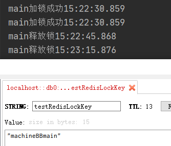

分布式锁结果：

启动时环境变量：machine.name=machineAA;server.port=8080和machine.name=machineBB;server.port=8081

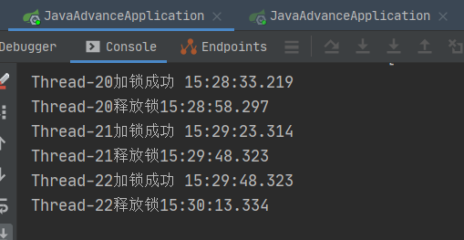

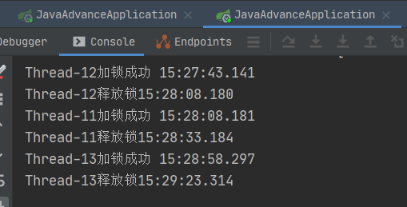

**Redisson**是一个很强大的**redis分布式锁框架**，一般要用redis作为分布式锁，可以直接使用Redisson。它使用**hash结构**来实现分布式锁，加锁解锁都是使用**lua**脚本来实现的，因为lua脚本操作redis是**保证原子性**的。它里面有个**看门狗机制**，用来监控key是否需要续过期时间，原理就是使用守护线程来监控。

### 8.3 zookeeper分布式锁

**使用zookeeper实现分布式锁**

- **实现高可用**：zookeeper的集群模式部署可以实现高可用，而且时强高可用。

- **实现可重入**：与redis分布式锁一样，可以使用ThreadLocal，也可以使用ConcurrentHashMap来实现
- **实现锁失效**：得益于zookeeper的临时节点的特性，当客户端断开后，对应的临时节点会自动删除

zookeeper的数据结构类似于文件系统，所以我们可以使用一个节点路径充当一个锁，而且它支持创建顺序的临时节点，即创建的节点后面会拼接0000000001，数字越大说明越后创建，因此zookeeper实现的分布式锁是公平锁，先来先得到锁。

zookeeper的监听机制可以帮助我们知道前一个节点(锁)已经执行完毕，它可以监听前一个节点，当前一个节点被删除后，监听器就会收到通知，从而知道前一个线程已经释放锁， 然后当前线程就可以获取锁。就算有很多个线程都在等待锁，但是它们只需要监听前一个节点就可以了，其他节点就不需要再管。

**zookeeper实现分布式锁**

使用3.6.2版本的zookeeper，引入依赖

```xml
        <dependency>
            <groupId>org.apache.zookeeper</groupId>
            <artifactId>zookeeper</artifactId>
            <version>3.6.2</version>
        </dependency>
```

创建zookeeper客户端连接类ZkLockWatcher

```java
import org.apache.zookeeper.WatchedEvent;
import org.apache.zookeeper.Watcher;
import org.apache.zookeeper.ZooKeeper;

import java.io.IOException;
import java.util.concurrent.CountDownLatch;

public class ZkLockWatcher implements Watcher {

    private ZooKeeper zk;
    private CountDownLatch latch = new CountDownLatch(1);

    public ZkLockWatcher() throws IOException, InterruptedException {
        this.zk = new ZooKeeper("127.0.0.1:2181", 3000000, this);
        latch.await();
    }
    public ZooKeeper getZk(){
        return zk;
    }

    @Override
    public void process(WatchedEvent event) {
        Event.EventType type = event.getType();
        Event.KeeperState state = event.getState();
        String path = event.getPath();
//        System.out.println("当前事件："+event);
//        System.out.println("当前事件类型："+type);
//        System.out.println("当前事件状态："+state);
//        System.out.println("当前路径："+path);
        if (Event.KeeperState.SyncConnected.equals(state)){
            switch (type){
                case None:
//                    System.out.println("zk客户端连接成功~~~");
                    latch.countDown();
                    break;
                case NodeCreated:
//                    System.out.println(path+"节点创建~~");
                    break;
                case NodeDeleted:
//                    System.out.println(path+"节点删除~~");
                    break;
                case NodeDataChanged:
//                    System.out.println(path+"节点数据改变~~~");
                    break;
                case DataWatchRemoved:
//                    System.out.println(path+"数据删除~~");
                    break;
                case ChildWatchRemoved:
//                    System.out.println(path+"子节点删除~~");
                    break;
                case NodeChildrenChanged:
//                    System.out.println(path+"子节点改变~~");
                    break;
                case PersistentWatchRemoved:
//                    System.out.println(path+"持久化删除~~");
                    break;
            }
        }else if (Event.KeeperState.AuthFailed.equals(state)){

//            System.out.println("客户端AuthFailed");
        }else if (Event.KeeperState.Closed.equals(state)){
//            System.out.println("客户端Closed");

        }else if (Event.KeeperState.ConnectedReadOnly.equals(state)){
//            System.out.println("客户端ConnectedReadOnly");

        }else if (Event.KeeperState.Disconnected.equals(state)){
//            System.out.println("客户端Disconnected");

        }else if (Event.KeeperState.Expired.equals(state)){
//            System.out.println("客户端Expired");

        }else if (Event.KeeperState.SaslAuthenticated.equals(state)){
//            System.out.println("客户端SaslAuthenticated");
        }
    }
}
```

zookeeper分布式锁实现类ZkLock

```java
package com.hat.javaadvance.thread.lock.distributed_lock.zookeeperlock;

import org.apache.commons.lang.StringUtils;
import org.apache.zookeeper.*;
import org.apache.zookeeper.data.Stat;

import java.io.IOException;
import java.nio.charset.StandardCharsets;
import java.util.Collections;
import java.util.List;
import java.util.Objects;
import java.util.concurrent.ConcurrentHashMap;
import java.util.concurrent.atomic.AtomicBoolean;
import java.util.concurrent.atomic.AtomicInteger;

public class ZkLock {

    // 线程的加锁计数器，实现重入锁
    private ConcurrentHashMap<Thread, AtomicInteger> local = new ConcurrentHashMap<>();
    private static final String ROOT_PATH = "/zkLock"; // 根节点
    private static final String LOCK_NAME = "lock_"; // 顺序子节点前缀
    private String machine; // 机器标识

    public ZkLock(String machine) {
        this.machine = machine;
    }

    /**
     * 加锁
     *
     * @param key 锁的key唯一标识
     * @return
     */
    public boolean lock(String key) {
        // key不能为空
        if (StringUtils.isBlank(key)){
            return false;
        }
        // 重入锁的实现
        Thread thread = Thread.currentThread();
        AtomicInteger count = local.get(thread);
        if (null != count && count.get() > 0) { // 如果当前线程加过锁（count > 0）则实现重入锁，计数+1
            count.incrementAndGet();
            return true;
        }
        try {
            ZooKeeper zk = new ZkLockWatcher().getZk();  // 创建zk客户端
            if (Objects.isNull(zk)) {
                return false;
            }
            String keyNode = ROOT_PATH + "/" + key;  // 锁的节点路径
            String data = machine + thread.getName(); // 机器与线程组成唯一标识，解锁时会根据该值来删除锁节点
            String lockNode = createNode(zk, key, data.getBytes(StandardCharsets.UTF_8));   // 创建锁节点
            if (null != lockNode) {   // 创建成功
                List<String> locks = zk.getChildren(keyNode, false);  // 获取所有的子节点
                Collections.sort(locks);  // 对子节点排序，正序
                int index = locks.indexOf(lockNode.substring(keyNode.length() + 1)); // 判断当前子节点在子节点列表中的位置
                if (index == -1) {
                    return false;  // 如果当前顺序子节点不在顺序子节点列表中则加锁失败或者抛出异常
                }
                if (index != 0) {  // 不是在第一位时加锁失败，设置监听器监听前一个节点，等待前一个节点被删除
                    AtomicBoolean flag = new AtomicBoolean(false);  // 监控前一位置的子节点是否被删除
                    // 获取前一子节点
                    String preNode = keyNode + "/" + locks.get(--index);
                    // 监听前一个节点
                    zk.exists(preNode, event -> {
                        System.out.println("监听到event===  " + event);
                        // 前一个子节点删除后将flag设置为true
                        if (Watcher.Event.EventType.NodeDeleted == event.getType()) {
                            flag.set(true);
                        }
                    });
                    // 循环等待事件触发（等待前一节点释放锁）
                    while (!flag.get()) {
                    }
                    ;
                }
                // 当前线程加锁计数器加一
                local.put(thread, new AtomicInteger(1));
                return true;  // 加锁成功
            }

        } catch (IOException | InterruptedException | KeeperException ioException) {
            ioException.printStackTrace();
        }
        // 加锁失败
        return false;
    }

    /**
     * 解锁，如果key节点有多个顺序子节点，则删除当前线程的顺序子节点
     * 如果key节点只有一个顺序子节点，则删除当前线程的顺序子节点，且删除key节点
     * 如果key节点没有顺序子节点，则删除key节点
     *
     * @param key
     * @return
     * @throws IOException
     * @throws InterruptedException
     * @throws KeeperException
     */
    public boolean unlock(String key) {
        if (StringUtils.isBlank(key)){
            return false;
        }
        // 重入锁的释放锁实现
        Thread thread = Thread.currentThread();  // 获取当前线程
        AtomicInteger count = local.get(thread);  // 从加锁计数器中获取当前线程加锁的次数
        if (null != count && count.get() > 1) {  // 如果加锁次数在2或以上时只做计数器减一操作
            count.decrementAndGet();
            return true;
        }
        try {
            ZooKeeper zk = new ZkLockWatcher().getZk();  // 创建zk客户端
            if (Objects.isNull(zk)) {
                return false;
            }
            String node = ROOT_PATH + "/" + key;  // key节点
            String data = machine + thread.getName(); // 当前机器+线程唯一标识
            List<String> children = zk.getChildren(node, false);  // 获取所有子节点
            if (children.size() > 1) {  // 子节点数大于1时，即有其他线程在等待
                // 遍历找出当前线程创建的顺序子节点，并删除该顺序子节点
                for (int i = 0; i < children.size(); i++) {
                    String curNode = node + "/" + children.get(i);
                    String nodeData = new String(zk.getData(curNode, false, null), StandardCharsets.UTF_8);
                    if (data.equals(nodeData)) {
                        zk.delete(curNode, -1);
                    }
                }
                // 顺序子节点只有一个时
            } else if (children.size() == 1) {
                zk.delete(node + "/" + children.get(0), -1);
                zk.delete(node, -1);
            } else {  // 没有顺序子节点时
                zk.delete(node, -1);
            }
            local.remove(thread);  // 如果当前线程完全释放锁则将加锁计数器删除
            return true; // 删除子节点成功
        } catch (InterruptedException | KeeperException | IOException e) {
            e.printStackTrace();
        }
        return false; // 删除子节点失败
    }


    /**
     * /root/key/lock-  结构或者/root/lock-，其中/root是永久节点，/key可以null，永久节点， /lock-是临时顺序节点
     *
     * @param zk
     * @param key
     * @return
     * @throws KeeperException
     * @throws InterruptedException
     */
    private String createNode(ZooKeeper zk, String key, byte[] data) throws KeeperException, InterruptedException {
        boolean b = existsRoot(zk);  // 判断是否存在根路径
        if (b) {
            // 锁的key标识
            String keyNode = ROOT_PATH + "/" + key;
            try {
                // 判断是否存在key节点
                if (zk.exists(keyNode, false) == null) {
                    // 不存在key节点则创建
                    keyNode = zk.create(keyNode, null, ZooDefs.Ids.OPEN_ACL_UNSAFE, CreateMode.PERSISTENT);
                }
            } catch (KeeperException.NodeExistsException e) {
                // 捕获NodeExistsException异常不做处理，相当于zk服务器已存在key节点
            }
            // 在key节点内创建临时顺序节点
            return zk.create(keyNode + "/" + LOCK_NAME, data, ZooDefs.Ids.OPEN_ACL_UNSAFE, CreateMode.EPHEMERAL_SEQUENTIAL);
        }
        // 创建失败时返回null
        return null;
    }

    /**
     * 判断是否存在根节点
     *
     * @param zk
     * @return
     */
    private boolean existsRoot(ZooKeeper zk) {
        String rootNode;
        try {
            // 存在根节点返回true
            Stat stat = zk.exists(ROOT_PATH, false);
            if (null != stat) {
                return true;
            }
            // 当不存在根节点时，创建根节点，成功创建返回true
            rootNode = zk.create(ROOT_PATH, null, ZooDefs.Ids.OPEN_ACL_UNSAFE, CreateMode.PERSISTENT);
            if (null != rootNode) {
                return true;
            }
        } catch (KeeperException | InterruptedException e) {
            e.printStackTrace();
        }
        // 没有根节点且创建失败返回false
        return false;
    }
}
```

测试类：

```java
package com.hat.javaadvance.thread.lock.distributed_lock.zookeeperlock;

import org.apache.curator.CuratorZookeeperClient;
import org.apache.curator.RetryPolicy;
import org.apache.curator.framework.CuratorFramework;
import org.apache.curator.framework.CuratorFrameworkFactory;
import org.apache.curator.framework.recipes.locks.InterProcessMutex;
import org.apache.curator.retry.RetryNTimes;

import java.time.LocalTime;
import java.util.concurrent.TimeUnit;

public class LockTest {
    private static ZkLock lock = new ZkLock("machineAAAAA");

    public static void main(String[] args) {
//        testReentrant();
        testDistributed();
    }

    private static void testDistributed(){
        ZkLock lockA = new ZkLock("machine__AAAA");
        ZkLock lockB = new ZkLock("machine__BBBB");
        for (int i = 0; i < 3; i++) {
            if (i % 2 == 0){
                new Thread(() -> {
                    try {
                        boolean b = lockA.lock("lokkkkk");
                        if (b){
                            System.out.println("machine__AAAA---"+Thread.currentThread().getName()+"加锁成功"+ LocalTime.now());
                            TimeUnit.SECONDS.sleep(5L);
                        }else {
                            System.out.println("machine__AAAA---"+Thread.currentThread().getName()+"加锁失败"+ LocalTime.now());
                        }
                    } catch (InterruptedException e) {
                        e.printStackTrace();
                    } finally {
                        lockA.unlock("lokkkkk");
                        System.out.println("machine__AAAA---"+Thread.currentThread().getName()+"释放锁"+ LocalTime.now());
                    }
                }).start();
            }else {
                new Thread(() -> {
                    try {
                        boolean b = lockB.lock("lokkkkk");
                        if (b){
                            System.out.println("machine__BBBB---"+Thread.currentThread().getName()+"加锁成功"+ LocalTime.now());
                            TimeUnit.SECONDS.sleep(5L);
                        }else {
                            System.out.println("machine__BBBB---"+Thread.currentThread().getName()+"加锁失败"+ LocalTime.now());
                        }
                    } catch (InterruptedException e) {
                        e.printStackTrace();
                    } finally {
                        lockB.unlock("lokkkkk");
                        System.out.println("machine__BBBB---"+Thread.currentThread().getName()+"释放锁"+ LocalTime.now());
                    }
                }).start();
            }

        }

    }

    private static void testReentrant(){
        try {
            boolean b = lock.lock("keykey");
            if (b){
                System.out.println(Thread.currentThread().getName()+"加锁成功"+ LocalTime.now());
                testReentrant2();
                TimeUnit.SECONDS.sleep(10L);
            }else {
                System.out.println(Thread.currentThread().getName()+"加锁失败"+ LocalTime.now());
            }

        } catch (InterruptedException e) {
            e.printStackTrace();
        }finally {
            lock.unlock("keykey");
            System.out.println(Thread.currentThread().getName()+"释放锁"+ LocalTime.now());
        }
    }

    private static void testReentrant2(){
        try {
            boolean b = lock.lock("keykey");
            if (b){
                System.out.println("testReentrant2"+Thread.currentThread().getName()+"加锁成功"+ LocalTime.now());
                testReentrant3();
            }else {
                System.out.println("testReentrant2"+Thread.currentThread().getName()+"加锁失败"+ LocalTime.now());
            }

        } finally {
            lock.unlock("keykey");
            System.out.println("testReentrant2"+Thread.currentThread().getName()+"释放锁"+ LocalTime.now());
        }
    }

    private static void testReentrant3(){
        try {
            boolean b = lock.lock("keykey");
            if (b){
                System.out.println("testReentrant3"+Thread.currentThread().getName()+"加锁成功"+ LocalTime.now());
                TimeUnit.SECONDS.sleep(5L);
            }else {
                System.out.println("testReentrant3"+Thread.currentThread().getName()+"加锁失败"+ LocalTime.now());
            }

        } catch (InterruptedException e) {
            e.printStackTrace();
        }finally {
            lock.unlock("keykey");
            System.out.println("testReentrant3"+Thread.currentThread().getName()+"释放锁"+ LocalTime.now());
        }
    }

    private void testCurator(){
        CuratorFramework client = CuratorFrameworkFactory.newClient("127.0.0.1:2181", new RetryNTimes(3, 1000));
        client.start();
        InterProcessMutex lock = new InterProcessMutex(client,"/testlock");
        new Thread(() -> {
            try {
                lock.acquire();
                System.out.println(Thread.currentThread().getName()+"成功获取锁");
                lock.acquire();
                System.out.println(Thread.currentThread().getName()+"成功获取锁");
                TimeUnit.SECONDS.sleep(200);
                lock.release();
                System.out.println(Thread.currentThread().getName()+"释放锁");
                TimeUnit.SECONDS.sleep(30);
//                lock.release();
                System.out.println(Thread.currentThread().getName()+"释放锁");
            } catch (Exception e) {
                e.printStackTrace();
            }
        }).start();
//        new Thread(() -> {
//            try {
//                lock.acquire();
//                System.out.println(Thread.currentThread().getName()+"成功获取锁");
//                TimeUnit.SECONDS.sleep(10);
//                lock.release();
//                System.out.println(Thread.currentThread().getName()+"释放锁");
//
//            } catch (Exception e) {
//                e.printStackTrace();
//            }
//        }).start();
    }
}

```

apache也提供了一个zookeeper客户端框架curator。而且该框架内置了分布式锁。一般如果需要使用zookeeper作为分布式锁，可以直接选择curator框架，它提供了一套很完整的方案。